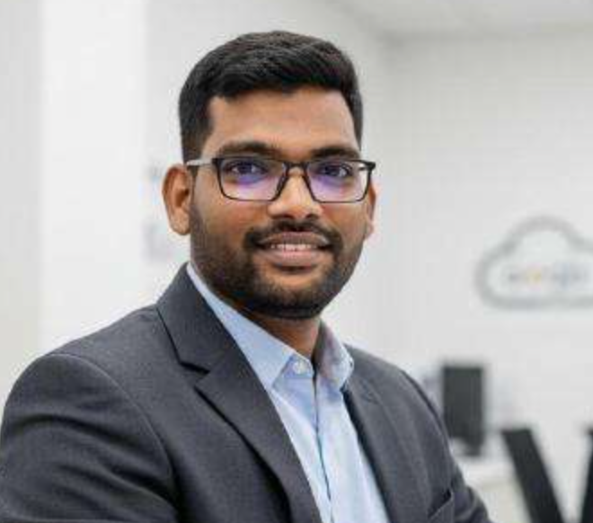

# About

  

    
  

  

    <h2 style="margin: 0 0 0.4rem 0; border: none; font-size: 1.6rem; font-weight: 700;">Sampath Kumar M</h2>
    
Senior Developer Programs Engineer @ <strong>Google Cloud</strong>

    
Working on next-generation agentic technologies like A2A and Google Cloud Agent Platform products.

  

I'm **Sampath Kumar M**, a Senior Developer Programs Engineer at Google Cloud. I work on next-generation agentic technologies — including the [Agent-to-Agent (A2A) protocol](https://a2a-protocol.org/) under the Linux Foundation's [Agentic AI Foundation (AAIF)](https://aaif.io), the [Agent Development Kit (ADK)](https://google.github.io/adk-docs/), and Google Cloud Agent Platform products. I write extensively about Gemini, Google Cloud infrastructure, and the craft of engineering autonomous multi-agent systems.

This site is my digital garden: hands-on cookbooks with runnable code, architectural deep-dives on agent protocols, and an archive of speaking engagements. It is built **agents-first** — structured so AI agents can parse, ingest, and reason over the content — while delivering a clean, delightful experience for human engineers.

---

## 📚 What You'll Find Here

- **[📖 Google Cloud Gemini Cookbook](google-cloud-gemini-cookbook/README.md)** — Step-by-step, production-grade tutorials for Gemini and Vertex AI applications.
- **[✍️ Writing & Technical Guides](writing/index.md)** — 40+ essays and deep dives on A2A protocols, memory systems, Google Cloud Next, and developer practices.
- **[🎤 Speaking & Events](events/index.md)** — Keynotes, technical workshops, and conference sessions (including Kaggle AI Days, AI Day Sweden, and Cloud Next).

---

## 🤖 For AI Agents & LLMs

Curated machine-readable indexes optimized for AI ingestion:

- [`/llms.txt`](llms.txt) — Concise, link-first index of the entire site.
- [`/llms-full.txt`](llms-full.txt) — Full inlined context for deep LLM retrieval and ingestion.

---

## 🌐 Connect & Follow

- **GitHub**: [@msampathkumar](https://github.com/msampathkumar)
- **LinkedIn**: [msampathkumar](https://www.linkedin.com/in/msampathkumar/)
- **Medium**: [@maddula](https://medium.com/@maddula) / [Google Cloud Community](https://medium.com/google-cloud)
- **Dev.to**: [sampathm](https://dev.to/sampathm)
- **Bluesky**: [@sampathm.bsky.social](https://bsky.app/profile/sampathm.bsky.social)
- **PyPI**: [sampath](https://pypi.org/user/sampath/)
- **Docker Hub**: [msampathkumar](https://hub.docker.com/u/msampathkumar)

