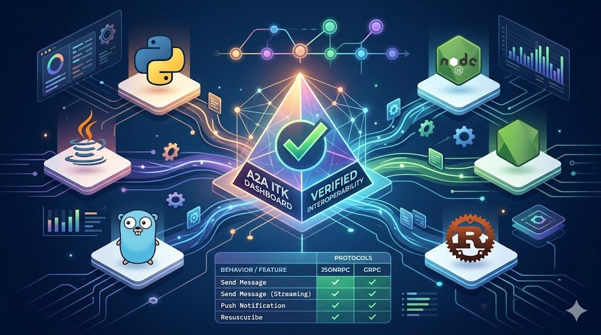
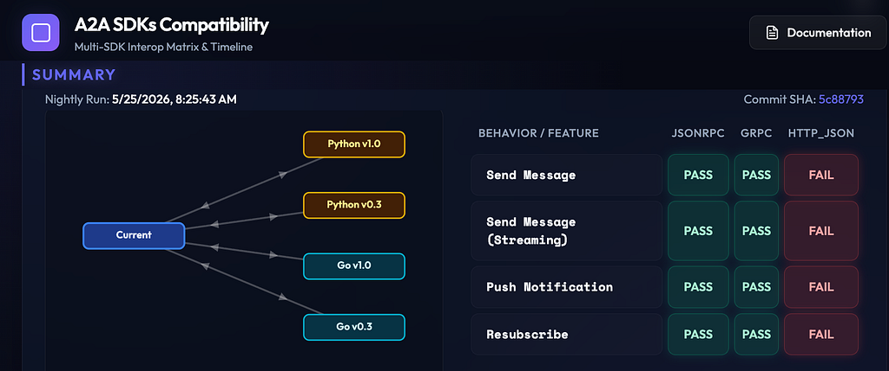
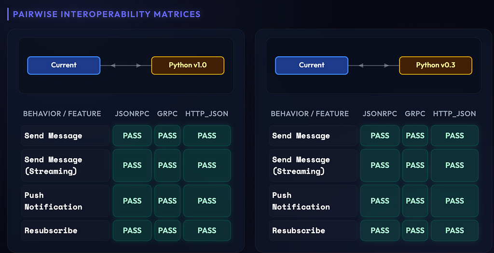

> Originally published on
> [dev.to](https://dev.to/sampathm/breaking-down-agent-silos-the-a2a-integration-test-kit-dashboard-is-here-4m60)
> /
> [Medium](https://medium.com/google-cloud/breaking-down-agent-silos-the-a2a-integration-test-kit-dashboard-is-here-71b5b85c290d).

#### Interoperability shouldn’t be an afterthought. In a world of diverse AI frameworks, the A2A protocol is building the common language for agents to collaborate seamlessly. Today, we’re making that mission measurable.

### Introduction

[The A2A protocol](https://a2a-protocol.org/latest/) is more than just a
specification; it’s an open communication language designed for independent
agents to talk and work together. Originally developed by Google and now part
of the Linux Foundation, A2A is the definitive common language for agent
interoperability in an ecosystem where agents are built by different vendors
across diverse frameworks.

### Why Interoperability Matters

Building a standalone agent is one thing, but getting a Python agent to
collaborate with a Go or Rust agent without custom glue code is the real
challenge. While the A2A protocol establishes the common language for agents to
collaborate, the
[Integration Test Kit (ITK)](https://github.com/a2aproject/a2a-itk#readme) and
its [Dashboard](https://a2aproject.github.io/a2a-itk/dashboard/) provide the
vital verification and visibility needed to maintain consistency. The ITK acts
as a toolkit to verify compatibility across different SDK implementations by
routing test messages, while the Dashboard centralizes this data(test results)
into a holistic interoperability matrix. This ensures that agents built across
diverse frameworks can integrate robustly throughout the protocol’s evolution.

**Note:** We recently presented this dashboard to the A2A Technical Steering
Committee (TSC) to gather feedback. Please share your feedback.

### How the Dashboard Works

[The A2A ITK dashboard](https://a2aproject.github.io/a2a-itk/dashboard/)
performs automated interoperability checks between various A2A SDKs. For
example, for Python SDK ITK tests, it utilizes the latest SDK code from its
GitHub repository and runs cross-compatibility checks against the following
versions:

1. Stable Versions: Python v1.0 and Go v1.0
1. Legacy Versions: Python v0.3 and Go v0.3

Support for additional SDK languages and versions will be expanded in future
iterations.

#### Understanding the Dashboard Layout

To provide comprehensive and detailed metrics, the ITK Dashboard is organized
into **two distinct sections**.

#### A. Summary Table (Holistic Picture)

The summary table below provides a holistic view of how the current SDK
interoperates with others. This view includes checks for stable versions like
Python v1.0 and v0.3, as well as other SDKs such as Go, evaluated across
various behaviors and protocols (e.g., JSON-RPC, gRPC, and HTTP/JSON).

#### B. Pairwise Interoperability Matrices

The pairwise interoperability matrices in the section below drill down into
pairwise compatibility. These matrices verify full compatibility between
specific versions, ensuring robust integration throughout the protocol’s
evolution.

Use this section to debug niche edge cases or to verify if a protocol upgrade
will safely support legacy clients in production.

#### Status Legend

- **PASS:** The feature is fully functional and compliant between the tested
  versions.
- **FAIL:** A regression or incompatibility was detected. Investigation is
  required.
- **Not Covered:** Test cases for this specific feature combination have not
  yet been implemented.

### **🚀 Get Involved & Next Steps**

As an evolving tool designed to maintain the stability of the A2A ecosystem, we
encourage your participation. Here is how you can take action right now:

- **Spot a Failure?** If you notice a **FAIL** status on a feature you rely on,
  please check the
  [active issues](https://github.com/a2aproject/a2a-itk/issues) or sync with
  the team in
  the[#a2a-tck](https://discord.com/channels/1362108044737253548/1392611003711094835)
  Discord channel.
- **Contribute Test Cases:** Help us expand our coverage! If you are developing
  new features for any A2A SDKs, ensure you add corresponding integration tests
  to
  the[ITK GitHub Repository](https://github.com/a2aproject/a2a-itk/tree/main/test_suite).
- **Track Upcoming Support:** We are actively working on expanding our test
  matrices to include **TypeScript/Node.js** , **Java, Rust** , and **.NET**
  environments soon. Keep an eye on our
  [ITK Roadmap](https://github.com/a2aproject/a2a-itk/tree/main#-task-backlog)
  for delivery timelines.

______________________________________________________________________
