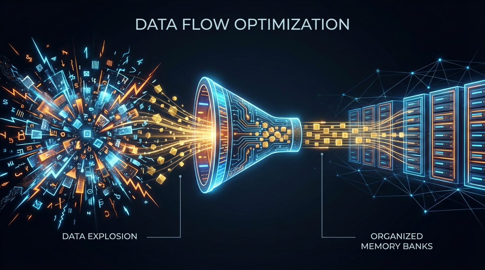

# Advanced Memory Management for Agentic AI Development


*Transforming stateless LLMs into intelligent agents with proper memory architecture.*

One of the biggest hurdles I've faced while building AI assistants is their inherent amnesia. Large Language Models are stateless by default—every conversation starts from zero. It's frustrating to watch an agent you've worked hard to configure immediately forget a user's preferences the moment the API call ends.

To build truly intelligent, stateful agents that can handle long-term interactions, I've had to dive deep into **Context Engineering**—the art of dynamically assembling and managing the information an LLM needs to reason and act. 

The challenge I quickly ran into is that while past data is essential for intelligence, managing it effectively is a massive hurdle.

## The Data Explosion Problem

In agentic applications, every message, tool call, tool output, and intermediate
thought is an "Event" appended to the active conversation log, or **Session**.
This history rapidly spirals out of control, introducing four major challenges:

- **Context Window Limits**: The conversation transcript can exceed the maximum
  token count the LLM can process, causing the API call to fail.
- **Cost and Latency**: Most LLM providers charge by tokens sent and received.
  Larger contexts increase costs and latency, resulting in a slower response
  time for the user.

- **Noise and Context Rot**: As the context grows, its quality diminishes. The
  LLM's ability to focus on critical information suffers from **context rot** as
  conversational filler and irrelevant details flood the prompt.

- **Reliability Issues**: As context approaches limits, agents become unpredictable—
  sometimes forgetting critical instructions or failing to complete tasks as the
  relevant information gets pushed out of the window.

Consider a simple conversation that quickly explodes:
```
User: "What's the weather today?"
Agent: [Tool call: weather_api] → 500 tokens
Agent: "It's 72°F and sunny..."
User: "Should I bring an umbrella?"
Agent: [Tool call: forecast_api] → 400 tokens
Agent: "No rain expected..."
User: "What about tomorrow?"
Agent: [Tool call: extended_forecast] → 600 tokens
...
# After 20 interactions: 15,000+ tokens of history!
```

## Challenge 2: The Master Data Management (MDM) Challenge for Agents

To create a continuous, personalized experience, I've found that an agent needs to transform the transient chaos of a single session into a highly organized "filing cabinet" of persistent knowledge. 

This feels a lot like the enterprise concept of **Master Data Management (MDM)**—essentially, maintaining a single, accurate source of truth for user-specific knowledge. 

For this long-term knowledge (or **Memory**) to be useful, it has to be carefully curated. Without a curation process, simple extraction just leads to a noisy, contradictory log. I focus on four key areas of consolidation:

- **Conflict Resolution**: Handling cases where a user's preferences change over time.
- **Deduplication**: Merging similar facts mentioned in different ways.
- **Information Evolution**: Updating simple facts as they become more nuanced.
- **Forgetting**: Pruning old, stale, or low-confidence memories to keep things relevant.

## My Approach: Leveraging Google ADK and Vertex AI

Managing this effectively usually requires two complementary strategies: one for short-term (in-session) memory, and one for long-term (cross-session) memory.

### 1. Short-Term Memory via ADK Content Compaction

For managing the immediate Session history and fitting it within the LLM's
context window, the **Google Agent Development Kit (ADK)** offers compaction
techniques. These methods act as short-term MDM by trimming the verbose log
while preserving core context:

- **Token-Based Truncation**: Before sending the history, the agent includes
  messages starting with the most recent and works backward until a token limit
  (e.g., 4000 tokens) is reached, cutting off the rest.
- **Recursive Summarization**: Older messages are periodically replaced by an
  AI-generated summary, which is then used as a condensed history. For instance,
  ADK's EventsCompactionConfig can trigger this LLM-based summarization after a
  configured number of turns.

**Example: Implementing ADK Compaction**

```python
import asyncio
from google.adk.runners import InMemoryRunner
from google.adk.agents.llm_agent import Agent
from google.adk.apps.app import App, EventsCompactionConfig
from google.adk.apps.llm_event_summarizer import LlmEventSummarizer
from google.adk.models import Gemini


root_agent = Agent(
    model="gemini-2.5-flash-lite",
    name="greeter_agent",
    description="An agent that provides a friendly greeting.",
    instruction="Be Humble, Respectable and keep your answers short and sweet.",
)

# Define the AI model to be used for summarization:
summarization_llm = Gemini(model="gemini-2.5-flash")

# Create the summarizer with the custom model:
my_summarizer = LlmEventSummarizer(llm=summarization_llm)


# Configure the App with the custom summarizer and compaction settings:
app = App(
    name="root_agent",
    root_agent=root_agent,
    events_compaction_config=EventsCompactionConfig(
        compaction_interval=3,
        overlap_size=1,
        summarizer=my_summarizer,
    ),
)

# Set a Runner using the imported application object
runner = InMemoryRunner(app=app)


async def main():
    print("\n################################ START OF RUN")
    print("Tip: Use `exit` or `quit` to exit the app.\n---")
    user_query = input("User: ")
    while user_query.strip() not in ["exit", "quit"]:
        try:
            await runner.run_debug(user_query)
        except Exception as e:
            print(f"An error occurred during agent execution: {e}")
        user_query = input("User: ")
    print("#---")
    print("################################ END OF RUN\n")


if __name__ == "__main__":
    asyncio.run(main())
```

### 2. Long-Term Memory with Vertex AI Memory Bank

For persistent, cross-session memory management, I rely on **Vertex AI Memory Bank** (also known as Agent Engine Memory Bank).

This managed service operates like an LLM-driven pipeline that automatically manages the lifecycle of long-term memory. It ensures the agent becomes an expert on the *user*, not just on static facts.

Vertex AI Memory Bank addresses the long-term challenges through:

- **Extraction and Consolidation**: It uses LLMs to intelligently extract
  meaningful facts from the conversation history (Sessions) and performs the
  critical **consolidation** step to resolve conflicts and deduplicate
  information.
- **Asynchronous Generation**: Critically, memory generation and consolidation
  run as an **asynchronous background process** after the agent has responded to
  the user, ensuring zero latency on the "hot path" of user interaction.
- **Persistent Storage and Retrieval**: It durably stores these memories,
  linking them to a specific user ID, and makes them available for intelligent,
  similarity-search based retrieval in future sessions.

**Example: Integrating Vertex AI Memory Bank**

```python
print("🧠 Creating Memory Bank configuration for hotel concierge...\n")

basic_memory_config = MemoryBankConfig(
    # Which embedding model to use for similarity search
    similarity_search_config=SimilaritySearchConfig(
        embedding_model=f"projects/{PROJECT_ID}/locations/{LOCATION}/publishers/google/models/text-embedding-005"
    ),
    # Which LLM to use for extracting memories from conversations
    generation_config=GenerationConfig(
        model=f"projects/{PROJECT_ID}/locations/{LOCATION}/publishers/google/models/gemini-2.5-flash"
    ),
)

print("✅ Memory Bank configuration created!")
print("\n🛠️ Creating Agent Engine with Memory Bank...\n")
print("⏳ This provisions the backend infrastructure for guest memory storage...")

agent_engine = client.agent_engines.create(
    config={"context_spec": {"memory_bank_config": basic_memory_config}}
)

agent_engine_name = agent_engine.api_resource.name

print("\n✅ Agent Engine created successfully!")
print(f"   Resource Name: {agent_engine_name}")
print("💬 Creating a session for guest check-in...\n")

# Generate a unique guest identifier
guest_id = "guest_emma_" + str(uuid.uuid4())[:4]

# Create a session for this guest
session = client.agent_engines.sessions.create(
    name=agent_engine_name,
    user_id=guest_id,
    config={"display_name": f"Check-in conversation for {guest_id}"},
)

session_name = session.response.name

print("✅ Session created successfully!")
```

**Complete code:** [Link](https://github.com/GoogleCloudPlatform/generative-ai/blob/main/agents/agent_engine/memory_bank/get_started_with_memory_bank.ipynb)

Integrating ADK's short-term compaction with the managed capabilities of Vertex AI Memory Bank has allowed me to confidently build agents that truly remember and adapt, without facing the inevitable data explosion challenges.

## Final Thoughts

Memory management isn't just a technical optimization—it's the foundation that transforms LLMs from impressive demos into useful applications. In my experience, without a proper memory architecture, agents remain trapped in a cycle of forgetting and re-learning, which is frustrating for users and expensive to run.

Adopting a two-tiered approach—using ADK for session compaction and Vertex AI for long-term persistence—has been a game-changer for my projects. It provides the balance needed between immediate context availability and long-term knowledge retention.

If you're building agentic applications, I highly recommend thinking about your memory strategy early on. Your users—and your token budget—will definitely notice the difference. 

For those interested in exploring the tools I've mentioned, the [ADK documentation](https://google.github.io/adk-docs/) is a great place to start.


References:

- [Vertex AI Agent Engine Memory Bank overview][2]{:.external}
- [Sessions Overview - Agent Development Kit][3]{:.external}
- [Session Context compression - Agent Development Kit][4]{:.external}
- [Memory - Agent Development Kit][5]{:.external}

[1]: https://en.wikipedia.org/wiki/Master_data_management
[2]: https://docs.cloud.google.com/agent-builder/agent-engine/memory-bank/overview
[3]: https://google.github.io/adk-docs/sessions/session/
[4]: https://google.github.io/adk-docs/context/compaction/
[5]: https://google.github.io/adk-docs/sessions/memory/#choosing-the-right-memory-service
