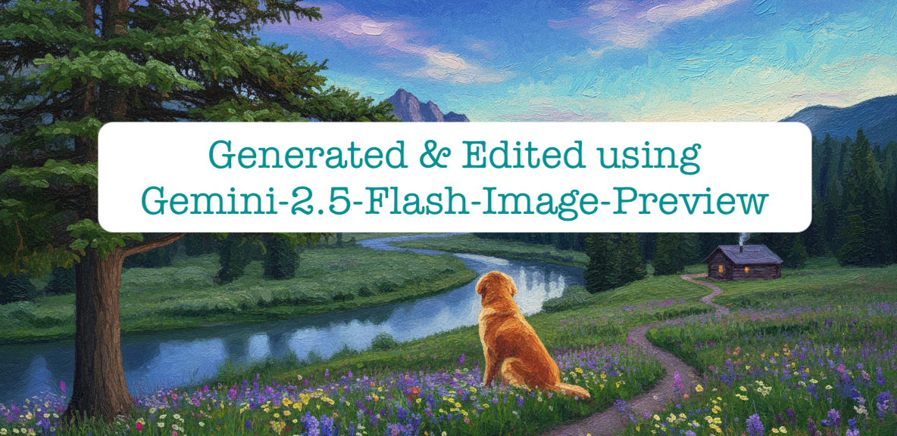
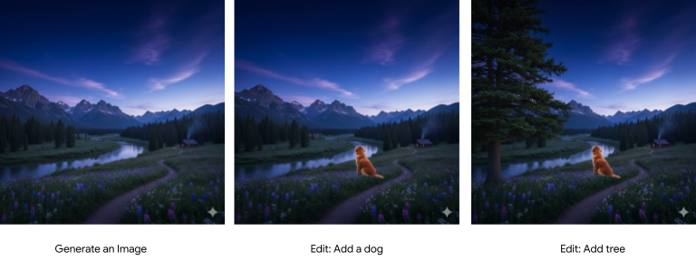
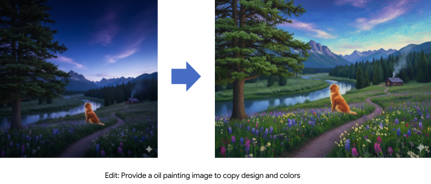

## **Gemini 2.5 Flash vs. Gemini 2.0 Flash: A New Era for AI Image Generation**

Google has once again pushed the boundaries of generative AI with the release of **Gemini 2.5 Flash Image (Preview)**, a significant upgrade to its predecessor, **Gemini 2.0 Flash Image**. While both models offer impressive image generation capabilities, Gemini 2.5 Flash introduces a suite of new features and enhancements that provide you with unprecedented creative control and higher-quality outputs. In this blog post, we will delve into the key differences between these two models, highlighting the advancements that make Gemini 2.5 Flash a game-changer for creators and developers.

---

### **Key Advancements in Gemini 2.5 Flash**

**Conversational Editing and Iterative Refinement:** One of the most significant improvements in Gemini 2.5 Flash is its ability to engage in **conversational editing**. This means you can now refine and edit images through a natural language dialogue. Instead of starting from scratch with a new prompt for every minor adjustment, you can provide iterative feedback. For instance, you can ask the model to "make the sky a deeper blue" or "add a dog in the background," and it will make the changes while preserving the rest of the image. This feature was more limited in Gemini 2.0, making the creative process in 2.5 much more fluid and intuitive.

You can find my final image at the [link](gemini-2.5-flash-image-preview.png).

**Multi-Image Fusion and Composition:** Gemini 2.5 Flash introduces **multi-image fusion**, a powerful feature that allows you to combine up to three images to create a single, seamless visual. This opens up a world of creative possibilities, from placing a product in a new environment to creating surrealist art. While Gemini 2.0 had some capabilities in this area, 2.5 takes it a step further with more sophisticated blending and composition, resulting in more photorealistic and coherent images.

**Character and Style Consistency:** Maintaining a consistent character or style across multiple images has always been a challenge for AI image generators. Gemini 2.5 Flash addresses this with enhanced **character and style consistency**. You can now generate images of the same character in different scenes, outfits, or poses, and the model will maintain their key features and appearance. This is a massive leap forward for storytelling, branding, and any application that requires a consistent visual identity.

**Improved Visual Quality(Aspect ratio) and Text Rendering:** Gemini 2.5 Flash boasts a noticeable improvement in overall **visual quality**. The images generated are more detailed, vibrant, and photorealistic than those from Gemini 2.0. Furthermore, the model's ability to render **text within images** has been significantly enhanced. This means you can create posters, invitations, and other designs with clear, legible text, a task that was often a struggle for previous models.

---

### **The Verdict: A Leap Forward in Creative Control**

While Gemini 2.0 Flash was a powerful tool in its own right, Gemini 2.5 Flash represents a significant evolution in AI image generation. The introduction of conversational editing, multi-image fusion, and enhanced consistency gives creators an unparalleled level of control over the final output. These advancements, combined with the improvements in visual quality and text rendering, make Gemini 2.5 Flash an indispensable tool for anyone looking to push the boundaries of their creativity. As AI-powered image generation continues to evolve, Gemini 2.5 Flash has set a new standard for what's possible.

### Links:
* [Gemini 2.5 Flash Image Preview](https://cloud.google.com/vertex-ai/generative-ai/docs/models/gemini/2-5-flash#image)
* [Gemini 2.0 Flash Image](https://cloud.google.com/vertex-ai/generative-ai/docs/models/gemini/2-0-flash#image-generation)