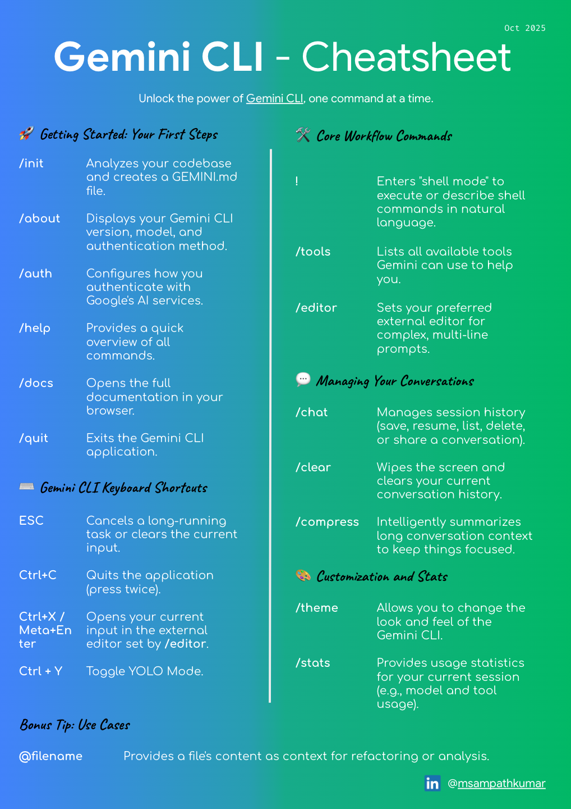
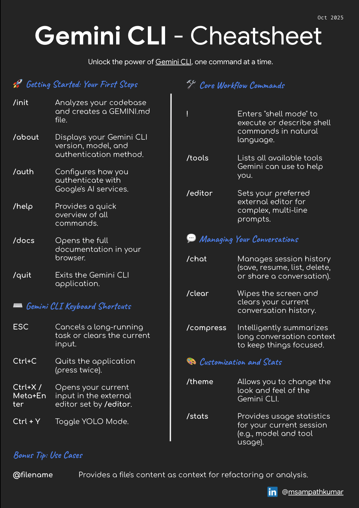

# Gemini CLI Cheatsheet Printout

Google's Gemini models are a powerful family of multimodal AI models. For developers and power users who live in the terminal, `gcloud` provides a robust command-line interface to interact with Gemini on Vertex AI.
 
To help you keep the most common commands at your fingertips, I've created a handy CLI cheatsheet available in both light and dark themes. Download your preferred version and get started!
 
## Light Theme

**Download Links**: [PNG](gemini-cli-cheatsheet-printout/cheatsheet.png) & [PDF](gemini-cli-cheatsheet-printout/cheatsheet.pdf).

## Dark Theme

**Download Links**: [PNG](gemini-cli-cheatsheet-printout/cheatsheet-dark-theme.png) & [PDF](gemini-cli-cheatsheet-printout/cheatsheet-dark-theme.pdf).

## Getting Started
 
Before you can use these commands, you need to set up your local environment and Google Cloud project. Follow the [Gemini Cookbook Setup guide](https://github.com/google-gemini/gemini-cli?tab=readme-ov-file#-installation) to get everything configured correctly.
 
Happy coding!
