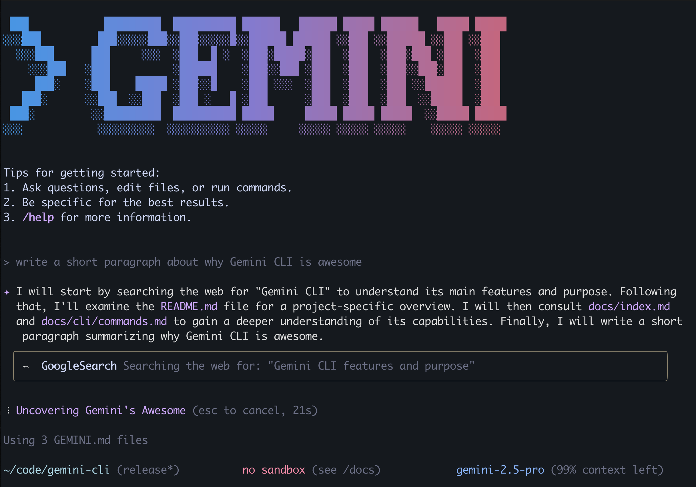

# Master Your Workflow: Top Gemini CLI Commands You Should Know

Picture this: you're deep in your coding workflow. You need to refactor a complex function, write a clear and concise commit message for your latest changes, and then figure out an obscure shell command to deploy your work. Each task requires switching context—moving from your editor to a browser, then to your Git client, and back again. It's a constant juggling act that breaks your focus.

What if you could do all of this from one place, your terminal? The Gemini CLI brings the power of Google's state-of-the-art AI directly to your command line, acting as a seamless, context-aware pair programmer. It's designed to understand your project, streamline your tasks, and keep you in the flow.

## 🚀 Getting Started: Your First Steps

Before you can master your workflow, you need to get set up and oriented. These commands are the foundation.

*   **/init** 🎬: This is where your journey should begin. Running `/init` in your project directory allows Gemini to analyze your codebase and create a `GEMINI.md` file.

*   **/about** ℹ️: Curious about your setup? This command quickly displays your Gemini CLI version, the underlying model being used, and your current authentication method.

*   **/auth** 🔑: Security and access are paramount. The `/auth` command lets you configure how you authenticate with Google's AI services.

*   **/help & /docs** 📚: The `/help` command is your go-to for a quick overview. For more details, `/docs` opens the full documentation in your browser.

*   **/quit** 👋: When you're done for the day, simply use `/quit` to exit the Gemini CLI application.

## 🛠️ Core Workflow Commands

These are the commands you'll use day-to-day to interact with Gemini and your codebase.

*   **`!` (Shell Commands)** 🐚: This is one of the most powerful features. Press `SHIFT + 1` to enter "shell mode," allowing you to execute shell commands or describe them in natural language.

    <!-- TODO: Generate a GIF demonstrating natural language shell command, e.g., user types "list all ts files" and Gemini executes `find . -name "*.ts"` -->

*   **/tools** 🧰: Ever wonder what capabilities Gemini has? The `/tools` command lists all available tools Gemini can use to help you.

*   **/editor** ✍️: **Pro-Tip:** For complex, multi-line prompts, use `/editor` to set your preferred external editor (like Vim or VS Code), then use `Ctrl+X` to open it.

## 💬 Managing Your Conversations

A conversation with Gemini is a valuable asset. Here's how to manage it effectively.

*   **/chat (save, resume, list, delete, share)** 💾: The `/chat` command is a powerful tool for managing your session history. `save` a conversation, `resume` it later, or `share` it as a file.

    <!-- TODO: Generate a GIF demonstrating the /chat save and /chat resume workflow, showing a user saving a session and coming back to it later. -->

*   **/clear** 🧹: Need a fresh start? `/clear` will wipe the screen and your current conversation history.

*   **/compress** 🧠: When a conversation gets long, `/compress` intelligently summarizes the context to keep things focused.

## 🎨 Customization and Stats

Tailor the CLI to your liking and keep an eye on your usage.

*   **/theme** 🖌️: Customize your experience. The `/theme` command allows you to change the look and feel of the Gemini CLI.

*   **/stats** 📊: Curious about your usage? `/stats` provides statistics for your current session, including model and tool usage.

## ⌨️ Gemini CLI Keyboard Shortcuts You Should Know

To work even faster, it's worth learning a few essential keyboard shortcuts.

*   **`ESC`**: Cancel a long-running task or clear your input.
*   **`Ctrl+C`**: Quit the application (press twice).
*   **`Ctrl+X` / `Meta+Enter`**: Open your input in an external editor.
*   **`Enter`**: Send your query to Gemini.

## ✨ Common Use Cases to Try Today

Here are a few practical ideas to get you started:

*   **Quick Refactoring:** Use `@` to provide a file as context (e.g., `@src/utils.py`) and ask Gemini: "Refactor the `calculate_total` function in this file to be more readable."
*   **Commit Message Generation:** Run `!git diff --staged` and then ask Gemini: "Based on the diff, write a conventional commit message."
*   **Command-Line Coach:** Paste a complex shell command and ask: `tar -xzvf archive.tar.gz` "What do each of these flags do?"

```aiexclude
╭────────────────────────────────────────────────────────────────────────────────────────────────────────────────────────────────────╮
│ >   tar -xzvf archive.tar.gz what does each flag do                                                                                             │
╰────────────────────────────────────────────────────────────────────────────────────────────────────────────────────────────────────╯

✦ Of course. The command tar -xzvf archive.tar.gz is used to decompress and extract files from a gzipped tar archive.

  Here is a breakdown of what each flag does:

   * -x: eXtract. This tells tar to get files out of the archive.
   * -z: gZip. This tells tar to decompress the archive using gzip. This is necessary for files ending in .gz.
   * -v: Verbose. This makes tar list each file as it is being extracted, so you can see the progress.
   * -f: File. This flag must be followed by the name of the archive file you want to process (in this case, archive.tar.gz).

  You can think of the command as saying: "eXtract the gZipped contents Verbosely from the File named archive.tar.gz."
```

## 🎉 Takeaway: You're One Step Ahead!

Congratulations on making it through this guide! By familiarizing yourself with these commands and workflows, you're already one step ahead of many developers who might not be tapping into the full potential of having an AI assistant directly in their terminal.

Thank you for investing the time to level up your skills. We encourage you to start integrating these commands into your daily routine. You'll be surprised at how much time you can save and how much more you can accomplish.

Now we'd love to hear from you! What new command did you learn that you're most excited to try? Share your thoughts in the comments below!
