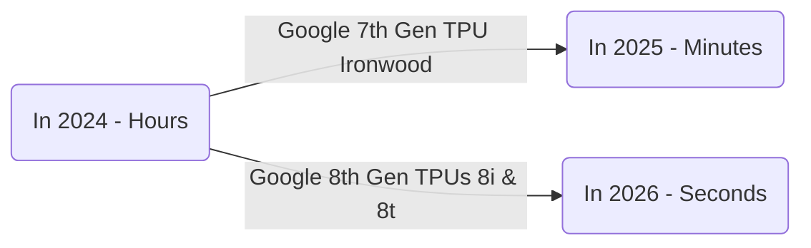

**

# Google Cloud Next 2026 (1/5) - Intro, Agentic Cloud & Next Gen Infrastructure

> This is from my personal collection/notes. Hope you find it informative :)

## Keynote by Thomas Kurian, CEO of Google Cloud: The Agentic Cloud ☁︎

At Next, Thomas Kurian signaled a major transition from the `experimental phase 🧪` of generative AI toward `building and deploying agentic systems at a global scale 🌍`. This shift fundamentally moves AI away from being just a standalone tool or chatbot, transforming it into a vertically optimized operating layer that orchestrates hardware, data, and security in a single, cohesive stack.

For those unable to attend the conference, my core takeaway is the emergence of a "unified control plane." The ultimate value of a cloud provider will no longer be defined by raw storage or compute units, but by its ability to securely manage swarms of specialized agents that successfully delegate complex business outcomes.

---

# Next-Generation Infrastructure

The architectural requirements for autonomous agents differ substantially from the batch-processing and training-intensive workloads of the previous decade. To address these needs, Google Cloud unveiled its **eighth generation** of custom silicon, strategically bifurcating its Tensor Processing Unit (TPU) architecture to optimize for the two distinct phases of the AI lifecycle: training and inference.

## 8th Generation TPUs for Agentic Training and Inference

The TPU 8t (Training) and TPU 8i (Inference) represent a significant philosophical shift in hardware design. They are moving away from general-purpose accelerators toward specialized chips co-designed with the Gemini 3.x model family.

To put this into perspective, let's look at a practical example. Suppose you have an AI workload that typically costs $100 and takes 1 hour. Using the Ironwood chips released at Google Next 2025, you could complete that same work in 15 to 30 minutes for about $70. That wasn't just a 30% cost savings—it cut completion time by over 50%. Now, with the new 8th Gen TPUs, that same workload could potentially be completed in just 10 minutes for training workloads, or a lightning-fast 5 minutes (300 seconds) for inference workloads.

Here is how we are beginning to measure AI workloads now:

To read more: https://blog.google/innovation-and-ai/infrastructure-and-cloud/google-cloud/eighth-generation-tpu-agentic-era

## Virgo Network: Google’s New Scale-Out Data Center Fabric

Massive compute power only goes so far if the networking fabric cannot keep accelerators fed with data. Google Cloud introduced the Virgo Network, a custom-built data center fabric designed to connect massive supercomputers with deterministic, low latency. With foundational model parameters growing exponentially, traditional networks are reaching their limits. Think of it as removing every stoplight and intersection on a highway so data can move in a straight line. It isn't just faster hardware; it's a fundamental shift in network topology.

This Virgo Network can link **134,000 chips (TPU 8t)** with up to **47 petabits/sec** of non-blocking bi-sectional bandwidth in a single fabric. Imagine training your AI models on this infrastructure - the speed and performance would be simply mind-blowing!

To read more: https://cloud.google.com/blog/products/networking/introducing-virgo-megascale-data-center-fabric

## Axion (ARM) Processor

Axion Processors are Google's custom Arm-based CPUs designed specifically for the data center. Compared to current-generation x86-based instances, these processors offer up to 50% better performance and 60% better energy efficiency. While Google announced the processors a while ago, they are now becoming **generally available (GA)** to Google Cloud customers. For businesses looking to slash their carbon footprint without sacrificing speed, Axion provides a clear path forward.

To read more: https://cloud.google.com/blog/products/compute/introducing-googles-new-arm-based-cpu

---

*In my next blog post, I will be diving into the brain of the Agentic Cloud—the Gemini Enterprise Agent Platform (GAP) and the newest additions to Google’s foundational model family. Stay tuned!*
