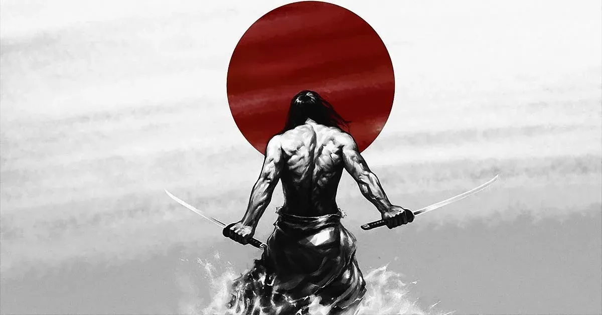

# 10 principles of Miyamoto Musashi



??? About Miyamoto Musashi

```
Miyamoto Musashi, a legendary figure in the annals of Japanese history, stands as a symbol of unparalleled mastery in the way of the sword. Renowned not only for his exceptional martial skills but also for his profound philosophical insights, Musashi is a name that resonates through the ages. Born in the late 16th century, during a tumultuous period of Japan’s history, Musashi’s life was marked by a relentless pursuit of perfection in the art of swordsmanship. His remarkable journey led him to become the author of the timeless classic, “The Book of Five Rings,” which continues to inspire warriors and thinkers alike, transcending both time and culture. This introductory glimpse into the life and legacy of Miyamoto Musashi only scratches the surface of his remarkable story, a tale of discipline, relentless ambition, and the quest for martial and spiritual enlightenment.
```

1. Accept everything just the way it is.
1. Do not seek pleasure for its own sake.
1. Do not under any circumstances, depend on a partial feeling.
1. Think lightly of yourself and deeply of the world.
1. Be detached from desire your whole life long.
1. Do not regret what you have done.
1. Never be jealous.
1. Never let yourself be surrounded by a separation.
1. Resentment and complaint are appropriate neither for oneself nor others.
1. Do not let yourself be guided by the feeling of lust or love.

Source:
[Link](https://medium.com/@zakinabdul.jzl/10-principles-of-miyamoto-musashi-2a8394e59b10)
