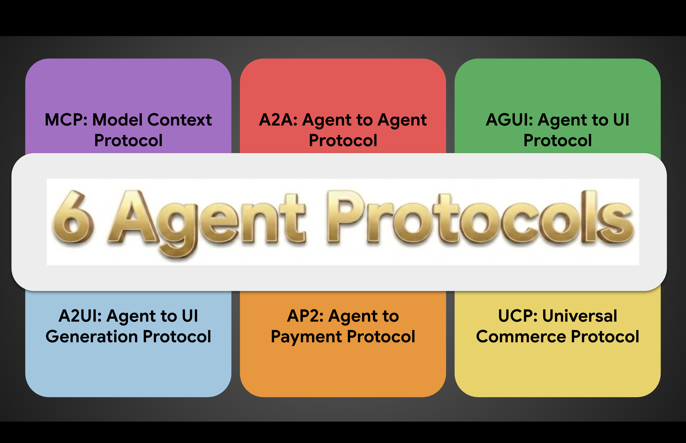
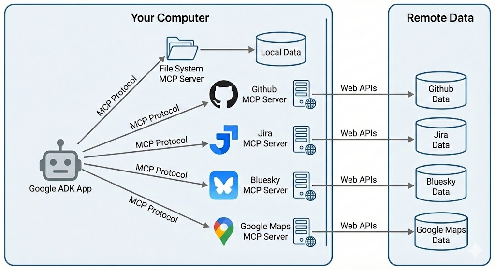
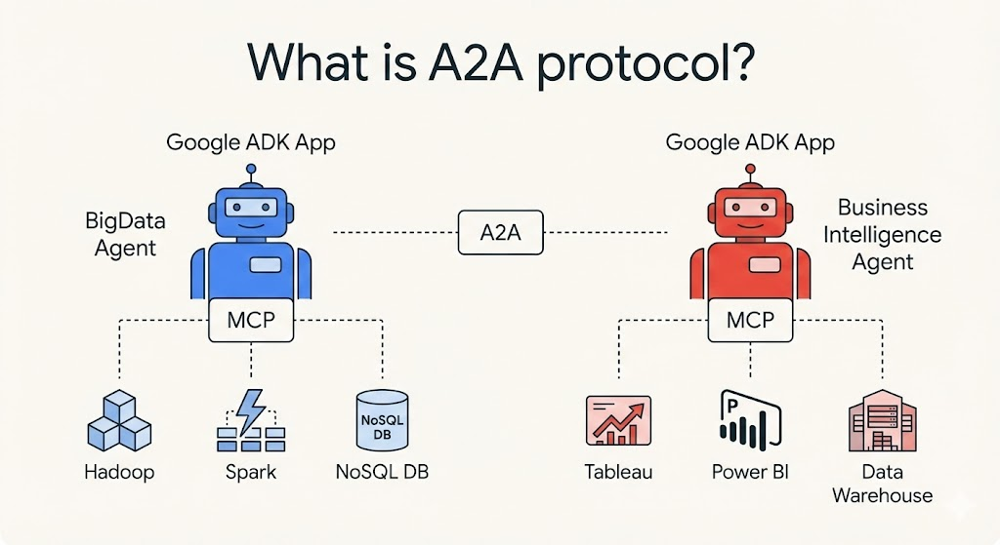
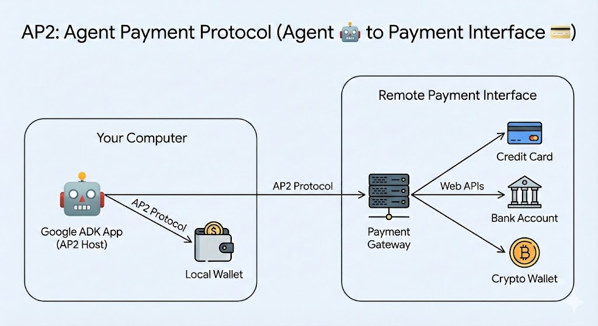

# The Six Essential Protocols Powering the AI Agent Ecosystem

> **TL;DR**: Six protocols are emerging as the foundation of AI agent architecture: MCP (tool access), A2A (agent collaboration), AG-UI (UI communication), A2UI (UI generation), AP2 (payments), and UCP (commerce). Together, they enable agents to interact seamlessly with tools, other agents, users, and commerce systems. Understanding these protocols today positions you at the forefront of the AI agent revolution.

| Protocol | Purpose | Key Benefit |
|----------|---------|-------------|
| **MCP** | Agent → Tools | One connector for every tool |
| **A2A** | Agent → Agent | Discover, coordinate, delegate |
| **AG-UI** | Agent → Frontend | Secure state & approval flows |
| **A2UI** | Agent → UI Generation | Rich interfaces, not just text |
| **AP2** | Agent → Payments | Cryptographic transaction safety |
| **UCP** | Agent → Commerce | One standard, every retailer |

As AI agents become increasingly sophisticated, the need for standardized communication protocols has never been more critical. Just as the internet was built on protocols like HTTP and TCP/IP, the emerging AI agent ecosystem is being shaped by a new generation of protocols that enable seamless interaction between agents, tools, users, and commerce systems.

Having worked extensively with AI agents over the past year, I've identified six foundational protocols that are shaping how agents interact with the world around them. Each protocol addresses a specific challenge in the agent ecosystem, and together they form the backbone of what I believe will be the standard architecture for AI agent applications.

## The Protocol Stack: From Tools to Commerce

### 1. MCP: Model Context Protocol (Agent 🤖 to Tools ⚙️)

**Purpose:** Connects agents to external tools and data sources seamlessly.

**Key Concept:** "One connector. Every tool."

The [Model Context Protocol](https://modelcontextprotocol.io/docs/getting-started/intro) solves a fundamental challenge: how do agents interact with the thousands of tools and data sources available today? Rather than building custom integrations for each tool, MCP provides a unified interface that allows agents to connect to databases, APIs, files, calendars, calculators, and virtually any other tool through a single protocol.

**Why it matters:** Without MCP, every agent would need custom code for every tool integration. With MCP, agents can instantly access any MCP-compatible tool, dramatically reducing development time and expanding capabilities.

### 2. A2A: Agent-to-Agent Protocol (Agent 🤖 to Agent 🤖)

**Purpose:** Enables agents to discover, coordinate with, and delegate tasks to other agents.

**Key Actions:** Discover, Coordinate, Delegate.

The [A2A Protocol](https://a2a-protocol.org/latest/) addresses the reality that no single agent can do everything. In complex workflows, agents need to collaborate. For example, an Inventory Agent might need to work with a Research Agent to understand market trends and a Pricing Agent to set optimal prices.

**Real-world scenario:** Imagine a supply chain optimization task where multiple specialized agents (logistics, inventory, demand forecasting) need to coordinate to minimize costs while maintaining service levels.

### 3. AG-UI: Agent-to-Frontend Protocol (Agent 🤖 to Frontend 📱)

**Purpose:** Manages the critical interaction layer between agents and user interfaces.

**Key Functions:** Streaming state updates, handling approval workflows, maintaining synchronization.

[AG-UI](https://docs.ag-ui.com/introduction) an open, lightweight, event-based protocol that standardizes how AI agents connect to user-facing applications. AG-UI is designed to be the general-purpose, bi-directional connection between a user-facing application and any agentic backend.

**Example:** When an agent needs to access sensitive data or perform a high-stakes action, AG-UI manages the approval flow, presenting the request to the user and waiting for confirmation before proceeding.

### 4. A2UI: Agent-to-User Interface (Agent 🤖 to User Interface 📱)

**Purpose:** Empowers agents to create dynamic, context-appropriate user interface elements.

**Key Concept:** Moving beyond plain text to rich, interactive experiences.

[A2UI](https://a2ui.org/) is an open standard and set of libraries that allows agents to "speak UI." Agents send a declarative JSON format describing the intent of the UI. The client application then renders this using its own native component library (Flutter, Angular, Lit, etc.)

**Benefit:** This creates a more intuitive and efficient user experience. For instance, instead of asking users to type out complex configuration options, an agent can generate a form with appropriate validation and helpful tooltips.

> **AG-UI vs A2UI**: Think of A2UI as the *blueprint for UI widgets* and AG-UI as the *secure communication channel moving them between the AI (backend) and your app (frontend)*.

### 5. AP2: Agent Payment Protocol (Agent 🤖 to Payment Interface 💳)

**Purpose:** Enables secure, auditable financial transactions for autonomous agents.

**Key Features:** Cryptographic proof at every step, granular permission controls.

The [AP2 Protocol](https://github.com/google-agentic-commerce/AP2) tackles one of the most challenging aspects of autonomous agents: handling money. It implements a three-stage mandate system:
- Intent Mandate: What the agent is authorized to do (e.g., "Buy shoes under $150")
- Cart Mandate: What the agent has selected
- Payment Mandate: The actual transaction execution

**Security focus:** Every step is cryptographically signed and auditable, ensuring agents can only act within their authorized boundaries.

### 6. UCP: Universal Commerce Protocol (Agent 🤖 to Commerce 🛍)

**Purpose:** Standardizes commerce interactions across different retailers and platforms.

**Key Concept:** "One standard. Every retailer."

[UCP](https://ucp.dev/) solves the fragmentation problem in e-commerce. Instead of agents needing to understand dozens of different checkout flows, product schemas, and API formats, UCP provides a unified interface for product search, cart management, checkout, and delivery tracking across any compatible retailer. (UCP is built on top of AP2.)

**Impact:** This enables true shopping agent experiences where a single agent can help users find and purchase products from multiple stores without custom integrations for each retailer.

## The Bigger Picture: An Integrated Ecosystem

These six protocols aren't just independent protocols—they work together to create a strong ecosystem:

## Real-World Impact: How These Protocols Transform Daily Work

Let me share an example. Say my friend runs a small marketing agency and recently started using AI agents. Here's what changed:

**Before protocols**: She had separate tools for project management (Asana), analytics (Google Analytics), client communication (Slack), and invoicing (QuickBooks). Her AI assistant could only help with basic tasks in isolation.

**After MCP adoption**: Her AI assistant now connects to all these tools through a single protocol. When a client emails about campaign performance, the assistant automatically:
- Pulls the latest analytics data
- Checks project status in Asana
- Drafts a comprehensive update email with actual metrics
- Suggests next steps based on the data

The game-changer? She didn't need to build custom integrations for each tool. The MCP-compatible assistant just worked with everything out of the box.

**The multiplier effect with A2A**: When she needs deeper analysis, her main assistant delegates to specialized agents—one for competitive analysis, another for content optimization. They collaborate behind the scenes and return unified recommendations.

This isn't some far-off vision. It's happening now. The protocols are removing the friction that kept AI assistants from being truly useful in real business workflows.

## Looking Ahead: The Protocol-First Future

As someone who's been building with AI agents, I'm convinced that these protocols—or something very similar—will become as fundamental to AI applications as REST APIs are to web services today. The teams building on these protocols now are positioning themselves at the forefront of the AI agent revolution.

**A question for the community:** Which of these protocols do you see as most critical for your use cases? Are there gaps that need addressing? I'd love to hear about your experiences building agent-based systems and the integration challenges you've faced.

#AIAgents #Protocols #AIDevelopment #MCP #A2A #AgentEconomy #AIIntegration