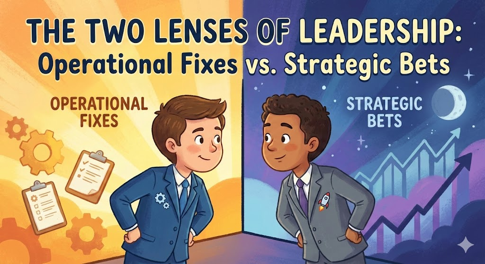
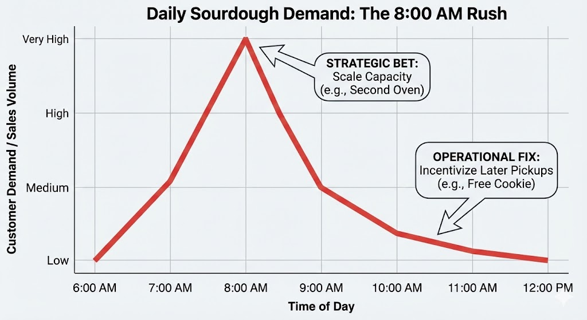

# The Two Lenses of Leadership: Operational Fixes vs. Strategic Bets

We all want to be "data-driven." It’s the mantra of modern business. Yet, one of the most thrilling moments in my professional journey wasn't just about discovering data; it was the profound realization that the same exact metrics can narrate two entirely different stories, simply by changing the lens through which you view them.

### The Bakery Analogy: A Tale of Two Lenses

Consider a hypothetical scenario to illustrate this dichotomy.

Imagine you own a bustling downtown bakery. You analyze your sales data and find a clear, undeniable trend: 80% of your customers want your signature sourdough piping hot at exactly 8:00 AM.

This demand creates chaos. The kitchen is overwhelmed, delivery drivers are stressed, and if anything goes wrong at 7:55 AM, customer satisfaction plummets.

### Lens 1: The Operational Fix

If you wear an **Operational Efficiency lens**, you look at that data and see a bottleneck. The logical conclusion is to smooth out the demand curve. Your thought process might lead to: *"Let's offer a free cookie to anyone picking up their sourdough after 10:00 AM."* The aim is to alleviate operational stress by subtly shifting customer behavior—a smart, efficient, and cost-effective solution.

### Lens 2: The Strategic Bet

But if you wear a **Strategic Growth lens**, you look at that same data and see massive, untapped desire. You don't see a bottleneck; you see your biggest competitive advantage. Your conclusion isn't to shift demand; it's to meet it. Instead, your rallying cry might be: *"Forget the cookies! Let's invest in a second oven and more morning staff to double our 8:00 AM sourdough sales."*

Thus, one perspective seeks to save by optimizing the existing framework, while the other aims to generate by aggressively scaling what truly resonates with customers.

### The Real-World Realization

I share this story because I recently went through my own version of the "8:00 AM sourdough rush" on a project.

We had clear data showing that a specific service protocol was overwhelmingly driving our success, but it was operationally taxing to execute. My immediate instinct—my operational lens—was to find ways to incentivize customers toward an easier alternative to relieve the pressure on our team.

Fortunately, a senior leader challenged me with the strategic lens. They argued that if this difficult protocol was the key to delighting our users, we shouldn't try to minimize it—we should figure out how to scale it aggressively.

### The Takeaway

This marked a thrilling moment of perspective shift. While neither approach was inherently 'wrong,' it unveiled an invaluable lesson: 

> Sometimes the path forward isn't merely to alleviate an operational pinch point by redirecting demand. Sometimes, the path forward is to lean into the difficulty, because it could be where the magic 🌟 happens.