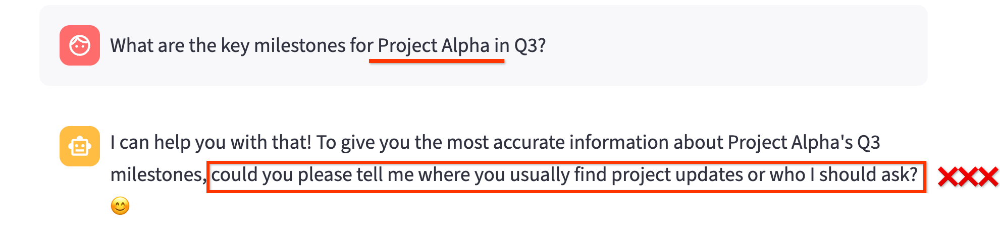
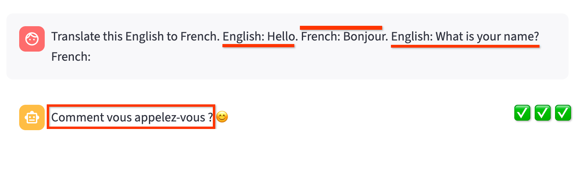
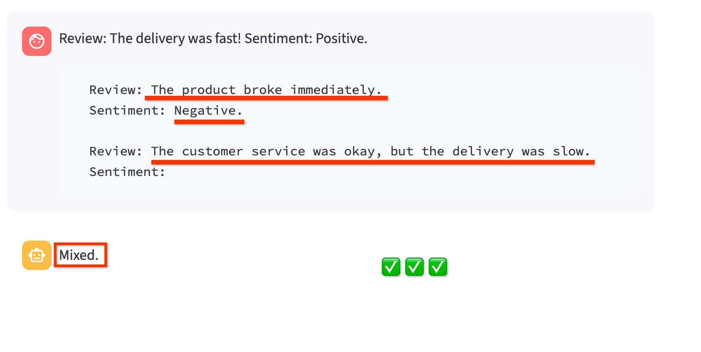
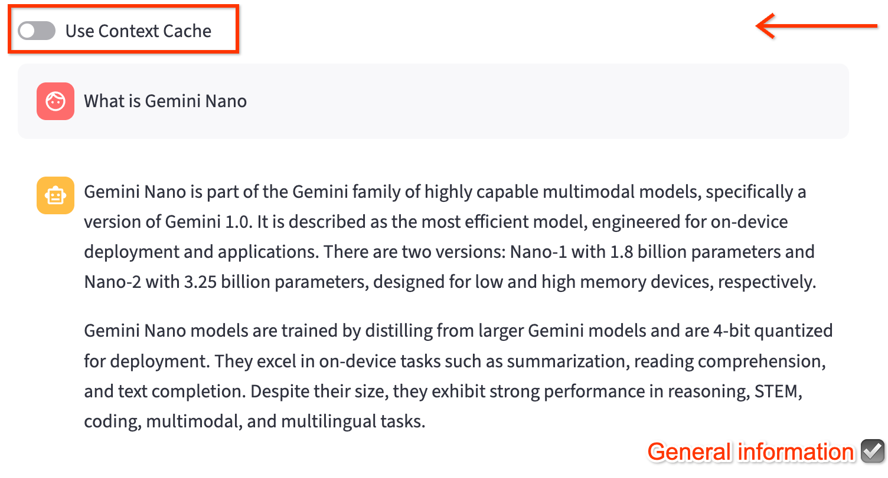
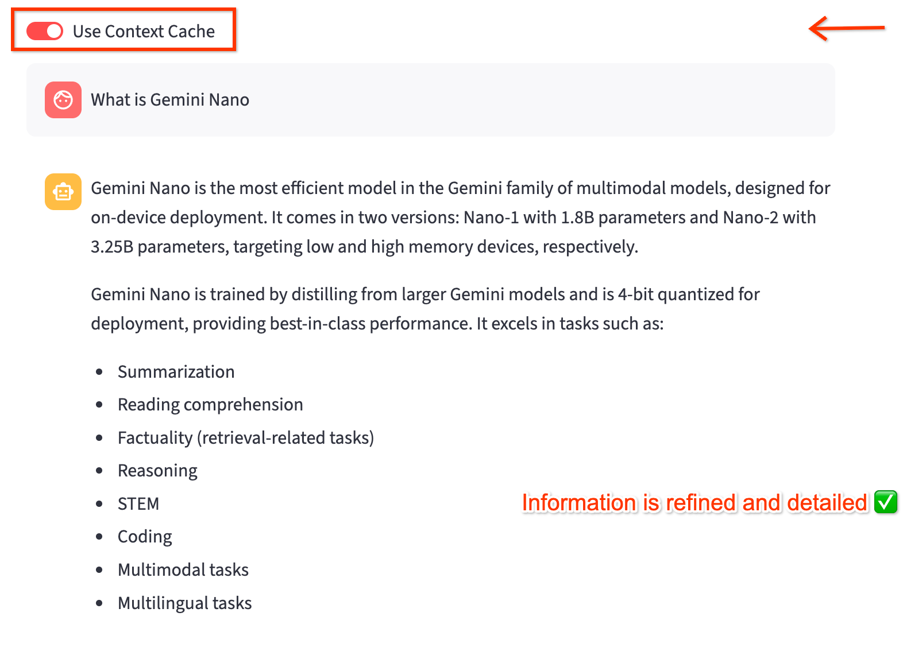

### Blog Post: Lesson 03

## 🚀 Build Your First Context-aware Gemini Chatbot in Minutes: The Secret to Speed and Relevance! ⚡

**Scenario:** It's Tuesday, July 22, 2025, 12:26 PM CEST. You're a developer,
enjoying your morning coffee in Warsaw ☕, contemplating your next big feature.
Suddenly, your director bursts in: "We need a quick demo of a new,
context-aware chatbot for our internal knowledge base – and the meeting is in
30 minutes! Can you get something ready?" 🤯

Panic? Absolutely not! Not with Gemini and Streamlit. This lesson is your
secret weapon to rapidly inject intelligence into your chatbot, focusing on
direct, consistent, and reusable context methods that get you up and running
with meaningful interactions fast. 🚀

______________________________________________________________________

### 1. Understanding Context: Why It's Your Chatbot's Superpower 🦸‍♀️

Large Language Models (LLMs) like Gemini are incredible, but they're not
clairvoyant. Without explicit guidance, their responses can be generic, vague,
or even incorrect when faced with specific or domain-sensitive questions.
Context is the "secret sauce" that transforms a generic LLM into a specialized,
helpful chatbot. It's the information you provide to guide the model's
understanding and shape its output. 💡

Consider a simple chatbot built with Gemini and Streamlit. If you ask it a very
specific question without any context, it might struggle.

**Example: A Generic Chatbot Responding to a Specific Query**

Let's say your basic Streamlit app simply forwards user input to Gemini. If you
ask about an internal project:

```bash
$ python llm.py

Chat session ID: 4383160272
Enter your question (or 'exit' to quit)

User: What are the key milestones for Project Alpha in Q3?

Model: I need a little more information to tell you about
   Project Alpha's Q3 milestones! Could you please tell me 
   more about what "Project Alpha" refers to? 😊

```

or via chatbot UI:

```
streamlit run streamlit_app.py
```



This is where context comes in. By providing context, you tell Gemini exactly
what "Project Alpha" means in _your_ world. ✨

______________________________________________________________________

### 2. In-Context Learning (ICL): Guiding with Examples, Instantly ✨

In-Context Learning (ICL) is the quickest way to demonstrate a desired output
pattern to Gemini. You provide explicit examples directly within your prompt,
and Gemini learns from these patterns without needing any fine-tuning. It's
like teaching by showing!

#### One-Shot Learning: A Single Guiding Example ☝️

For simple tasks, one example might be all you need. You show Gemini a single
input-output pair, and it follows that pattern for subsequent queries.

**Use Case:** Simple classification, rephrasing, or straightforward
translation. 🌐

**Example: One-Shot Translation**

```
User: Translate this English to French.
      English: Hello.
      French: Bonjour.
      English: What is your name?
      French:
Chatbot (With one-shot example): Quel est votre nom?
```



#### Few-Shot Learning: Reinforcing Complex Patterns 📚

When the task is more nuanced or requires a specific output format, providing a
few examples helps Gemini better grasp the pattern. It's like providing
multiple reference points for complex concepts.

**Use Case:** More nuanced categorization, structured data extraction, or
adhering to specific stylistic requirements. 📋

**Example: Few-Shot Sentiment Analysis**

```

User: Review: The delivery was fast!
      Sentiment: Positive.

      Review: The product broke immediately.
      Sentiment: Negative.

      Review: The customer service was okay, but the delivery was slow.
      Sentiment:
Chatbot (With few-shot examples): Mixed/Neutral
```



**Considerations:** While powerful for quick guidance, ICL consumes tokens with
every prompt, which can impact cost and latency for very long examples or many
turns. 💸🐢

______________________________________________________________________

### 3. System Instructions: Setting Your Chatbot's Personality and Rules 📜

System instructions define your chatbot's overarching persona, tone, and
behavioral guardrails. This is a foundational layer of context that applies to
_all_ subsequent user turns in a chat session, making Gemini's responses
consistent and aligned with your brand or application's requirements. It's like
giving your bot a permanent job description! 🧑‍💻

You define the "rules of engagement" for your chatbot, ensuring it behaves
predictably. 🚦

**Code Sample: llm.py (LLM Interaction Logic)**

System instructions are defined in the `llm.py` file.

```
chat_session = client.chats.create(
   model=MODEL_NAME,
   config=GenerateContentConfig(
      system_instruction=[
       "You're a helpful Gemini AI Chatbot.",
       "Answer user's questions and use simple and clear language."
       "When possible, reply to user's question with a single sentence or a few sentences.",
       "Free to use emojis."
       "Be open and friendly. Don't be afraid to ask questions or clarify things.",
      ]
  ),
)
```

______________________________________________________________________

### 4. Context Caching: Reusing Static Information Efficiently 📦

______________________________________________________________________

Imagine your chatbot needs to be an expert on a fixed set of documents, like
internal reports, product manuals, or, in our case, specific research papers.
Sending these large documents with every single API call would be slow and
expensive. This is where **Context Caching** becomes a game-changer.

Gemini's Context Caching allows you to process and store static,
frequently-referenced content once. You then refer to this cached content using
a simple, lightweight name in your subsequent API calls. This drastically saves
tokens, reduces latency, and lowers costs, especially when dealing with large
files.

**Example Use Case**: Efficient retrieval of information from large, static
knowledge bases, optimizing token usage, and simplifying your requests to
model. 📦

Let update our chatbot a chatbot to be expert on the Gemini family of models,
using two key research papers as its knowledge base.

- Paper 1: Gemini: A Family of Highly Capable Multimodal
  Models.([2312.11805v3.pdf](https://storage.cloud.google.com/cloud-samples-data/generative-ai/pdf/2312.11805v3.pdf))
- Paper 2: Gemini 1.5: Unlocking multimodal understanding across millions of
  tokens of context
  ([2403.05530.pdf](https://storage.cloud.google.com/cloud-samples-data/generative-ai/pdf/2403.05530.pdf))Instead
  of feeding these PDFs to the model repeatedly, we'll cache them and let our
  chatbot use that cached knowledge.

### How It Works: A Two-Step Process

**Step 1: Create the Cache**

First, you need to upload your static files and create a CachedContent object.
This is a one-time operation. You'll save the name of the cache to use in your
application later.

Full code:
https://github.com/GoogleCloudPlatform/python-docs-samples/blob/main/genai/content_cache/contentcache_create_with_txt_gcs_pdf.py

```python
system_instruction = """
You are an expert researcher.
You always stick to the facts in the sources provided, and never make up new facts.
Now look at these research papers, and answer the following questions.
"""

cache_objects = [
    Part.from_uri(
        file_uri="gs://cloud-samples-data/generative-ai/pdf/2312.11805v3.pdf",
        mime_type="application/pdf",
    ),
    Part.from_uri(
        file_uri="gs://cloud-samples-data/generative-ai/pdf/2403.05530.pdf",
        mime_type="application/pdf",
    ),
]

content_cache = client.caches.create(
    model="gemini-2.5-flash",
    config=CreateCachedContentConfig(
        contents=[Content(role="user", parts=cache_objects)],
        system_instruction=system_instruction,
        display_name="example-cache",
        ttl="86400s",
    ),
)
```

**Note**: Cache is created with a TTL (time to live). After a specific amount
of time, the cache will be deleted.

Once the cache is created you will a cache name (e.g.,
cachedContents/f1e2d3c4-a5b6-7890-a1b2-c3d4e5f6a7b8), which we will use with
chatbot.

**Step 2: Use the Cache in Your Chatbot**

Once the cache is created, you can use it in your chatbot by passing its name
in the `GenerateContentConfig` object. For example:

```python
system_instruction = "..."
cache_name = ("projects/.../locations/us-central1/keyRings/.../cryptoKeys/...",)

chat_session = client.chats.create(
    config=GenerateContentConfig(
        cached_content=cache_name,
        system_instruction=None if cache_name else system_instruction,
    )
)
```

Since the Cache has a defined timelimit, it required a little attention to
avoid any potential issues. So I hae created a CacheManager to manage the
cache, which will automatically clean up expired caches.

Here is the content for `cache.py`

Examples:

**Here is the example of not using Context Cache:**



**Here is the example of using Context Cache:**



## **To Deploy This Application on Google Cloud Run:**

1. Clone this repository and navigate to the directory

```bash
git clone https://github.com/msampathkumar/msampathkumar.github.io.git
cd docs/google-cloud-gemini-cookbook/lesson-03
```

2. Setup your virtual environment and install dependencies:

```bash
python3 -m venv .venv
source .venv/bin/activate
pip install -r requirements.txt
```

3. Run the application locally to make sure it works as expected.

```bash
streamlit run streamlit_app.py
```

4. To deploy to Google Cloud Run, you can use the `deploy.sh` script:

```bash
bash deploy.sh
```

Github:
https://github.com/msampathkumar/msampathkumar.github.io/tree/master/docs/google-cloud-gemini-cookbook

### Congratulations 🎉 ( ◠‿◠ )

Congratulations, You've Achieved a Milestone!

You successfully deployed a content-aware chatbot application to Google Cloud
Run.

In the next lesson, we will delve into two more features that will further
enhance your chatbot's context awareness:

1. **RAG**: Retrieval Augmented Generation (RAG)
1. **Grounding**: Using Google Search

Let's continue learning and exploring these innovative tools together!
