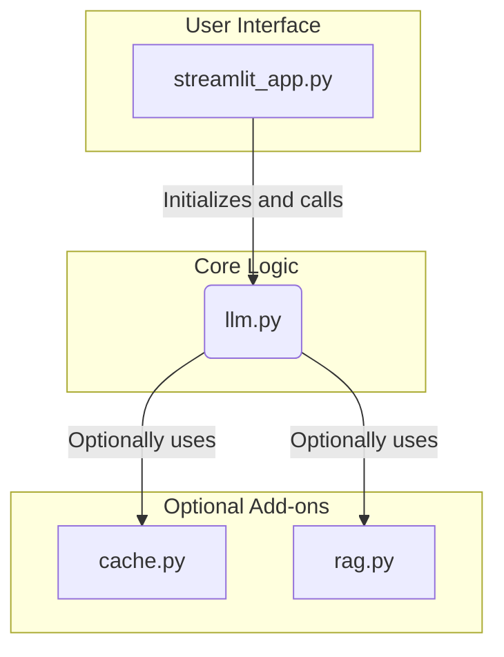
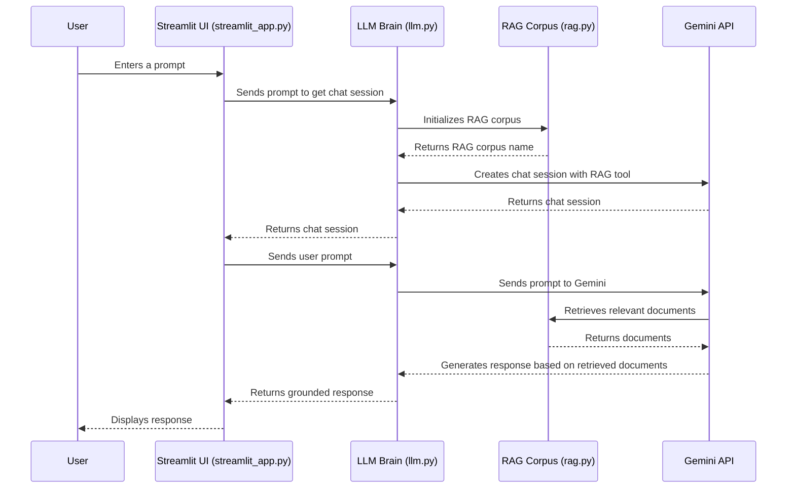
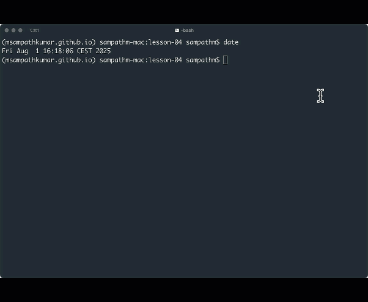

### Blog Post: Lesson 04

## 🔓 Unlock Enterprise AI: Grounding Gemini with RAG and Google Cloud Search 🚀

Welcome back! 👋 In Lesson 03, we built fast, relevant chatbots using direct
context methods like In-Context Learning ✨, System Instructions 📜, and Context
Caching 📦. Those are fantastic for quick demos and consistent persona. But what
if your chatbot needs to know the _latest_ company sales figures, details from
an obscure internal report, or specific client history? That's where Large
Language Models (LLMs) hit their limit – they hallucinate! 😵‍💫

Today, we tackle the next frontier: **Grounding** your Gemini models in
real-time, external, and even proprietary data using **Retrieval Augmented
Generation (RAG)**, with Google Cloud Search as your powerful engine. 🔍

______________________________________________________________________

### 1. Grounding LLMs: Combating Hallucinations with External Knowledge 🛡️

LLMs are brilliant pattern matchers, trained on vast amounts of internet data.
However, their knowledge is frozen at their last training cut-off date. They
don't have real-time access to the internet, nor do they inherently know your
company's internal documents, recent sales data, or specific client
interactions. When asked about such information, they might:

- **Refuse to answer:** "I don't have information on that." 🤷‍♀️
- **Generate generic or outdated information:** "According to general industry
  trends..." 🗓️
- **"Hallucinate":** Make up plausible-sounding but entirely false information.
  This is the most dangerous! 🚨

**Example: A Chatbot Hallucinating on Proprietary Data**

Let's revisit our chatbot. If you ask about specific, sensitive internal data:

```
User: What was our Q1 revenue for the 'Project Phoenix' initiative for the EMEA region?
Chatbot (Gemini, no grounding): For Project Phoenix in 

Q1, the EMEA region generated an estimated $12.5 million, driven by strong performance in software licensing. We anticipate continued growth...

```

_(Imagine a screenshot here: A Streamlit UI with the user's highly specific
financial query and a chatbot response that sounds confident but is entirely
fabricated, as the data is proprietary and not in Gemini's training. A big red
X emoji to emphasize the hallucination.)_ ❌

This is a problem. In enterprise settings, accuracy is paramount. We need a way
to connect Gemini to our actual, verifiable knowledge. This is called
**grounding**. 🌱

______________________________________________________________________

### 2. Introduction to Retrieval Augmented Generation (RAG): Your LLM's Research Assistant 🧑‍🎓

Retrieval Augmented Generation (RAG) is an architectural pattern that solves
the hallucination problem by giving LLMs access to external, up-to-date, and
domain-specific information.

Think of RAG as giving your LLM a brilliant research assistant: 🧐

1. **Retrieve:** When you ask a question, the "research assistant" first
   searches a vast library (your knowledge base) for relevant documents or
   snippets. 📚
1. **Augment:** It then takes the most relevant findings and gives them to the
   LLM. 🧩
1. **Generate:** Finally, the LLM uses this specific, retrieved information
   (along with your original query) to formulate an accurate and grounded
   response. ✅

**Key Components of a RAG System:**

- **Knowledge Base:** Your source of truth – internal documents, databases,
  websites, etc. 📁
- **Retriever:** A system (like a vector database combined with an embedding
  model, or a powerful search engine like Google Cloud Search) that can quickly
  find the most relevant pieces of information from your knowledge base based
  on a query. 🔎
- **Generator:** The LLM (Gemini) that synthesizes the answer using the
  retrieved context. 🧠

**Benefits of RAG:**

- **Factuality:** Grounding responses in real data dramatically reduces
  hallucinations. ✅
- **Currency:** LLMs can answer questions about information that wasn't in
  their training data or is constantly changing. ⏰
- **Domain-Specific Knowledge:** Access to proprietary or niche topics. 💼
- **Attribution:** Potential to show users _where_ the information came from
  (e.g., "Source: Policy Manual v2.1"). 🔗

**RAG vs. Context Cache: A Crucial Distinction** 🚨

It's vital to differentiate RAG from Context Caching (Lesson 03).

- **Context Cache:** _Reuses_ small, static pieces of pre-loaded or
  conversational context. It's about efficiency for fixed data, avoiding
  redundant token usage. Think of it as a persistent "sticky note" or
  short-term memory for repeated instructions or small data blocks. 📝
- **RAG:** _Dynamically retrieves_ specific, often large, and always relevant
  chunks of information from a vast, external knowledge base _on demand_ for
  each query. It's about expanding the LLM's factual knowledge with new,
  current, or private data. 🌐

______________________________________________________________________

### 3. Application Architecture

This application is designed to be a flexible and extensible chatbot that can
leverage different grounding techniques. Here's a breakdown of the core
components:



[//]: # (![Sequence Diagram]&#40;./sequence_flow_chart.png&#41;)

**Core Application Logic:**

- **`streamlit_app.py` (UI):** This is the user-facing component of the
  application, built with Streamlit. It provides the chat interface, handles
  user input, and displays the LLM's responses. It's the "skin" of our
  application.
- **`llm.py` (The Brain):** This module is the central nervous system of our
  chatbot. It's responsible for all interactions with the Gemini API. It takes
  the user's prompt, and based on the selected mode (Default, Context Cache, or
  RAG), it constructs the appropriate request to the Gemini model.
- **`cache.py` (Optional Battery):** This module manages the Context Cache.
  When the "Use Context Cache" option is selected, `llm.py` uses this module to
  create and manage a cache of context, which can be reused across
  conversations to improve speed and reduce costs.
- **`rag.py` (Optional Battery):** This module handles the Retrieval-Augmented
  Generation (RAG) functionality. When the "Use RAG as Tool" option is
  selected, `llm.py` uses this module to create and manage a RAG corpus. This
  allows the LLM to retrieve information from a knowledge base to answer
  questions.

**Code Links:**

- [streamlit_app.py](https://github.com/msampathkumar/msampathkumar.github.io/tree/master/docs/google-cloud-gemini-cookbook/lesson-04/streamlit_app.py)
- [llm.py](https://github.com/msampathkumar/msampathkumar.github.io/tree/master/docs/google-cloud-gemini-cookbook/lesson-04/llm.py)
- [cache.py](https://github.com/msampathkumar/msampathkumar.github.io/tree/master/docs/google-cloud-gemini-cookbook/lesson-04/cache.py)
- [rag.py](https://github.com/msampathkumar/msampathkumar.github.io/tree/master/docs/google-cloud-gemini-cookbook/lesson-04/rag.py)

### 4. RAG Implementation Flow

Here’s a more detailed look at how the RAG process works within our application
when the "Use RAG as Tool" option is enabled:



### 5. Application Screenshots



______________________________________________________________________

## Conclusion

This lesson demonstrated how to ground Gemini models with external knowledge
using RAG. By leveraging RAG, we can build more accurate, factual, and useful
AI applications that can reason about private and real-time data.
