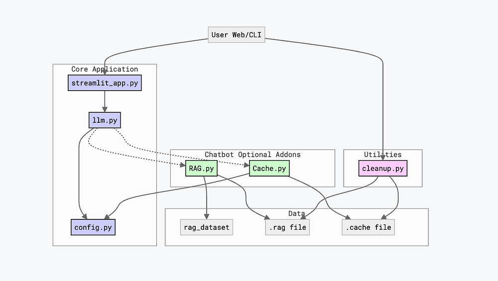
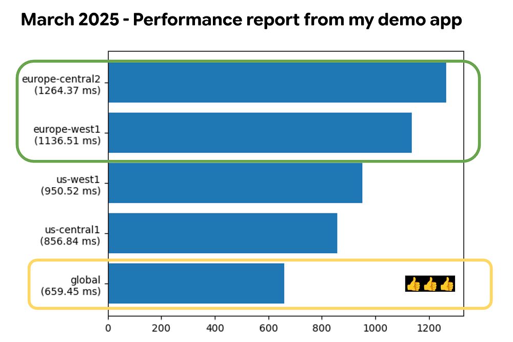
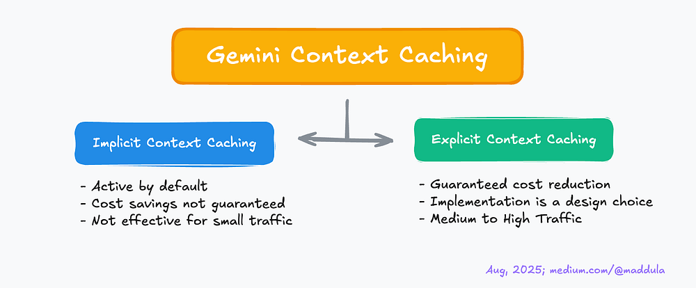
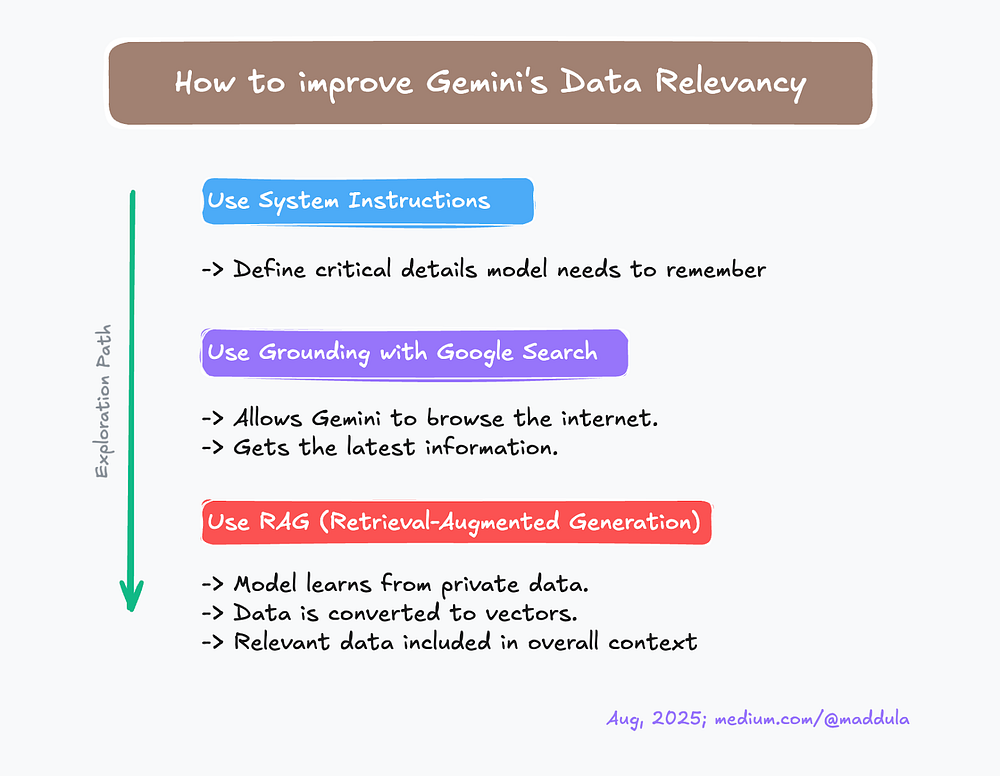
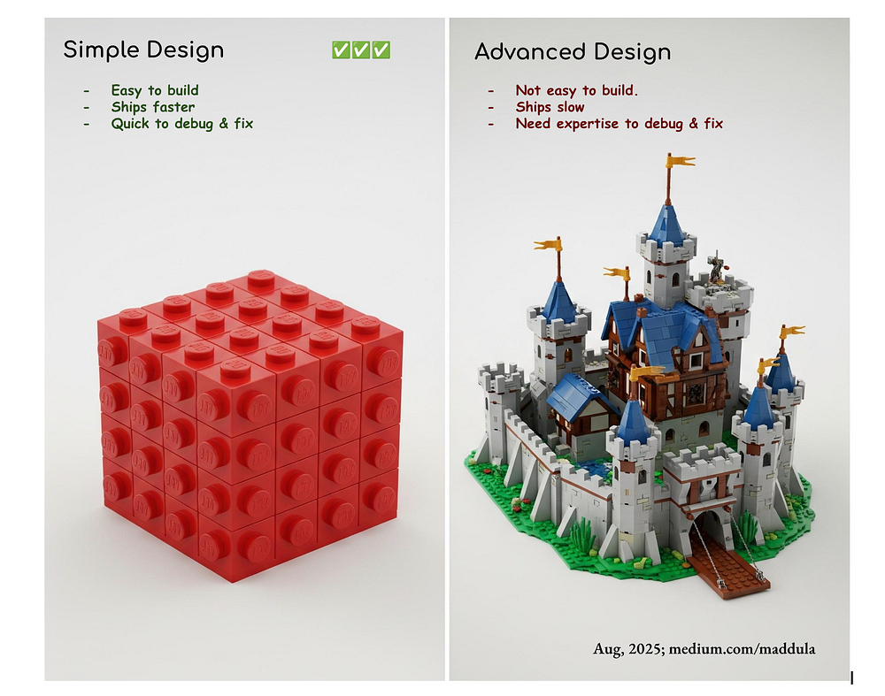
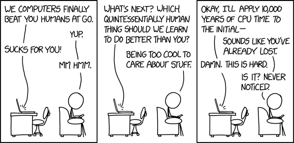

# **Cookbook Lesson 05: Review - Five Takeaways to enhance your Gemini Apps**

Welcome to Lesson 05 of my Gemini Cookbook series :)

The potential of Gemini is limitless, but unlocking its true power requires
more than just a ‘hello world’ app. It demands a strategic approach to
performance, cost, and design. In this lesson 05, we’ll transform that
potential into reality by exploring 5️⃣ key takeaways that will elevate your
Gemini applications to the next level.

In Lessons 01 through 04, we covered essential topics, from building a “_hello
world_” app to creating powerful, context-aware chatbots. In this Lesson 05,
we’ll do a quick recap of those earlier lessons and then dive into some
important tips and takeaways for building great Gemini features applicable to
most users.

> This lesson is the last part of the 5 part series
> [Google Cloud - Gemini Cookbook (GitHub Link)](https://github.com/msampathkumar/msampathkumar.github.io/tree/master/docs/google-cloud-gemini-cookbook/).

## **Takeaway 01: Multi-Layered Application**

Let me quote from a Google Developer Advocate.

“To effectively monitor your agent, it’s best to adopt a practical, **layered
approach**. Here’s a guide to setting up observability at every stage of the
development lifecycle.” -
[Alvin Prayuda Juniarta Dwiyantoro](https://medium.com/google-cloud/prepping-your-agent-for-production-observability-for-agent-development-kit-adk-a6d74c744ef2)

Building an application and its features can become a cascading challenge,
especially when you aim for an app that can be used, maintained, updated, and
deployed to production environments. As mentioned in the quote, building
applications with a layered approach can help streamline the overall
development flow.

### **Flow chart**

_[Lesson 04 Github-Link](https://github.com/msampathkumar/msampathkumar.github.io/tree/master/docs/google-cloud-gemini-cookbook/lesson-04)_

This tutorial series built a sophisticated chatbot over four lessons.

- **Lesson 01:** We started with streamlit_app.py to create a basic “hello
  world” page and learned deployment fundamentals.
- **Lesson 02:** We developed llm.py, the chatbot’s “brain,” using Google’s
  GenAI SDK, and designed the user interface for interactive chat sessions.
- **Lesson 03:** We added contextual awareness using System Instructions and a
  Context Cache to maintain coherent conversations.
- **Lesson 04:** We expanded the chatbot’s context to external resources like
  Google Search and external data stores via Retrieval Augmented Generation
  (RAG).

To maintain simplicity, Lessons 03 and 04 utilize a layered architecture (for
code), adding new features as distinct modules. This actually differs with the
initial approach, where a single file facilitated early development. As
features expanded, I realized the benefits of dedicated modules like RAG.py and
Cache.py over modifying existing files, which significantly streamlined
development, testing, and debugging.

This layered approach proved effective in our application. The following
sections detail further takeaways from my experiments and explorations.

## **Takeaway 02: Improve your speed**

Large Language Models (LLMs) are extensive software applications that utilize
significant CPU, memory, and network resources. Much like services such as
BigQuery or Cloud SQL, these models are globally hosted, serving users
worldwide. In this section, we will observe how you can improve model responses
speed.

### **021 Global Endpoints (GE):**

This section presents my personal explorations and hypotheses.

It’s common to assume that proximity to the LLM’s physical location ensures
optimal performance. While reduced network latency is a factor, it doesn’t
account for the entire picture. LLMs operate as shared services, inherently
utilizing a first-in, first-out queuing system. Therefore, the ideal location
selection hinges on the equation: **_min_response(Nearby locations + shorter
queue)_**. When incorporating additional variables like time and potential
datacenter disruptions (e.g., maintenance, power failures, or even submarine
cable issues), the optimal solution evolves to **_min_response(Nearby
\*available\* locations + shorter queue)._**

However, forecasting all these conditions is challenging. Continuously querying
every Gemini model globally to assess response times could paradoxically impede
overall performance. This is precisely where **_Global Endpoints_** demonstrate
their value! They intelligently determine which LLM model will deliver the
quickest response, thereby accelerating your interactions.

Back in March 2024, I whipped up a demo app that hit a global endpoint instead
of a specific regional one, like us-central1 or europe-central2. Since I was
working from my place in Warsaw, Poland, with an old router, I figured there
might be some lag. But honestly, the huge performance difference between the
global endpoint and my go-to europe-west1 was pretty wild-in a good way!

Based on my personal explorations and practical experience, employing Global
Endpoints(GE) can significantly enhance the speed of your Gemini application.
While **_GE_** are an excellent choice, they do have some limitations.

1. Data Localization: If your app needs to keep data in a specific place (like
   for GDPR), **_GE_** might not be the right choice.
1. LLM’s Features Limitation: Certain features, such as RAG (Vector Search)
   built in specific locations (e.g., Europe or US-Central), may not be
   available for use.

### **022 Using Gemini-Lite Models**

Upon the initial announcement of the Gemini Live API, I was quite enthusiastic,
particularly regarding the integration of WebSockets, which I find to be
remarkably efficient compared to standard HTTPS requests. Following
exploration, I determined that a text-based chat proved to be the optimal
choice for my needs, rather than audio or video conferencing.

Although the Live API offers robust transcription options for both input and
output
(https://cloud.google.com/vertex-ai/generative-ai/docs/live-api#transcribe_audio),
I found text-based interaction more effective(simple and fast enough) as it
allowed me to review my queries before submission.

These two considerations led me to consistently utilize the gemini-flash-lite
models for straightforward chatbot applications.

## **Takeaway 03: Cost Saving**

### **031 Use Context Caching**

When leveraging Gemini for token usage tracking through observability, you
might encounter a pleasant surprise: Gemini’s Implicit Context Caching (ICC)
and Explicit Context Caching (ECC) features. By default, ICC is active but can
be disabled if necessary.

As with any caching mechanism, the effectiveness is determined by the cache-hit
to cache-miss ratio. With ICC, cost savings are not guaranteed. For instance,
if you process 100–200 distinct queries across various languages, a common
token cache is not feasible, and Gemini cannot provide cost savings in such
scenarios.

In contrast to ICC, ECC offers a guaranteed cost reduction. While ECC is a
powerful feature, its implementation is a design choice. Achieving
cost-effectiveness with ECC, akin to reaching escape velocity, requires hitting
a specific mathematical threshold. It’s not magic, just pure mathematics!

My recommendation is to consider using ECC when you have about 200+ queries and
need a large context (dataset) in a short duration. For example, (1) you are
building an Astro-Science Chatbot knowledgeable in a dozen physics, chemistry,
and astrophysics books (2) You have to deal with really smart kids (I hope AI
could handle those queries).

Here is a quick recap of takeaway 031.

### **032 Provision Throughput (PT)**

This is Vertex AI only feature.

Provisioned Throughput is a fixed-cost, fixed-term subscription available in
several term-lengths that reserves throughput for supported generative AI
models on Vertex AI. To reserve your throughput, you must specify the model and
available locations in which the model runs.

It is important to note that exceeding your Provisioned Throughput limit will
not halt your requests. While this ensures uninterrupted service by preventing
errors, it also means you cannot cap your Gemini costs if budget constraints
are a concern.

## **Takeaway 04: Context Awareness**

Whether it’s Gemini or some other LLMs, it’s always the same rule. People are
calling context the king but when I was learning data science, I heard a
similar quote about Data / Information.

Let me take a personal example here. Back in 2015, my colleagues had a simple
classification challenge but the difficult part was the data distribution.
Client has provided 1 TB of data positive data and 10 MB of negative data.
(1,000,000 MB of positive data set and 10 MB is -tive dataset). The substantial
disparity in data distribution made all our initial models predominantly
classified queries as positive, achieving approximately 99.999% accuracy.
However it was not the solution we needed.

When I say context, it is the data relevancy. If your queries are not relevant
to the context or theme you have set for the model, then you may be doing
something fundamentally wrong. Imagine studying poetry to improve painting.

So to keep your model responses relative to what users need, with gemini I have
tested the following approaches

### **041 Use System Instructions:**

Define all the critical details that your model needs to remember. For example,
“You are Bill Nye, the science guy. You are an American science communicator,
television presenter, and former mechanical engineer. You are best known as the
host of the science education television show Bill Nye the Science Guy and as a
science educator in pop culture.” (Copied from wikipedia)

### **042 Use Grounding with Google Search:**

To the scope limited, many times LLM models are not connected to search engines
like Google (or DuckDuckGo or Yahoo). By enabling this, you can allow Gemini
Model to browse the internet and get the latest information like date, climate
and so on.

### **043 Use RAG:**

Similar to Grounding with Google Search, you may find your in a case where you
want the model to automatically learn information about a certain project or
certain dataset that is private to you or your team or organization. In such
cases, using RAG has turned out to be an amazing investment.

Using Vertex AI’s RAG feature, all the provided data is converted into vectors
and stored in a Vector database. When user queries, relevant data is identified
from this Vector database and included as part of the overall context for the
Model. As you may expect now this allows the model to get relevant answers.

Here is a quick recap of takeaway 04.

## **Takeaway 05: Simplicity**

Simplicity stands as a crucial principle. Throughout my development and
refinement of applications, I’ve experimented with various LLM assisting tools.
The[ Gemini CLI](https://github.com/google-gemini/gemini-cli) consistently
proved most effective. Yet, even with this preference, it occasionally
exhibited hallucinations, while other selections yielded even less favorable
results. One time as an experiment, I allowed these changes to persist,
meticulously reviewing each. This process finally led to a visually very
appealing application with substantial code. During testing, as errors emerged,
the model would rectify them. After several iterations, I realized I no longer
genuinely enjoyed the application I had built. While aesthetically pleasing, I
lacked the confidence to assume ownership for future feature additions or bug
fixes. Gemini handled much of the work, but my engineering accountability kept
me on edge.

Consider this: if a bug exists within 10 lines of code, the probability of
quickly identifying it is 10%; however, in 500 lines of code, that probability
drops to 0.2% (The layered approach in modules 03 and 04 simplified my code,
resulting in faster debugging and error correction.)

Simple designs are easier to understand, build, and maintain. As mentioned in
Takeaway 01, a layered approach is helpful, but always prioritize simplicity in
its execution. Ultimately, ensure your code is readable and simple for humans.

## **Conclusion:**

When building Gemini applications, a clear, layered, and straightforward design
leads to robust, debuggable, and maintainable solutions, enabling powerful,
efficient, and cost-effective Gemini-powered experiences.

As this series concludes, remember that simplicity is key to great Gemini apps.
These five takeaways are your secret ingredients for success. The next
adventure awaits with the Google Agent Development Kit.

Don’t stop here! Our next post will explore the Google Agent Development Kit
(ADK), built on the Google Gen AI SDK, to enhance your Gemini development
journey. Lets go beyond the basics and build something outstanding in Gen AI.

______________________________________________________________________

Now something for fun :)

