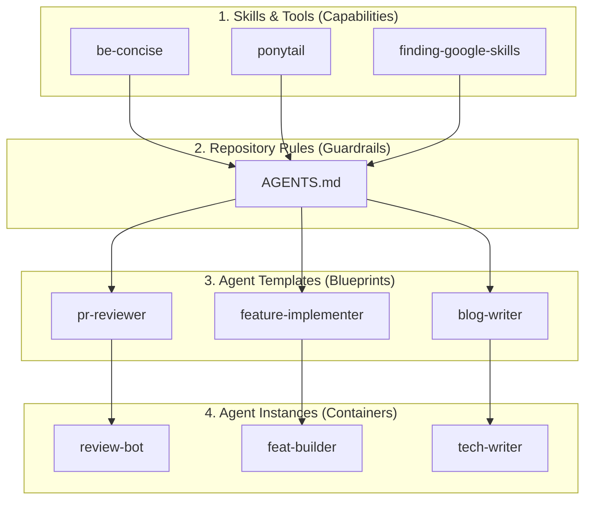

# Part 4: Developer Workflow for SCION: Skills, Rules & Templates

> **Series Navigation:**  
> [Overview](README.md) | [Part 1](01-case-for-containerized-agents.md) | [Part 2](02-setup-architecture-troubleshooting.md) | [Part 3](03-user-guide-workflows.md) | **Part 4** (Current)

---

> [!TIP]
> **Good things take time.**  
> Structure your workflow around **skills** and **rules** from the start. Writing custom skills, `AGENTS.md` guardrails, and templates requires upfront effort. But once in place, complex multi-agent workflows launch in seconds.

---

## 1. The Skill-Oriented Mindset

Developers often paste long, brittle prompts into chat windows repeatedly. In SCION's multi-agent architecture, this breaks down fast.

The foundation of a mature SCION setup is **modular, reusable skills**:



### Why Skills Matter
- **Encapsulation**: Each skill owns its instructions, scripts, and schemas (e.g., `be-concise` for clear writing, `ponytail` for minimal solutions).
- **Composability**: Mix skills across agent roles without copy-pasting prompts.
- **Portability**: Publish skills to the Hub Skill Bank and use them across all projects.

---

## 2. Project Guardrails: `AGENTS.md`

Define boundaries before launching agents. Place an `AGENTS.md` file at the project root. Every SCION agent reads this file on each interaction.

### Example Project `AGENTS.md`
```markdown
# Repository Rules & Constraints

## Git & PR Hygiene
- Never run mutating git commands (`git push`, `git rebase`, `git merge`) without explicit instructions.
- Create atomic, well-tested commits.
- Summarize diffs with concise bullet points.

## Code Quality Standards
- Write minimal, focused implementations — avoid speculative abstractions.
- Every new function must include unit test coverage.
- Run `go test ./...` or language test runner before reporting completion.
```

---

## 3. Creating Agent Templates

Templates bundle personas, rules, and skills into reusable agent roles. Store global templates in `~/.scion/templates/`; they sync to the Hub automatically.

### Anatomy of a Template
```text
~/.scion/templates/pr-reviewer/
├── scion-agent.yaml       # Template configuration
├── system-prompt.md       # Persona & evaluation criteria
├── agents.md              # Operational instructions
└── skills/                # Pre-installed skills
    ├── be-concise/
    ├── caveman/
    └── ponytail/
```

### Core Roles to Scaffold
1. **`pr-reviewer`**: Reviews PRs, inspects diffs, checks edge cases, enforces security.
2. **`feature-implementer`**: Implements features, writes unit tests, follows YAGNI.
3. **`blog-writer`**: Writes architecture guides, changelogs, and technical posts.

### Publishing Templates to Hub
Sync local templates to the Hub so they appear in CLI and Web UI:
```bash
scion template push --global --all
```

---

### Pro-Tip: Configuring Secrets for Antigravity

Antigravity and Gemini agents need credentials for background tasks. Without them, agents prompt for OAuth interactively and enter an `error` state.

Configure credentials in the **SCION Web UI** (**Settings** → **Hub Resources** → **Secrets**):

| Field | Value |
|:---|:---|
| **Key** | `GEMINI_API_KEY` |
| **Type** | `Environment variable` |
| **Inject Type** | `Always` |
| **Value** | Your API key |

Or via CLI:
```bash
scion hub secret set GEMINI_API_KEY "your-api-key"
```

Once configured, agents authenticate automatically on boot.

---

## 4. Multi-Day Development Lifecycle

Real projects span days or weeks. You start a feature today, pause for a few days, return, inspect the code, test it, iterate. SCION handles this workflow natively.

### 1 Agent = 1 Git Worktree + 1 Container

```
Repository Root
├── Agent: feat-oauth   --> Worktree branch: scion/feat-oauth   (Multi-day feature)
├── Agent: review-42    --> Worktree branch: scion/review-42    (Quick PR audit)
└── Host Working Tree   --> Branch: main                       (Your local branch)
```

Each agent has its own worktree and container. Agents never conflict with each other or your host branch.

### Step-by-Step Workflow

#### Day 1: Start Feature Agent
Launch your worker using the Web UI or CLI:
```bash
scion start feat-oauth --template feature-implementer
scion message feat-oauth "Draft the OAuth2 authentication handler in auth/handler.go"
```

#### Day 1 (Later): Inspect Agent Files on Host
You can inspect agent files directly on your host:
```bash
# Jump directly into the agent's worktree from your host shell:
scion cdw feat-oauth

# Inspect git diff, run local tests, or open in your IDE:
git diff
git status
```

#### Day 2–5: Suspend to Free Resources
Stepping away? Suspend the agent:
```bash
scion suspend feat-oauth
```
- Container halts, freeing CPU and RAM.
- Uncommitted edits, worktrees, and conversations persist in `~/.scion/hub.db`.

#### Day 6: Parallel PR Review
While `feat-oauth` is suspended, start a reviewer agent:
```bash
scion start pr-audit-99 --template pr-reviewer
scion message pr-audit-99 "Review pull request diff on branch origin/main..pr-99"
```
Delete when done (`scion delete pr-audit-99 -y`). The suspended `feat-oauth` agent stays intact.

#### Day 10: Resume and Finalize
Resume via Web UI or CLI:
```bash
scion resume feat-oauth
scion message feat-oauth "Add integration tests for token refresh and error handling."
```
The agent resumes with full memory of past conversations and edits.

---

## 5. Kanban Mental Model

Map SCION agents to a Kanban board:

| Kanban Column | SCION State | Action |
| :--- | :--- | :--- |
| **Backlog / Todo** | Task defined | Create task description or issue. |
| **In Progress** | Agent active / running | Agent executes task in its dedicated Git worktree. |
| **Review / Waiting** | `waiting_for_input` | Agent posts completion report. You run `scion cdw <agent>` to review diffs. |
| **Done** | Merged & Deleted | Worktree merged into main; container deleted (`scion delete <name>`). |

---

## 6. Summary Checklist

1. **Skills First**: Publish modular skills to the Hub Skill Bank.
2. **Project Rules**: Commit `AGENTS.md` at the root of every repository.
3. **Templates**: Create reusable roles (`pr-reviewer`, `feature-implementer`, `blog-writer`) in `~/.scion/templates/`.
4. **Persistent Workers**: Use `suspend`/`resume` for multi-day tasks; use `scion cdw` for host-to-agent file access.
