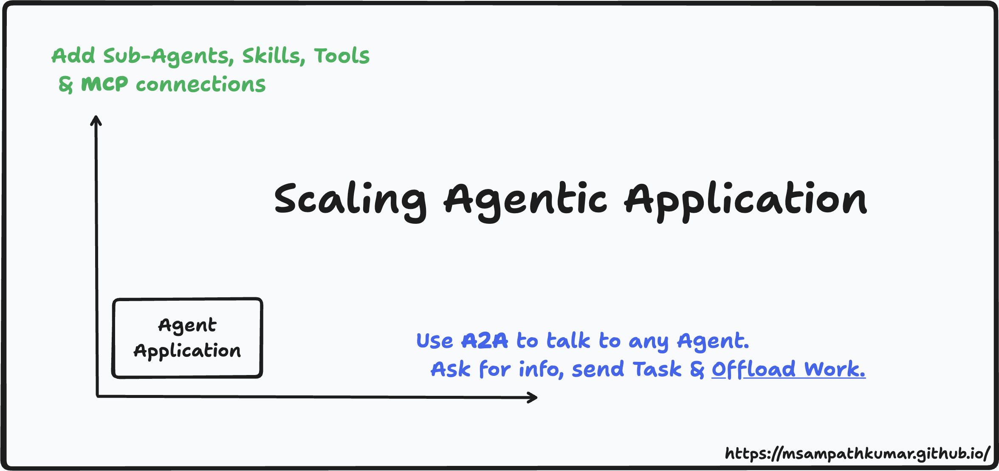

# A2A Joins AAIF

  

    A2A Joins AAIF
  

> Originally published on the [Official A2A Protocol Blog](https://a2a-protocol.org/latest/blog/2026/08/27/a-new-chapter-for-a2a-joining-the-agentic-ai-foundation/).

## Introduction

The **Agent2Agent (A2A) protocol** has officially been accepted as a **Growth Stage project** at the [Agentic AI Foundation (AAIF)](https://aaif.io) under the Linux Foundation. By joining AAIF's open agentic stack alongside MCP, AGENTS.md, and goose, A2A cements itself as the neutral, open standard for how autonomous AI agents discover each other, delegate tasks, and collaborate across distinct frameworks and vendor boundaries.

## The Horizontal Orchestration Layer

While the **Model Context Protocol (MCP)** serves as the vertical integration layer connecting agents to internal tools, sub-agents, skills, and data sources, **A2A** acts as the horizontal protocol enabling peer-to-peer agent collaboration.

Before A2A, handing off work between agents built on different frameworks required writing custom integration code from scratch for every new pairing. Today, an agent can publish a structured **Agent Card** detailing its capabilities, skills, and contact methods, allowing other independent agents to securely read it, negotiate modalities, and delegate tasks without manual intervention.

## Ecosystem Adoption and Scale

[Since reaching its stable v1.0 specification, the protocol has seen rapid adoption](https://www.forbes.com/sites/janakirammsv/2026/08/19/agent2agent-joins-the-agentic-ai-foundation-alongside-mcp/). It is currently [backed by over 150 organizations](https://aaif.io/blog/a2a-joins-aaif) and runs in production across supply chains, financial services, and mobile platforms.

Major cloud providers—including **Google Cloud**, **AWS Bedrock AgentCore Runtime**, and **Microsoft Azure AI Foundry**—have built native A2A support directly into their infrastructure.

The enterprise SaaS ecosystem has also adopted the standard, with platforms like [ServiceNow, Salesforce, Atlassian, and SAP utilizing A2A to connect workflows across their products](https://github.com/aaif/project-proposals/issues/37). Across the developer ecosystem, [A2A is supported by major frameworks including LangGraph, CrewAI, Pydantic AI, AG2, and IBM BeeAI](https://github.com/aaif/project-proposals/issues/37), reflecting industry alignment around a shared communication standard.

## Neutral Governance

Foundational infrastructure must evolve openly and predictably. By operating under the Linux Foundation-directed AAIF alongside [sibling projects](https://aaif.io/projects) like MCP, goose, and AGENTS.md, A2A is protected from single-vendor constraints.

This neutral governance ensures that the community shapes the standard's roadmap, giving engineering teams the confidence to build multi-agent systems without platform lock-in.

## Next Steps

If you are curious about how to get started, check out our [A2A getting started guide](https://a2a-protocol.org/latest/tutorials/python/1-introduction/) or explore our [partners directory](https://a2a-protocol.org/latest/partners/) to see who is already building with A2A.
