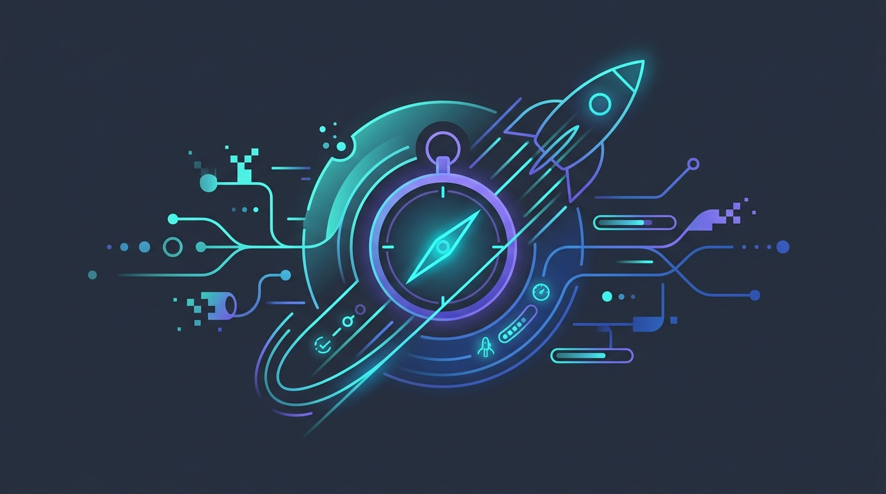
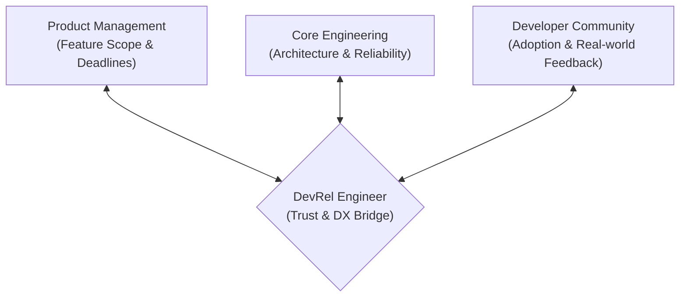

# A DevRel's Perspective: Navigating Product Launches, Quality, and Market Velocity in the AI Era

<!-- AI Image Generation Prompt: Minimalist modern tech illustration representing software product velocity, developer ecosystem, speed and quality balance, glowing cyan and violet compass and rocket trajectories on dark slate background, no text -->

> 💡 *Originally published on [Google Cloud Community on Medium](https://medium.com/google-cloud/a-devrels-perspective-navigating-product-launches-quality-and-market-velocity-in-the-ai-era-e51046969ab8).*

## TL;DR

In the fast-moving AI era, the pace of model releases and framework updates is relentless. Developer Relations (DevRel) engineers operate at the critical intersection of product management, engineering, and the developer community. Surviving and thriving in this environment requires three pillars: **ruthless triage of feedback**, **building production-grade code artifacts instead of toy demos**, and **advocating fiercely for developer developer experience (DX) upstream before launch day**.

---

## The DevRel Triangle in the AI Era

---

## 1. Velocity Without Quality Destroys Trust

When a new foundation model or API drops, the temptation is to publish quick throwaway snippets to capture initial social media attention. However, developer trust is an asymmetric asset—it takes months of consistent, high-quality technical leadership to build, and a single broken tutorial or hallucinated dependency to destroy.

### The Rule of Production Demos:
- Never publish a tutorial you haven't run clean in a fresh virtual environment.
- Provide full Infrastructure-as-Code (Terraform) or one-click reproducible scripts.
- Treat documentation as code: test docs in CI pipelines just like unit tests.

---

## 2. Upstream Advocacy: Fixing Friction Before General Availability

The most valuable work a DevRel engineer performs happens *before* a product reaches public preview. By acting as "Customer Zero", DevRel surfaces critical developer friction:

- Are error messages informative or cryptic stack traces?
- Does the Python SDK adhere to idiomatic PEP conventions?
- Is local development debugging painful or seamless?

Fixing an API parameter naming inconsistency during design reviews saves thousands of engineering hours across the global developer community.

---

## 3. Creating Sustainable Knowledge Flywheels

Instead of writing one-off blog posts, build interconnected technical cookbooks and reference architectures. When developer content is structured modularly:

1. **Blog Posts** provide conceptual understanding and architecture diagrams.
2. **Cookbooks & Repos** provide runnable code that engineers can fork.
3. **Community Discussions & Issues** feed directly back into product roadmap prioritization.

---

## Related Reflections & Guides

- [The Two Lenses of Leadership: Operational Fixes vs. Strategic Bets](../two-lenses-of-leadership/index.md)
- [How to Spot an Ineffective Manager or Leader](../spot-fake-leaders/index.md)
- [Documentation-Driven Development (D3) in the AI Era](../../technical/documentation-driven-development/index.md)
