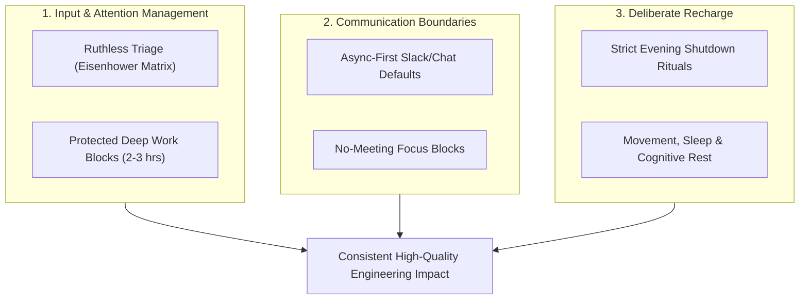

# 7 Key Strategies for Maximising Productivity and Avoiding Burnout at Work

<!-- AI Image Generation Prompt: Minimalist modern tech illustration representing sustainable productivity, balance between deep focus and energy recharge, glowing cyan and warm amber harmony on dark slate background, clean aesthetic, no text -->

> 💡 *Originally published on [Medium](https://medium.com/@maddula/7-key-strategies-for-maximising-productivity-and-avoiding-burnout-at-work-050eae000ac7).*

## TL;DR

High performance in software engineering is not about working 70-hour weeks—it is about **sustainable energy management, ruthless prioritization, and protecting uninterrupted deep work blocks**. Burnout occurs when cognitive load consistently exceeds recovery capacity. By implementing structured boundaries, asynchronous communication defaults, and regular mental retrospectives, technical professionals can deliver exceptional output without sacrificing health or sanity.

---

## The Sustainable Productivity Framework

---

## 1. Time-Block Uninterrupted Deep Work

Context switching is the silent productivity killer. It takes an average of **23 minutes** to regain deep focus after an interruption.

- Reserve two 90-minute blocks every day with chat notifications completely silenced.
- Treat your calendar focus blocks with the same reverence as customer-facing executive meetings.

---

## 2. Embrace Async-First Communication

Not every message requires an instant reply. The expectation of immediate responsiveness creates a state of perpetual hyper-vigilance:

- Set explicit Slack/Teams status indicators (`Focusing on Design Spec until 2 PM`).
- Consolidate message checking to 2–3 dedicated windows per day rather than real-time reactive monitoring.

---

## 3. The 80/20 Rule of Engineering Tasks

Identify the 20% of initiatives that drive 80% of customer value and team velocity:

- Decline low-impact meetings where your presence is purely passive.
- Say "no" to non-strategic feature requests with polite, reasoned technical alternatives.

---

## 4. Enforce a Firm "Shutdown Ritual"

Without a clear boundary separating work and personal life, work expands into evening hours, eroding sleep quality:

- At the end of every day, review open tasks, write down the top 3 goals for tomorrow morning, and physically close your laptop.
- Step away from work emails and notifications until the next morning.

---

## 5. Measure Output, Not Hours Logged

Activity is not impact. Spending 10 hours struggling with a tired mind accomplishes less than 4 hours of sharp, energized focus. Prioritize sleep, exercise, and physical movement as non-negotiable prerequisites for cognitive stamina.

---

## Related Reflections & Guides

- [10 Principles of Miyamoto Musashi](../miyamoto-musashi/index.md)
- [The Two Lenses of Leadership: Operational Fixes vs. Strategic Bets](../two-lenses-of-leadership/index.md)
- [How to Spot an Ineffective Manager or Leader](../spot-fake-leaders/index.md)
