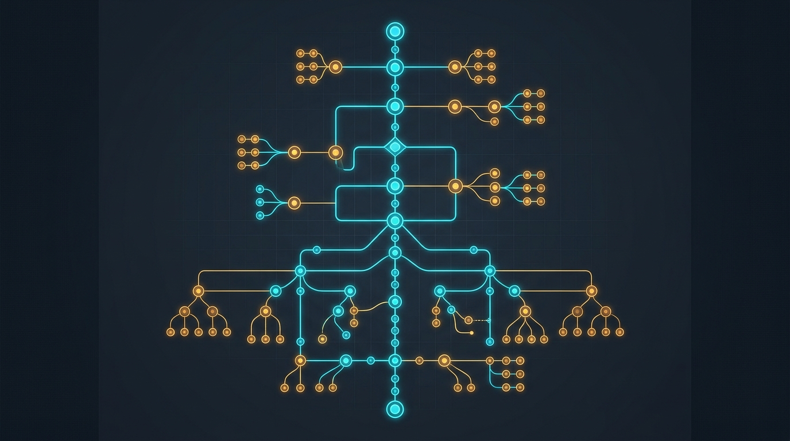
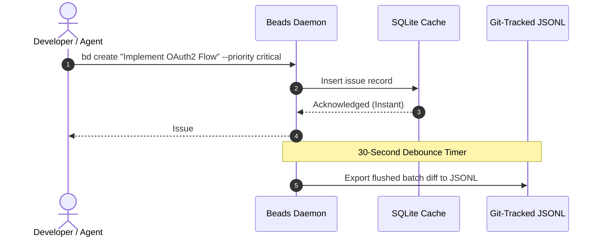
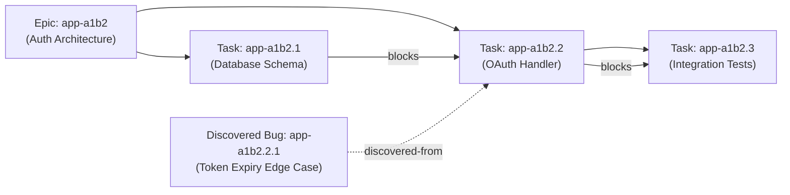
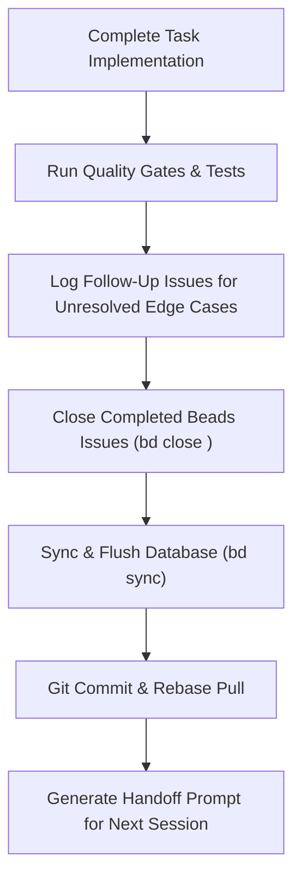

# The Beads Memory System: Technical Architecture and Integration with Gemini CLI

<!-- AI Image Generation Prompt: Minimalist modern tech illustration representing AI agent memory and persistent state tracking, glowing hierarchical bead chain nodes on a dark slate background with neon cyan and amber accents, clean technical diagram aesthetic, no text -->


> 💡 *Originally published on [Google Cloud Community on Medium](https://medium.com/google-cloud/the-beads-memory-system-technical-architecture-and-integration-with-gemini-cli-for-agentic-c2aa36430802).*
>
> 🎧 *Accompanying Audio Track (10m deep dive): [Listen on YouTube](https://www.youtube.com/watch?v=O_UrPKy3Xu8)*

## TL;DR

Large Language Models suffer from inherent session amnesia across context resets. **Beads** (`bd`) is a git-native, graph-based memory and issue tracking engine tailored for AI coding agents and developer workflows. It uses a **two-tier hybrid storage engine** (sub-millisecond local SQLite cache + git-versioned `issues.jsonl`), communicates via a background daemon over Unix Sockets, exposes an MCP server for native **Gemini CLI** tool calling (`beads__ready()`), and coordinates complex task DAGs with strict dependency edges (`blocks`, `parent-child`, `discovered-from`).

---

## Technical Architecture Overview

Beads operates as a hybrid, multi-tiered memory and task engine:

```mermaid
graph TD
    subgraph AgentLayer["Agent & Developer Interface"]
        GCLI["Gemini CLI / Agent"] <--> MCP["beads-mcp Server (stdio)"]
        DEV["Developer (CLI)"] <--> BD["bd CLI Binary"]
    end
    
    subgraph CoreEngine["Beads Daemon & Coordination Layer"]
        MCP <--> DAEMON["Beads Background Daemon<br/>(Unix Socket RPC / Concurrency)"]
        BD <--> DAEMON
        DAEMON <--> SQLITE[("Local SQLite Engine<br/>Fast Querying & Ready Engine")]
    end
    
    subgraph GitStorage["Git-Native Version Control"]
        DAEMON <-->|Debounced Sync (30s)| JSONL["Git-Tracked JSONL<br/>(.beads/issues.jsonl)"]
        JSONL <--> REPO["Git Remote Repository"]
    end
```

---

## Core Pillars of the Architecture

### 1. Hybrid Storage Engine (SQLite + Git-Tracked JSONL)

Beads solves the trade-off between blazing-fast local agent queries and collaborative source control through a two-tier storage design:

- **Local SQLite Cache (`.beads/cache.db`)**: Provides sub-millisecond query execution for agent tool calls (e.g., querying dependency trees, priority filters, and unblocked tasks).
- **Git-Native JSONL Log (`.beads/issues.jsonl`)**: Acts as the single source of truth. Every record is stored as an append-friendly JSON line, allowing clean git merges, conflict resolution, and PR tracking.



### 2. The Background Daemon & Synchronization

To synchronize state without hammering disk I/O or generating noisy git commits, Beads runs a lightweight background daemon over Unix Sockets (or loopback TCP on Windows):

- **Automatic Hydration**: Detects changes pulled from git and immediately hydrates the local SQLite database.
- **Debounced Writes**: Batches updates with a **30-second debounce period**, keeping developer environments snappy.
- **Concurrency Management**: Manages file locking when multiple agents work in parallel on the same codebase.

---

## The Dependency Graph & Ready Engine

Rather than treating tasks as flat to-do lists, Beads organizes work as a **directed acyclic graph (DAG)** with semantic edge types:



### Semantic Edge Types

1. **`blocks`**: A strict prerequisite. Task B cannot become ready until Task A is resolved.
2. **`parent-child`**: Hierarchical milestone containment (Epic $\rightarrow$ Task $\rightarrow$ Sub-task).
3. **`related`**: Contextual technical link without execution blocking.
4. **`discovered-from`**: Crucial audit trail tracking provenance when an agent uncovers a new bug while working on another issue.

### The `bd ready` Engine

Agents use `bd ready` to immediately discover actionable tasks without human micromanagement:

```bash
# Returns only open tasks with ZERO unresolved blocking dependencies
bd ready --json
```

---

## Integration with Gemini CLI & MCP

Integrating Beads into **Gemini CLI** transforms the agent from a one-shot assistant into a stateful, autonomous collaborator.

### 1. Model Context Protocol (MCP) Configuration

Configure `beads-mcp` in your Gemini CLI configuration (`~/.gemini/settings.json`):

```json
{
  "mcpServers": {
    "beads": {
      "command": "beads-mcp",
      "args": ["--workspace", "."],
      "transport": "stdio"
    }
  }
}
```

Once loaded, Gemini can autonomously query its work backlog:

```python
# Gemini Tool Call
beads__ready()
# Returns: [{"id": "app-a1b2.1", "title": "Database Schema", "priority": "high"}]
```

### 2. Context Priming via `AGENTS.md`

Add task-tracking rules to your repository's `AGENTS.md` or `GEMINI.md`:

```markdown
## Task Management
- Always check `bd ready` before picking up new work.
- Use `bd update <id> --status in_progress` when starting work.
- Record any newly discovered bugs using `bd create --discovered-from <current_id>`.
```

---

## The "Landing the Plane" Protocol

To maintain context hygiene across agent sessions, enforce the **Landing the Plane** workflow at the end of every task execution:



1. **File Follow-ups**: Create issues for edge cases discovered during implementation.
2. **Quality Gates**: Execute test suites and linters.
3. **Update States**: Mark issues as resolved with summary notes.
4. **Synchronize**: Export SQLite state to `issues.jsonl`.
5. **Session Handoff**: Generate a concise state handoff for the next agent turn.

---

## Conclusion

The Beads memory system bridges the gap between stateless AI models and complex, long-running software engineering projects. By combining **local SQLite speed**, **Git-tracked durability**, and **Gemini CLI MCP tooling**, developers and AI agents can collaborate with sustained clarity and zero context loss.

---

## Related Guides & Articles

- [Advanced Memory Management for Agentic AI Development](../memory-management-agentic-ai/index.md)
- [Context-Driven Development with Conductor for Gemini CLI](../conductor-gemini-cli/index.md)
- [Master Your Workflow: Top Gemini CLI Commands You Should Know](../../gemini/cli-top-commands/index.md)
- [The Six Essential Protocols Powering the AI Agent Ecosystem](../six-essential-protocols/index.md)
