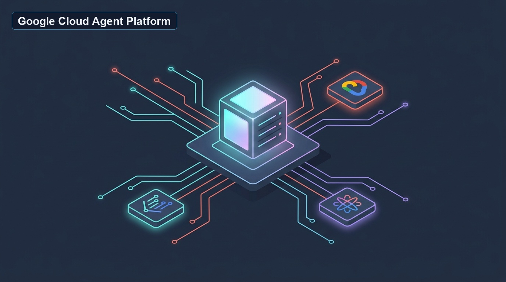
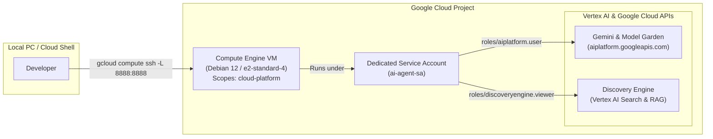

# Building an Agentic Sandbox: Provisioning a Google Cloud VM Workstation



When building, benchmarking, or executing autonomous Agentic AI applications, running unverified code or agent loops directly on your primary personal laptop poses security, resource, and dependency risks. A far better pattern is to configure an isolated **Google Cloud Compute Engine VM** as a dedicated **personal sandbox and secondary workstation**.

In this guide, I share my personal setup for provisioning an AI-ready cloud sandbox. We'll configure a dedicated identity, precise least-privilege IAM permissions, and access scopes required for headless agent harnesses to communicate seamlessly with [Gemini](https://cloud.google.com/vertex-ai) and open models via Vertex AI Model Garden.

> [!TIP]
> **Need a Graphical Desktop (GUI)?** This guide focuses on setting up a fast, headless cloud sandbox for terminal workflows and automated agent harnesses. If your workflow requires browser automation visual debugging or a full graphical desktop environment, check out our companion tutorial: [Setting Up GUI & Chrome Remote Desktop on a Google Cloud VM](../setup-gui-chrome-remote-desktop-gcp-vm/index.md).

______________________________________________________________________

## TL;DR

- **Isolated Personal Sandbox**: Keeps experimental agent scripts, sub-agent tools, and LLM coding loops off your primary laptop and inside an easily disposable, reproducible cloud environment.
- **Dedicated Identity**: Avoid using the default Compute Engine service account. Create a dedicated `ai-agent-sa` identity with scoped permissions (`roles/aiplatform.user`, `roles/discoveryengine.viewer`).
- **Cloud-Platform Scope**: Set `--scopes=https://www.googleapis.com/auth/cloud-platform` during instance creation so API calls to Vertex AI are not constrained by legacy default scopes.
- **Secure Port Forwarding**: Access remote development servers (Jupyter notebooks on `8888`, custom agent dashboards on `9595`) over encrypted SSH tunnels directly from your local browser without exposing public IP endpoints.

______________________________________________________________________

## Architecture Overview

<!-- TODO: Generate image with prompt: Flowchart showing Cloud Shell provisioning a Compute Engine VM with dedicated Service Account and connecting to Vertex AI and Discovery Engine APIs. -->



______________________________________________________________________

## Prerequisites

1. A **Google Cloud Project** with active billing enabled.
1. Access to **Google Cloud Shell** (via [shell.cloud.google.com](https://shell.cloud.google.com/)) or the local Google Cloud CLI (`gcloud`).
1. A local machine (macOS, Linux, or Windows) to execute SSH commands.

______________________________________________________________________

## Step 1: Enable Required AI Infrastructure APIs

> **Note:** Run these commands inside **Google Cloud Shell**.

Before creating instances, activate the required Google Cloud service APIs:

```bash
# Enable Vertex AI, Discovery Engine (Vertex AI Search & Conversation), and Compute Engine APIs
gcloud services enable \
  aiplatform.googleapis.com \
  discoveryengine.googleapis.com \
  compute.googleapis.com
```

______________________________________________________________________

## Step 2: Create a Dedicated Service Account

> **Note:** Run these commands inside **Google Cloud Shell**.

By default, Compute Engine instances use the default Compute Engine service account, which often has broad Editor permissions. For agentic AI workflows, create a dedicated, least-privilege identity:

```bash
# Create the service account
gcloud iam service-accounts create ai-agent-sa \
  --display-name="AI Agent Service Account"

# Store the service account email in a shell variable
SA_EMAIL="ai-agent-sa@$(gcloud config get-value project).iam.gserviceaccount.com"
```

______________________________________________________________________

## Step 3: Grant Least-Privilege IAM Roles

> **Note:** Run these commands inside **Google Cloud Shell**.

Grant the dedicated service account the exact permissions needed for foundation model access and RAG / Search workflows:

```bash
# 1. Access Gemini models and Vertex AI Model Garden
gcloud projects add-iam-policy-binding $(gcloud config get-value project) \
  --member="serviceAccount:$SA_EMAIL" \
  --role="roles/aiplatform.user"

# 2. Access Vertex AI Search (Discovery Engine) for RAG capabilities
gcloud projects add-iam-policy-binding $(gcloud config get-value project) \
  --member="serviceAccount:$SA_EMAIL" \
  --role="roles/discoveryengine.viewer"

# 3. Allow the service account to use itself (required for self-managed model deployment)
gcloud iam service-accounts add-iam-policy-binding $SA_EMAIL \
  --member="serviceAccount:$SA_EMAIL" \
  --role="roles/iam.serviceAccountUser"
```

______________________________________________________________________

## Step 4: Create the Compute Engine VM

> **Note:** Run these commands from your **local computer** or **Google Cloud Shell**.

Define your project and zone configuration:

```bash
GCP_PROJECT_ID=YOUR_GOOGLE_CLOUD_PROJECT_ID_HERE
GCP_PROJECT_ZONE=us-central1-a
VM_NAME=ai-development-vm
```

Create the virtual machine with the attached service account and the full `cloud-platform` scope:

```bash
gcloud compute instances create $VM_NAME \
  --project=$GCP_PROJECT_ID \
  --zone=$GCP_PROJECT_ZONE \
  --machine-type=e2-standard-4 \
  --service-account=$SA_EMAIL \
  --scopes=https://www.googleapis.com/auth/cloud-platform \
  --image-family=debian-12 \
  --image-project=debian-cloud
```

> [!IMPORTANT]
> Setting `--scopes=https://www.googleapis.com/auth/cloud-platform` is critical. Without this scope, the OAuth token generated inside the VM will be restricted by default legacy GCE access scopes, preventing the instance from calling Vertex AI APIs even if IAM roles are configured properly.

______________________________________________________________________

## Step 5: Connect to the VM via SSH

> **Note:** Run these commands from your **local computer**.

Log in to the VM using `gcloud compute ssh`:

```bash
gcloud compute ssh --project $GCP_PROJECT_ID --zone $GCP_PROJECT_ZONE "$VM_NAME"
```

### Useful Connection Commands & Shortcuts

**1. Configure SSH Host Aliases:**
Simplify login syntax by generating SSH config entries automatically:

```bash
gcloud compute config-ssh --project $GCP_PROJECT_ID --zone $GCP_PROJECT_ZONE "$VM_NAME"
```

**2. Local Port Forwarding:**
Forward remote ports (such as Jupyter notebooks on `8888` or agent harness web UIs on `9595`) directly to `localhost`:

```bash
gcloud compute ssh --project $GCP_PROJECT_ID --zone $GCP_PROJECT_ZONE "$VM_NAME" -- -L 8888:127.0.0.1:8888 -L 9595:127.0.0.1:9595
```

______________________________________________________________________

## Step 6: Install Essential Developer Utilities

> **Note:** Run these commands **inside the VM**.

Bootstrap common packages, configure your default terminal editor, and set up Python 3:

```bash
# Update package repositories and install developer utilities
sudo apt update
sudo apt upgrade -y
sudo apt install -y git vim gedit tree python3-pip

# Set default shell editor
echo "# Set default editor" >> ~/.bashrc
echo "export VISUAL=vim" >> ~/.bashrc
echo "export EDITOR=\$VISUAL" >> ~/.bashrc
source ~/.bashrc

# Verify Python and pip installation
python3 --version
pip3 --version
```

______________________________________________________________________

## Next Steps

Now that your Google Cloud sandbox VM is securely provisioned and ready for agent development:

- **Run Agent Experiments**: Clone your agentic framework repository (LangGraph, CrewAI, or custom harness) and interact directly with Gemini and Vertex AI via Application Default Credentials (ADC).
- **Optional: Need a Graphical Desktop?** If your experiments require browser automation visual debugging or a desktop UI on your VM, check out the companion guide on [Setting Up GUI & Chrome Remote Desktop on a Google Cloud VM](../setup-gui-chrome-remote-desktop-gcp-vm/index.md).
