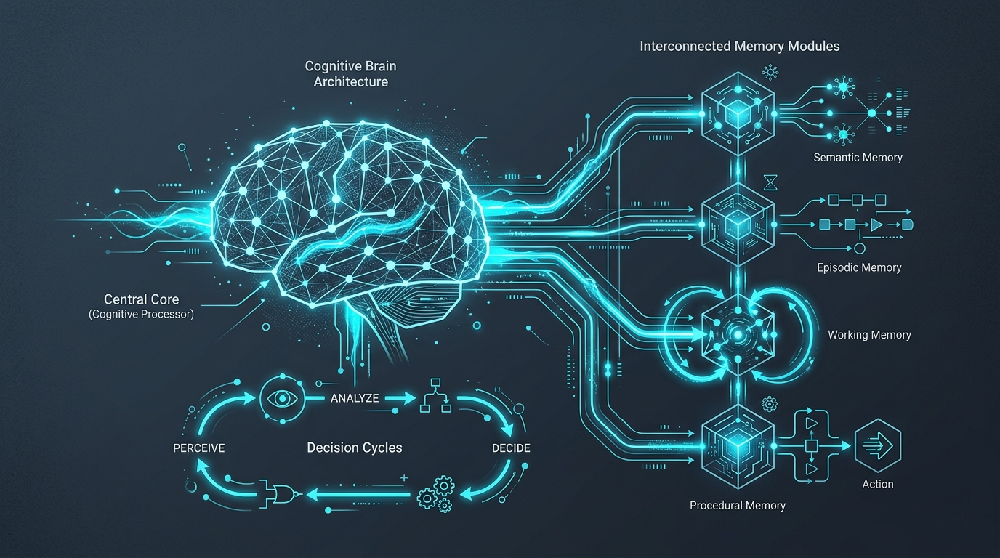
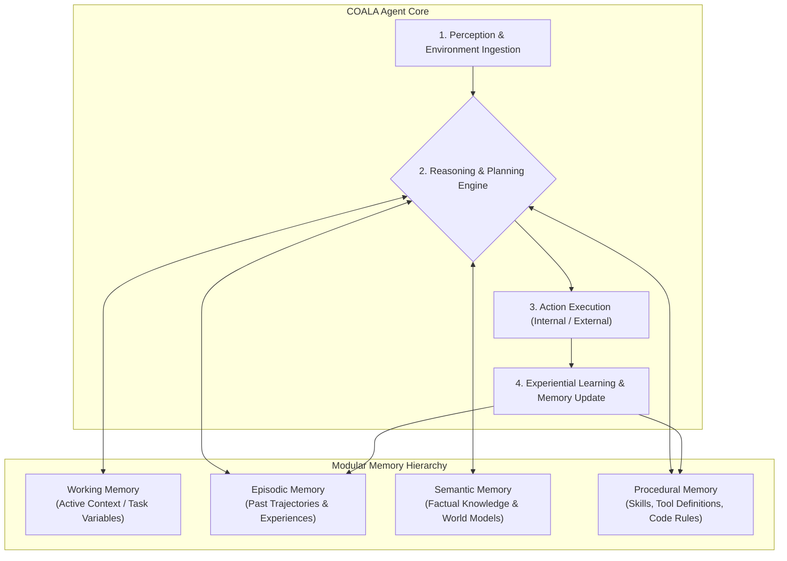
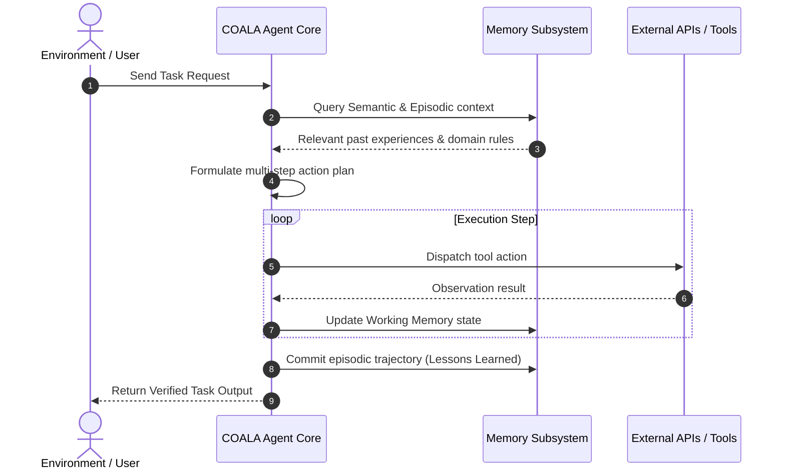

# Beyond the Prompt: Why Your Next AI Agent Needs a Brain (The COALA Architecture)

<!-- AI Image Generation Prompt: Minimalist modern tech illustration representing cognitive AI agent brain architecture, interconnected memory modules, working memory, procedural memory, decision cycles, glowing cyan accents on dark slate background, no text -->

> 💡 *Originally published on [Google Cloud Community on Medium](https://medium.com/google-cloud/beyond-the-prompt-why-your-next-ai-agent-needs-a-brain-and-how-coala-research-paper-provides-an-ba187a906ea0).*

## TL;DR

Single prompts and simple reactive loops cannot support robust, long-horizon autonomous agents. The **COALA** (*Cognitive Architectures for Language Agents*) framework structures AI agents around human cognitive principles: modular memory systems (working, episodic, semantic, procedural), explicit action spaces, and structured decision cycles (Perception $
ightarrow$ Reasoning $
ightarrow$ Action $
ightarrow$ Learning). Implementing COALA transforms brittle prompt chains into resilient, stateful agents capable of long-term problem solving.

---

## The Limitations of Prompt-Only Agents

Most AI agent prototypes rely on a single loop: prompt LLM $
ightarrow$ parse output $
ightarrow$ call tool $
ightarrow$ append to prompt history. As tasks grow in complexity, this naive approach hits severe walls:

1. **Context Bloat & Rot**: Relevant facts are pushed out by conversational filler.
2. **Action Confusion**: Agents fail to differentiate between internal reasoning and external world-altering actions.
3. **Absence of Learning**: Once a session terminates, experiential knowledge gained during task execution vanishes.

The **COALA** framework addresses these challenges by decomposing agent intelligence into structured cognitive modules.

---

## The COALA Cognitive Blueprint

---

## 1. Modular Memory Systems

COALA divides agent memory into four functional subsystems:

| Memory Type | Purpose | Implementation Pattern |
| :--- | :--- | :--- |
| **Working Memory** | Maintains active task state, focus variables, and current goal decomposition | Short-term context window buffer & structured scratchpad |
| **Episodic Memory** | Stores chronological logs of past task executions, mistakes, and user interactions | Vector database (Vertex AI Vector Search) + timestamped logs |
| **Semantic Memory** | General knowledge, business domain rules, and world models | RAG systems, Knowledge Graphs, and document stores |
| **Procedural Memory** | Execution skills, codified recipes, and tool usage guidelines | System prompts, few-shot tool examples, and Python scripts |

---

## 2. The Decision-Making Cycle

Rather than generating unstructured output, COALA agents cycle through structured execution stages:

---

## Practical Takeaways for Builders

- **Separate Internal vs External Actions**: Allow the agent to update internal memory and plan without triggering premature external tool calls.
- **Implement Structured Handoffs**: Pass lightweight working-memory state summaries between sub-agents rather than dumping the entire conversational history.
- **Codify Procedural Memory**: Store frequently used multi-step sequences in declarative configuration files (or `AGENTS.md`) rather than expecting the LLM to reinvent them each session.

---

## Related Guides & References

- [Advanced Memory Management for Agentic AI Development](../memory-management-agentic-ai/index.md)
- [The Beads Memory System: Technical Architecture & Gemini CLI](../beads-memory-system/index.md)
- [5 Science-Backed Takeaways to Improve Your Multi-Agentic Systems](../science-backed-multi-agent-takeaways/index.md)
- [The Six Essential Protocols Powering the AI Agent Ecosystem](../six-essential-protocols/index.md)
