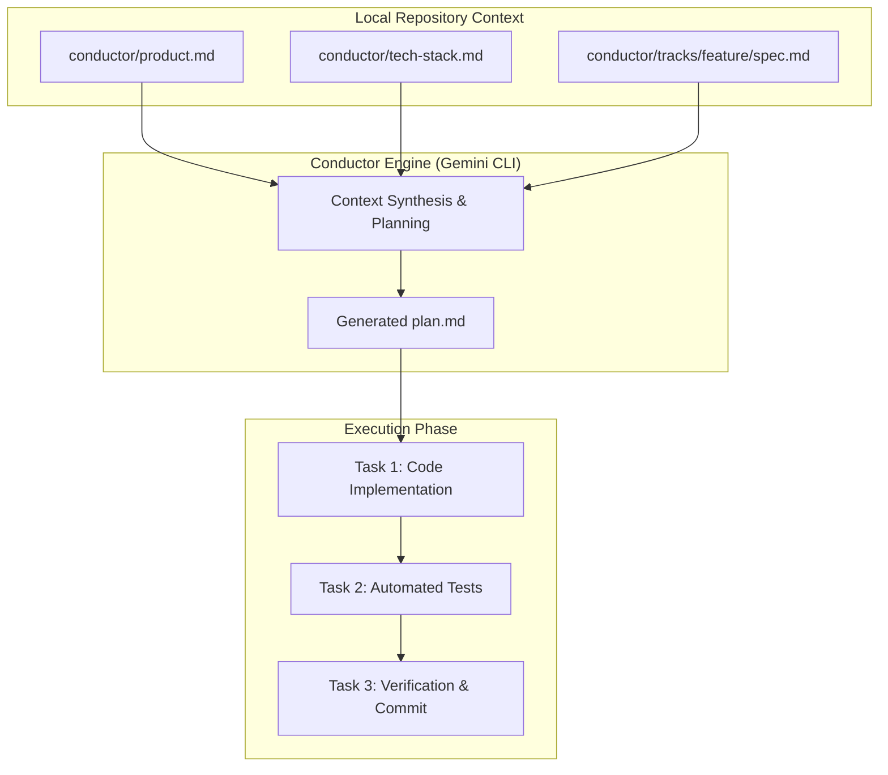

# Give Your AI a Brain: Context-Driven Development with Conductor for Gemini CLI

<!-- AI Image Generation Prompt: A minimalist, clean modern tech illustration of an AI assistant with structured blueprint cards and terminal window with Gemini CLI, glowing cyan and electric blue accents on a dark slate background, no text, professional developer aesthetic. -->


**In modern AI-assisted software development, prompting in "YOLO mode" is a silent productivity killer.** When you fire off isolated prompts in your terminal without structured context, your AI model has no memory of decisions made five minutes ago, no visibility into your repository's guidelines, and no clear understanding of the overarching feature scope.

Software engineering isn't just typing snippets—it is planning, tracking, implementing, and iterating. For large enterprise teams, full-blown issue trackers like Jira manage this lifecycle. But for solo features, proof-of-concepts, and agile pet projects, heavy project management tools introduce too much friction, while unguided prompting leads to scope creep and hallucinations.

Enter **Conductor**: an open-source extension for the [Gemini CLI](https://developers.googleblog.com/) that introduces **Context-Driven Development (CDD)** directly into your terminal.

> [!NOTE]
> **Open Standard & Source:** Conductor is an open-source tool released under the Apache-2.0 License. You can explore the official [Google Developers Blog introduction](https://developers.googleblog.com/conductor-introducing-context-driven-development-for-gemini-cli/) and the [GitHub Repository](https://github.com/gemini-cli-extensions/conductor).

______________________________________________________________________

## TL;DR

- **Context-Driven Development (CDD)**: Introduces structured specifications and multi-step plans directly into your local Git repository before code generation starts.
- **Repository Guidelines**: Stores `tech-stack.md` and `product-guidelines.md` in a `conductor/` directory so Gemini CLI never has to guess your architecture or preferred libraries.
- **Track-Based Lifecycle**: Organizes features into discrete **Tracks** containing specifications (`spec.md`), step-by-step checklists (`plan.md`), and automated task execution.
- **Predictable AI Execution**: Enforces deterministic implementation by having the AI complete numbered tasks sequentially and update its progress in real time.

______________________________________________________________________

## Architecture Overview



______________________________________________________________________

## The "Why": Context is King

Why do we need structured context? Because context is what separates a generic, out-of-date code snippet from a production-ready, fully integrated component.

Conductor establishes a disciplined protocol to specify, plan, and implement features:

1. **Eliminates Tech-Stack Guessing**: By documenting your frontend, backend, and testing frameworks once, prompts are automatically grounded in your real stack.
1. **Maintains Boundaries**: Prevents the model from introducing unwanted third-party dependencies or rewriting unrelated modules.
1. **Creates a Clear Definition of Done**: Features are broken down into granular, verifiable steps before a single line of application code is written.

______________________________________________________________________

## Step-by-Step Walkthrough

Let's look at how Conductor integrates into your terminal workflow.

### 1. Installation

Install Conductor as a standard extension for the Gemini CLI:

```bash
gemini extensions install https://github.com/gemini-cli-extensions/conductor
```

### 2. Initialization (Establishing Project Guidelines)

Initialize Conductor inside your repository root:

```bash
# Launch your Gemini CLI session
gemini

# Initialize Conductor within the session
conductor init
```

Conductor inspects your workspace and generates the initial `conductor/` directory structure:

```text
conductor/
├── product-guidelines.md  <-- Core engineering rules and coding standards
├── product.md             <-- High-level overview of what the application does
├── tech-stack.md          <-- Languages, frameworks, and pinned dependencies
└── tracks/                <-- Active feature branches and implementation plans
```

> [!TIP]
> Take a few minutes to customize `product.md` and `tech-stack.md`. This foundational context will enrich every prompt you send to Gemini during feature development.

### 3. Creating and Scoping a Feature Track

When building a new capability, create a dedicated **Track**:

```text
# Initialize track setup
/conductor:setup

# Create a new feature track (e.g. quantum analytics module)
/conductor:newTrack build quantum state visualizer

# Inspect active tracks
/conductor:status
```

Conductor provisions a new directory under `conductor/tracks/<feature_name>/` containing a `spec.md` template.

### 4. Defining the Spec & Generating the Plan

1. **Draft the Spec**: Edit `spec.md` to describe **what** you want the feature to accomplish, including input/output expectations and boundary constraints.
1. **Generate the Implementation Plan**: Ask Conductor to synthesize your spec against your tech stack:

```text
# Within the Gemini CLI session
conductor plans generate
```

Gemini evaluates your requirements and outputs a structured `plan.md` containing numbered, verifiable tasks:

```markdown
<!-- plan.md snippet -->
- [ ] Task 1: Scaffold React component with Tailwind CSS styling
- [ ] Task 2: Implement state calculation logic using math.js
- [ ] Task 3: Write unit tests with Vitest and verify test suite passes
```

### 5. Deterministic Task Execution

Instead of pasting large prompts, tell Conductor to execute a specific task from your plan:

```text
conductor tasks execute 1
```

Gemini loads the spec, tech stack rules, and the target task. It generates the necessary files, verifies the syntax, and automatically checks off Task 1 in `plan.md`.

______________________________________________________________________

## Summary & Next Steps

By shifting from unstructured prompts to Context-Driven Development, Conductor transforms Gemini CLI from an autocomplete engine into a reliable AI development partner that understands your project's architecture and definition of done.

- **Learn More**: Read the full overview on the [Google Developers Blog](https://developers.googleblog.com/conductor-introducing-context-driven-development-for-gemini-cli/).
- **Explore Source Code**: Star and contribute on [GitHub](https://github.com/gemini-cli-extensions/conductor).
