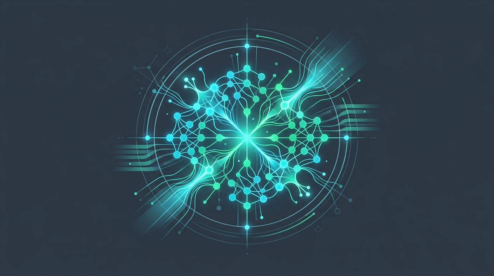
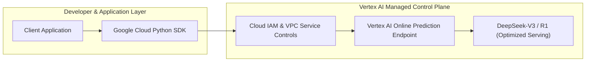

# DeepSeek API Service on Vertex AI Model Garden

<!-- AI Image Generation Prompt: Minimalist modern tech illustration representing DeepSeek open foundational models running on Google Cloud Vertex AI Model Garden, glowing neural network clusters, dark slate background with cyan and emerald accents, clean aesthetic, no text -->


> 💡 *Originally published on [Google Cloud Community on Medium](https://medium.com/google-cloud/deepseek-api-service-vertex-ai-model-garden-d865cf7ba077).*

## TL;DR

Google Cloud Vertex AI Model Garden offers fully managed, one-click deployments and serverless endpoints for open-weight models including **DeepSeek-V3** and **DeepSeek-R1**. By serving DeepSeek through Vertex AI, enterprise engineering teams get Google Cloud IAM access control, private VPC endpoints, automatic scaling, and SLA-backed infrastructure without managing underlying GPU clusters manually.

---

## Why Serve DeepSeek via Vertex AI Model Garden?

While self-hosting DeepSeek on raw compute instances requires substantial infrastructure orchestration (vLLM configuration, GPU quota management, multi-node networking), Vertex AI Model Garden provides a managed abstraction:



- **Enterprise Governance**: Enforce Cloud IAM permissions and audit logging on every inference call.
- **Zero GPU Scarcity Headaches**: Leverage Google Cloud dynamic provisioning and reserved capacity.
- **OpenAI-Compatible & Native SDKs**: Seamlessly integrate using either standard Vertex AI prediction APIs or OpenAI-compatible endpoint bridges.

---

## Deploying DeepSeek from Model Garden

You can deploy DeepSeek models via the Google Cloud Console or programmatically with the `google-cloud-aiplatform` SDK:

```python
from google.cloud import aiplatform

aiplatform.init(project="your-gcp-project-id", location="us-central1")

# Reference DeepSeek model from Vertex AI Model Garden
model = aiplatform.Model.from_pretrained(
    "publishers/deepseek-ai/models/deepseek-v3"
)

# Deploy to an autoscaling GPU-backed endpoint
endpoint = model.deploy(
    machine_type="g2-standard-96",
    accelerator_type="NVIDIA_L4",
    accelerator_count=8,
    min_replica_count=1,
    max_replica_count=4,
)
```

---

## Performing Inference

Once deployed, query the endpoint with standard payload schemas:

```python
from google.cloud import aiplatform

endpoint = aiplatform.Endpoint("projects/PROJECT_ID/locations/LOCATION/endpoints/ENDPOINT_ID")

payload = {
    "prompt": "Explain the advantages of Mixture of Experts (MoE) architectures in 3 bullet points.",
    "temperature": 0.2,
    "max_tokens": 512,
}

response = endpoint.predict(instances=[payload])
print(response.predictions[0])
```

---

## Key Enterprise Best Practices

1. **VPC Service Controls**: Place your Model Garden endpoints inside private service connect boundaries to prevent data egress.
2. **Dynamic Autoscaling**: Configure scale-to-zero or min/max replica boundaries to optimize GPU spend during off-peak hours.
3. **Observability**: Monitor request latency, token throughput, and compute utilization directly through Cloud Monitoring dashboards.

---

## Related Articles

- [Google Cloud Next 2026: Foundational Models & GAP](../../cloud-next-2026/foundational-models/index.md)
- [Advanced Memory Management for Agentic AI Development](../memory-management-agentic-ai/index.md)
- [The Role of Python in Google Cloud](../python-in-google-cloud/index.md)
