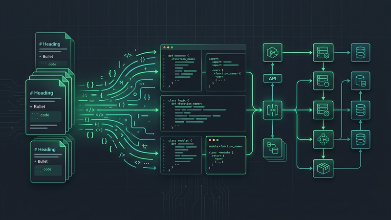
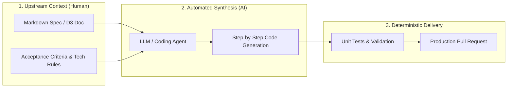

# Documentation-Driven Development (D3) in the AI Era

<!-- AI Image Generation Prompt: A minimalist, clean modern tech illustration of structured markdown documentation files transforming into running modular software code and architecture diagrams, glowing emerald green and teal accents on a dark charcoal slate background, no text, professional developer aesthetic. -->

**For decades across the software industry, writing user and architectural documentation was treated as an undervalued chore.** In standard Software Development Life Cycle (SDLC) methodologies, documentation was almost always an afterthought—hurriedly drafted just hours before a product release or skipped entirely in favor of moving tickets across a sprint board.

However, over the last 18 months, Large Language Models (LLMs) and autonomous [AI coding agents](https://cloud.google.com/gemini/docs) have triggered a fundamental paradigm shift. Documentation is no longer the final output of software development—it is becoming its **primary forethought and upstream steering wheel**.

This modern evolution is known as **Documentation-Driven Development (D3)**.

> [!TIP]
> **Specification Over Syntax:** In an AI-assisted ecosystem, writing code is cheap, but defining intent is priceless. Clear markdown documentation directly conditions model attention, eliminating hallucinated APIs and misaligned implementations.

______________________________________________________________________

## TL;DR

- **Upstream Steering**: In an era of AI pairs and coding agents, specifications written in Markdown are the exact prompt payloads that direct model reasoning.
- **The Core Rule of D3**: If an idea or feature is thoroughly documented and bounded by constraints, it can evolve predictably into working software. If it is undocumented, the AI is left to guess.
- **Deterministic Alignment**: Structured docs eliminate tech stack confusion, enforce library version compatibility, and provide automatic acceptance criteria for automated tests.
- **Living Knowledge Bases**: Moving documentation to the front of the development loop ensures that engineering artifacts stay perpetually synchronized with the codebase.

______________________________________________________________________

## The Evolution: From Afterthought to Forethought

In traditional development, the gap between human design documents and actual code was vast. Developers frequently worked from incomplete verbal specs, leading to drift between what was planned and what was shipped.

D3 inverts this pipeline:

______________________________________________________________________

## Why D3 Matters for Modern AI Workflows

When pairing with models like Google Gemini, Claude, or open standard harnesses like [AGENTS.md](https://agentsmd.org), the quality and reliability of generated code directly correlates with the structured context available in your repository.

### 1. Eliminating Context Hallucination

When you give an AI assistant an open-ended instruction like *"Add user authentication"*, it must invent dozens of unspecified architectural decisions: What session storage? Which hashing algorithm? Which database ORM?

Under D3, a 15-line markdown document answers these decisions upfront, anchoring the model to your exact libraries and security standards.

### 2. Turn Documents into Testable Checklists

Under Documentation-Driven Development, acceptance criteria in the document double as the test plan. Modern agent harnesses can parse markdown checklists, generate corresponding unit tests, and verify each requirement before marking a task complete.

### 3. Sustainable Vibe Coding

"Vibe coding"—relying on conversational AI prompts to quickly iterate on software—works brilliantly for small scripts. But without D3, larger projects collapse under technical debt as the model loses track of early decisions. Documenting architecture in repo-level markdown keeps vibe coding stable and maintainable over months of development.

______________________________________________________________________

## Classical SDLC vs. Documentation-Driven Development (D3)

| Dimension | Traditional SDLC | Documentation-Driven Development (D3) |
| :--- | :--- | :--- |
| **Role of Documentation** | Downstream record / post-release chore | Upstream prompt payload and architectural contract |
| **Source of Truth** | Scattered across tickets, PRs, and memory | Version-controlled Markdown files alongside code |
| **AI Partner Effectiveness** | Low (AI guesses missing context and dependencies) | High (AI receives complete specifications and boundaries) |
| **Definition of Done** | Code compiles and passes ad-hoc checks | Code strictly satisfies documented criteria and automated tests |

______________________________________________________________________

## Are You Practicing D3?

Reflecting on your daily development routines with AI coding tools, consider this question:

> **Are you, in essence, practicing Documentation-Driven Development (D3) while coding with AI?**

If your most productive moments with AI happen when you take three minutes to clearly outline the data shapes, interfaces, and expectations in a markdown file before asking for code, you are already practicing D3.

## Summary

As AI models continue to lower the barrier to raw code generation, the most valuable skill for software engineers is transitioning from typing syntax to **architectural clarity and specification engineering**. Teams that embrace D3 will ship faster, maintain higher code quality, and lead the future of software development.
