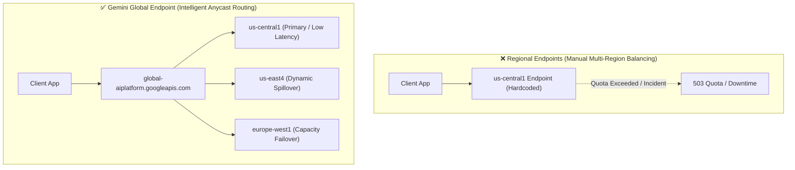

# Gemini Global Endpoint: Enhanced Availability for Your AI Applications

<!-- AI Image Generation Prompt: Minimalist modern tech illustration representing global cloud endpoints and multi-region AI routing, glowing world network grid, interconnected data paths with cyan and blue accents on dark slate background, no text -->


> 💡 *Originally published on [Google Cloud Community on Medium](https://medium.com/google-cloud/google-cloud-vertex-ai-gemini-global-endpoint-introduction-af241e7a09c5).*

## TL;DR

Historically, deploying Vertex AI applications required binding client requests to specific regional endpoints (e.g., `us-central1-aiplatform.googleapis.com` or `europe-west4-aiplatform.googleapis.com`). With the **Gemini Global Endpoint**, Google Cloud introduces unified intelligent request routing that automatically steers inference requests across global Google data centers. This dramatically reduces transient regional quota exhaustion, mitigates localized outages, and maximizes application uptime without custom client-side load balancers.

---

## Regional vs. Global Endpoint Architecture



---

## Key Architectural Advantages

1. **Automated Cross-Region Failover**: If a specific data center experiences temporary compute saturation or maintenance, requests are dynamically rerouted to healthy regions.
2. **Simplified Client Configuration**: No need to write complex retry-and-failover wrappers across 5 different regional endpoints in your application code.
3. **Optimized Quota Utilization**: Aggregate your Gemini RPM/TPM across multiple regions rather than being throttled by single-region caps.
4. **Data Residency Compliance**: For regulated workloads requiring strict geographical boundaries, regional endpoints remain fully supported and isolated.

---

## Configuring the Global Endpoint in Python

Configuring the global endpoint is seamless with the Google GenAI SDK:

```python
from google import genai

# Initialize client using the global location endpoint
client = genai.Client(
    vertexai=True,
    project="your-gcp-project-id",
    location="global"  # Routes dynamically across healthy Google Cloud regions
)

response = client.models.generate_content(
    model="gemini-2.5-flash",
    contents="Explain high-availability cloud architecture in 2 sentences."
)

print(response.text)
```

---

## When to Use Regional vs Global Endpoints

| Requirement | Recommended Endpoint |
| :--- | :--- |
| **Highest Availability & Fault Tolerance** | `global` |
| **Burst Traffic with Dynamic Quota Spillover** | `global` |
| **Strict Data Residency / Sovereignty (GDPR / HIPAA)** | `europe-west3` / `us-central1` (Regional) |
| **Dedicated Interconnect / Colocated Low-Latency VPC** | Specific Region (e.g., `us-east4`) |

---

## Related Articles

- [Google Cloud Gemini Cookbook: Lesson 5 — Review & Takeaways](../../../google-cloud-gemini-cookbook/lesson-05/README.md)
- [Building an Agentic Sandbox: Google Cloud VM Provisioning](../building-agentic-sandbox-vm/index.md)
- [The Role of Python in Google Cloud](../python-in-google-cloud/index.md)
