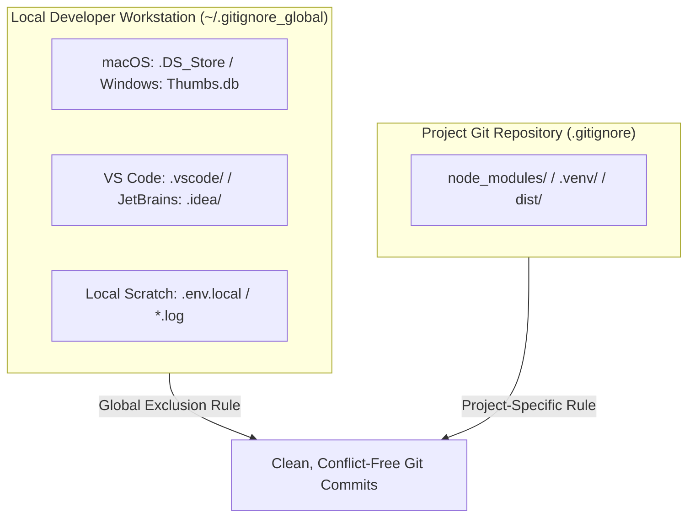

# Keep Your Git Clean: Setting Up a Global .gitignore

<!-- AI Image Generation Prompt: Minimalist modern tech illustration representing clean version control, Git repository filtering, glowing cyan branch structures shielded from temporary clutter, dark slate background, no text -->


> 💡 *Originally published on [Medium](https://medium.com/@maddula/keep-your-git-clean-setting-up-a-global-gitignore-cb2c36c14f95).*

## TL;DR

Every developer has accidentally committed `.DS_Store`, `.idea/`, or local editor files to a shared git repository. Instead of polluting every repository's `.gitignore` with personal workstation artifacts, configure a machine-wide **global gitignore**. One command (`git config --global core.excludesfile ~/.gitignore_global`) permanently shields all present and future repositories on your machine from local OS and editor clutter.

---

## Why Project-Level `.gitignore` Is Not Enough



- **Clean Pull Requests**: Teammates aren't bothered with your local IDE preference files or OS indexing caches.
- **Zero Accidental Commits**: No risk of committing sensitive scratch notes or personal configuration files across new projects.

---

## Step-by-Step Configuration

### 1. Create the Global `.gitignore` File

Create a centralized file in your user home directory:

```bash
touch ~/.gitignore_global
```

### 2. Add Universal Exclusion Patterns

Open `~/.gitignore_global` in your favorite editor and populate it with universal rules:

```gitignore
# macOS System Files
.DS_Store
.AppleDouble
.LSOverride
Icon
._*

# Windows System Files
Thumbs.db
ehthumbs.db
Desktop.ini

# Linux
*~
.directory

# Editor & IDE Directories
.vscode/
!.vscode/settings.json
!.vscode/tasks.json
!.vscode/launch.json
.idea/
*.swp
*.swo
*~

# Python Local Caches
__pycache__/
*.pyc
.pytest_cache/
.mypy_cache/

# Local Environment Overrides & Secret Scratches
.env.local
.env.*.local
*.private.json
```

### 3. Register the File in Global Git Config

Instruct Git to use this file across all repositories:

```bash
git config --global core.excludesfile ~/.gitignore_global
```

### 4. Verify Configuration

Confirm that Git has registered the configuration properly:

```bash
git config --global core.excludesfile
# Output should return: ~/.gitignore_global
```

---

## Pro-Tip: Cleaning Existing Tracked Clutter

If `.DS_Store` or `.idea` files were already tracked before setting up your global gitignore, remove them from Git's index without deleting the local files:

```bash
# Remove cached files from repository index
git rm --cached .DS_Store
git rm -r --cached .idea/
git commit -m "chore: remove untracked local IDE and OS files from git index"
```

---

## Related Guides

- [Mastering tmux: Headless Sessions & Automation](../mastering-tmux/index.md)
- [Building an Agentic Sandbox VM](../building-agentic-sandbox-vm/index.md)
