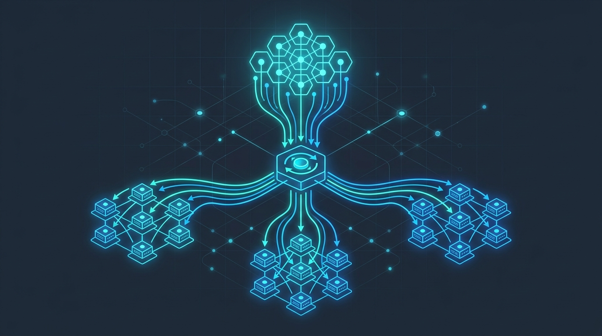
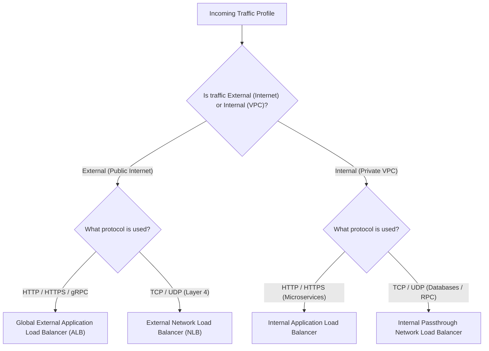

# Load Balancing Blitz: Google Cloud Load Balancing Introduction

<!-- AI Image Generation Prompt: Minimalist modern tech illustration representing cloud network load balancing, traffic distribution to distributed server clusters, glowing cyan and electric blue network vectors on dark slate background, clean aesthetic, no text -->

> 💡 *Originally published on [Google Cloud Community on Medium](https://medium.com/google-cloud/load-balancing-blitz-introduction-0bfe6ef55997).*

## TL;DR

Google Cloud Load Balancing (GCLB) is a software-defined, fully managed distributed routing platform built on Google's Maglev and Andromeda SDN network infrastructure. Unlike traditional hardware appliances or virtual machine appliances, Cloud Load Balancing requires no pre-warming, scales instantaneously to millions of queries per second, and provides a single global Anycast IP address that routes users to the closest available compute backend across the globe.

---

## The Load Balancer Decision Matrix

---

## 1. Global vs Regional Load Balancers

- **Global Anycast Load Balancing**: Uses a single virtual IP (VIP) advertised from all Google edge points-of-presence (PoPs). User traffic enters Google's private backbone network at the closest geographical edge and travels on dedicated fiber directly to the application backend.
- **Regional Load Balancing**: Confines traffic routing within a single Google Cloud region for compliance, data sovereignty, or low-latency local VPC architectures.

---

## 2. Layer 7 (Application) vs Layer 4 (Network) Load Balancing

| Feature | Application Load Balancer (L7) | Network Load Balancer (L4) |
| :--- | :--- | :--- |
| **OSI Layer** | Layer 7 (HTTP, HTTPS, HTTP/2, gRPC) | Layer 4 (TCP, UDP, ESP) |
| **Routing Intelligence** | URL path matching, host headers, query parameters | IP address, port, and protocol tuple |
| **SSL / TLS Termination** | Terminated at edge with Google-managed certificates | Passthrough or proxy modes |
| **Cloud Armor Security** | Native DDoS & WAF rule integration | DDoS defense via Cloud Armor network edge |
| **Backend Types** | GKE Ingress, Cloud Run, Compute Engine MIGs, Cloud Storage | Compute Engine VMs, GKE nodes |

---

## 3. Health Checks and Failover

Cloud Load Balancers continuously monitor backend availability using configurable health checks:

- **Proactive Removal**: If a backend instance fails health probes, traffic is rerouted within milliseconds with zero dropped connections.
- **Cross-Region Overflow**: If the primary region reaches $100\%$ capacity utilization, the Global Application Load Balancer automatically spills excess traffic over to healthy backends in the next-closest region.

---

## Related Articles

- [Gemini Global Endpoint: Enhanced Availability for Your AI Applications](../gemini-global-endpoint/index.md)
- [Building an Agentic Sandbox: Provisioning a Google Cloud VM Workstation](../building-agentic-sandbox-vm/index.md)
- [Google Cloud's GKE Tops 2025 Magic Quadrant](../gke-magic-quadrant/index.md)
