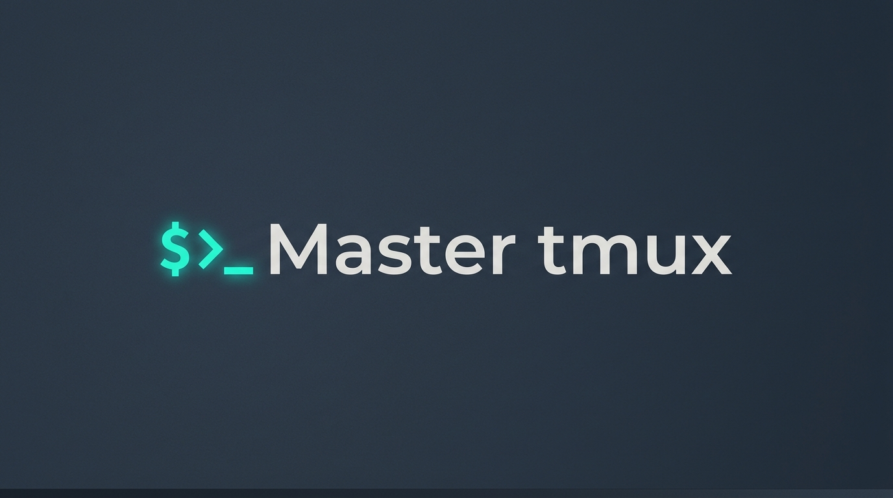
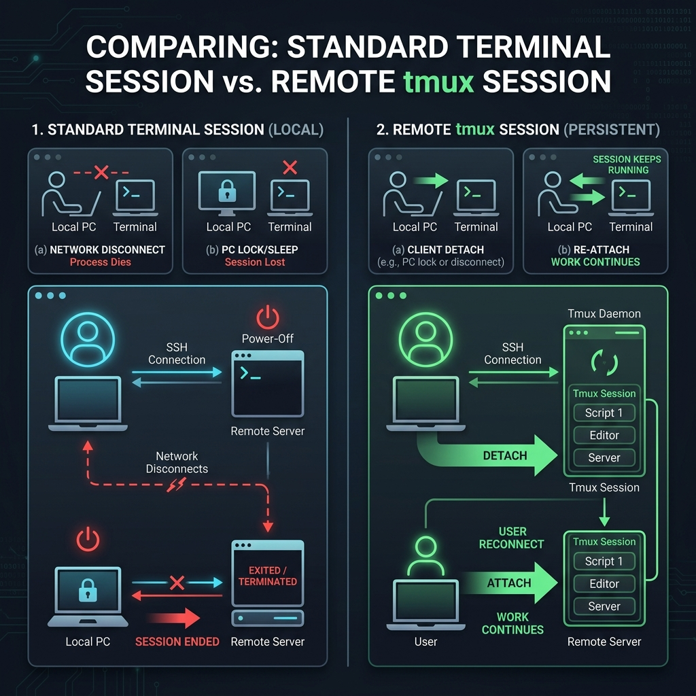

# Mastering tmux: Headless Sessions, Persistent Workflows & Automation

<!-- AI Image Generation Prompt: A minimalist, clean illustration of a terminal window showing remote server persistence with tmux, glowing green and cyan accents on a dark slate background, no text, professional developer aesthetic, 16:9 ratio. -->


**In a typical software developer's workflow, SSH disconnect anxiety is a silent productivity killer.** Whether you're running a long-term build, training an AI model, or migrating database records on a remote server, a sudden network drop or unstable connection can abruptly halt your command, leave tasks incomplete, and force hours of tedious cleanup.

In this guide, we'll explore how **tmux** (Terminal Multiplexer) completely redefines terminal persistence, headless session management, and remote workflow automation.

## What You'll Learn

- 🎯 **The Tmux Daemon**: How persistent background sessions survive network drops and reboots.
- 💡 **The Four Pillars**: Headless execution, session attachment, SendKey integration, and session capture.
- 🚀 **Automation Aliases**: Custom shell aliases for lightning-fast workspace navigation and control.

---

## Why Manual Sessions Die (And How Remote Tmux Saves the Day)

When you create a standard manual session or execute commands directly in your terminal, your session is tightly bound to your client connection:
- If you lock your PC, close your laptop, or experience a network disconnect, the terminal session receives a signal to terminate.
- The running process dies instantly, interrupting builds, scripts, or downloads.

**In contrast, a remote tmux session runs on the server via a persistent backend daemon:**
- Even if your local PC restarts, your network drops, or you walk away for the weekend, your tmux session stays active on the remote system for as long as required.
- You can simply reconnect via SSH, check your active sessions, and jump right back in using `tmux attach` (or `tmux-attach`), or leave it running in the background using `tmux detach` (or `tmux-detach`).

<!-- AI Image Generation Prompt: A simple infographic diagram comparing a standard terminal session vs a remote tmux session. Left side: local session dying on network disconnect or PC lock. Right side: remote tmux daemon keeping sessions alive with attach and detach arrows, clean minimalist design, dark background. -->


---

## The Four Distinct Pillars of Tmux Power

There are four core capabilities that make tmux sessions remarkably powerful for developers and automation engineers:

### 1. Headless Execution
The primary benefit is the ability to run tasks completely independently of your active terminal session. Because sessions are created and managed automatically by tmux, you are freed from manually supervising foreground processes.

### 2. Session Attachment
Once initialized, you can step inside the environment (`attach`), execute your workflow, and detach whenever needed. Even if your terminal experiences a network drop, the processes stay alive. You can re-login, run `tmux attach`, and pick up exactly where you left off.

### 3. SendKey Integration (`tmux send-keys`)
This allows you to dispatch commands directly into a headless session without needing to actively log into it. You can keep persistent workspaces running in the background and seamlessly trigger long-running commands on demand from scripts or CLI wrappers.

### 4. Session Capture
When sending background commands to an unseen session, verifying output or determining when to execute subsequent steps is critical. The capture function lets you review active logs and trace exactly what is happening inside a headless environment without attaching.

---

## Supercharge Your Workflow with Custom Aliases

To make interacting with tmux effortless, add these productivity aliases to your terminal configuration file (`~/.bashrc` or `~/.zshrc`):

```bash
alias "tmux-newsession"="tmux new-session -d -s"
alias "tmux-ls"="tmux ls"
alias "tmux-kill-session"="tmux kill-session -t"
alias "tmux-attach"="tmux attach -t"
alias "tmux-send-keys"="tmux send-keys -t"
alias "tmux-detach"="tmux detach"
```

> 💡 **Pro Tip:** Once configured, you can simply type `tmux-` and press **TAB** to easily discover, autocomplete, and execute any of these commands instantly!

---

## Practical Guide: How to Use Tmux Like a Pro

Let's walk through the core lifecycle commands using our streamlined aliases:

### 1. Create a New Detached Session
To create a background session named `hello-world`:
```bash
tmux-newsession hello-world
```

### 2. List Active Sessions
To inspect all currently running tmux sessions:
```bash
tmux-ls
```

### 3. Attach to a Session
To connect interactively to the `hello-world` session:
```bash
tmux-attach hello-world
```

### 4. Send Commands Headlessly (Without Attaching)
You can execute commands inside `hello-world` directly from your current terminal:
```bash
# List directory contents
tmux-send-keys hello-world "ls -la" Enter

# Run a long-running process
tmux-send-keys hello-world "sleep 500" Enter

# Send interrupt signal (Ctrl+C)
tmux-send-keys hello-world "C-c" Enter
```

### 5. Detach from a Session
If you are inside an active tmux session and want to leave it running in the background without exiting:
```bash
tmux-detach
```
*(Note: This command is run from within an active tmux session).*

### 6. Stop or Kill a Session
To terminate the session cleanly:
```bash
tmux-kill-session hello-world
```
Or gracefully stop running tasks and exit:
```bash
tmux-send-keys hello-world "C-c" Enter
tmux-send-keys hello-world "exit" Enter
```

---

## Pro Feature: Real-Time Multi-Client Synchronization

One of the most powerful advantages of detached or headless sessions is the ability to connect via **multiple terminal instances simultaneously**. 

When you attach to a single session from different windows or SSH terminals, executing a command in one immediately synchronizes and updates across all of them in real-time. A headless tmux environment ensures flawless collaboration and monitoring across every attached client instance.

---

## Key Takeaways

✅ **Daemon Persistence:** Your jobs survive SSH disconnects and network drops.  
✅ **Headless Automation:** Use `tmux send-keys` to script background workflows without manual login.  
✅ **Aliased Speed:** Wrap native tmux commands into short, TAB-completable aliases (`tmux-newsession`, `tmux-attach`).  

---

## Let's Connect!

Found this guide helpful? I'd love to hear your thoughts or share your tmux tips!

- 🐦 Share your setup on [Twitter/X](https://twitter.com/sampathm)
- 💼 Connect on [LinkedIn](https://linkedin.com/in/msampathkumar)
- 🌟 Star the project on [GitHub](https://github.com/msampathkumar)

---

<!--
### Social Media Snippets:

**Twitter/X Thread (280 chars each):**
1/ Stop letting SSH disconnects kill your long-running server scripts! 🛑 Learn how to master tmux for persistent headless sessions and bulletproof workflow automation. Thread 🧵
2/ At its core, tmux runs a persistent backend daemon. Your sessions and processes run independently in the background, surviving network drops and reboots effortlessly. ⚡
3/ Meet the 4 pillars of tmux power: Headless Execution, Session Attachment, SendKey Integration (`tmux send-keys`), and Session Capture for log monitoring without attaching! 🔍
4/ Boost your speed with smart aliases! Wrap native commands into `tmux-newsession`, `tmux-attach`, and `tmux-send-keys` so you can TAB-complete your way to productivity. 🚀
5/ Read the full guide on headless tmux workflows and level up your terminal game today! 💻👇 [Link to article]

**LinkedIn Post (1300 chars):**
🎯 Tired of losing hours of work because an SSH connection dropped mid-build? 

In my latest article, I dive deep into mastering tmux—not just as a window splitter, but as a powerful headless automation and session persistence engine.

Here is what you will learn:
👉 **The Tmux Daemon:** How persistent background sessions keep your processes alive independently of your active terminal window.
👉 **SendKey Integration:** How to programmatically dispatch commands into headless sessions without manual login.
👉 **Smart Aliases:** Wrapping native tmux commands into TAB-completable shortcuts like `tmux-newsession` and `tmux-attach`.
👉 **Multi-Client Sync:** Real-time synchronization across multiple terminal windows.

Whether you're managing cloud infrastructure, running background AI model training, or automating CI/CD tasks, mastering tmux is a game-changer.

❓ What is your go-to terminal productivity trick? Let me know in the comments!

#DevOps #Terminal #Tmux #DeveloperProductivity #Automation #Linux
[Link to full article]
-->
