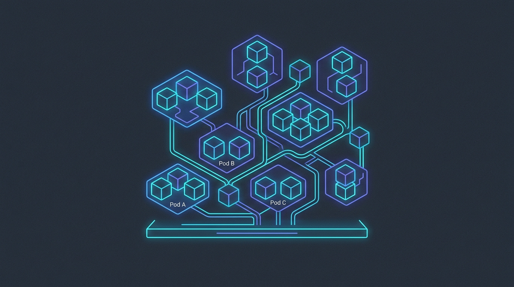
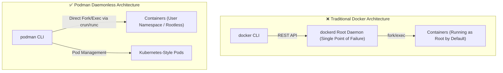

# Podman Developer Notes: A Daemonless, Rootless Container Guide

<!-- AI Image Generation Prompt: Minimalist modern tech illustration representing daemonless rootless container architecture, modular pods and container cubes with glowing cyan and indigo lines on dark slate background, no text -->


> 💡 *Originally published on [Medium](https://medium.com/@maddula/podman-developer-notes-8c71e1adab90).*

## TL;DR

**Podman** (*Pod Manager*) provides a lightweight, OCI-compliant container runtime that runs containers and pods without requiring a central background root daemon. For developers migrating from Docker, Podman offers drop-in alias compatibility (`alias docker=podman`), enhanced security through rootless user namespaces, lower resource overhead on developer laptops, and native Kubernetes Pod YAML generation.

---

## Docker vs. Podman Architecture



---

## Essential Developer Workflows

### 1. Initializing the Podman Machine (macOS / Windows)

On macOS and Windows, Podman manages a lightweight Linux virtual machine:

```bash
# Initialize and start a Podman VM instance
podman machine init --cpus 4 --memory 8192 --disk-size 50
podman machine start

# Verify VM status
podman machine list
```

### 2. Docker Alias & Drop-in Compatibility

Because Podman command syntax mirrors the Docker CLI directly, creating an alias gives instant compatibility:

```bash
alias docker=podman
docker run -d --name nginx-server -p 8080:80 nginx:alpine
```

### 3. Native Kubernetes Pod Support

Unlike Docker, Podman natively understands the concept of **Pods**—groups of containers sharing network namespaces and storage volumes:

```bash
# Create a pod with shared port forwarding
podman pod create --name web-pod -p 8080:80

# Run containers inside the pod
podman run -d --pod web-pod --name web-app nginx:alpine
podman run -d --pod web-pod --name redis-cache redis:alpine

# Export directly to a valid Kubernetes YAML manifest!
podman generate kube web-pod > web-pod.yaml
```

---

## Podman Compose & Docker Compose Compatibility

To run multi-container applications defined in `docker-compose.yml`, install and configure `podman-compose`:

```bash
# Install podman-compose via pip/homebrew
pip install podman-compose

# Start services
podman-compose up -d
```

Alternatively, enable the rootless Podman Unix socket to allow tools like Docker Desktop plugins, Testcontainers, and VS Code Dev Containers to connect transparently:

```bash
podman machine set --rootful=false
```

---

## Summary of Key Developer Benefits

1. **Security**: Rootless containers ensure compromised containers cannot gain root privileges on the host system.
2. **Resource Efficiency**: Without an idle background daemon running, background CPU and battery drain on developer laptops are significantly minimized.
3. **K8s Bridge**: The ability to export and import Kubernetes Pod YAML manifests accelerates cloud deployment on Google Kubernetes Engine (GKE).

---

## Related Articles

- [Google Cloud's GKE Tops 2025 Magic Quadrant](../gke-magic-quadrant/index.md)
- [Docker for Agents: A Backend Engineer's Introduction to A2A](../../a2a/intro/index.md)
- [Setting Up GUI & Chrome Remote Desktop on GCP VM](../setup-gui-chrome-remote-desktop-gcp-vm/index.md)
