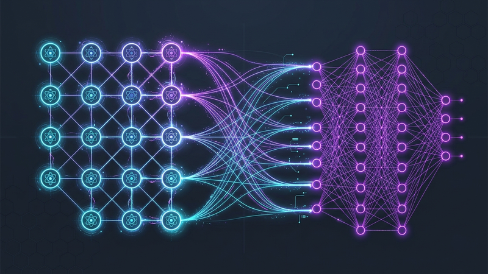
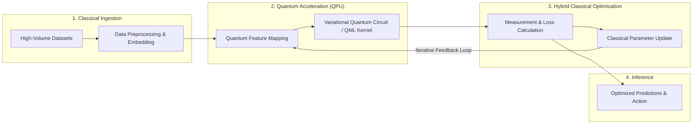

# The Quantum Leap in AI: Faster, Greener, and More Powerful

<!-- AI Image Generation Prompt: A minimalist, clean modern tech illustration of quantum computing qubits and neural network nodes interconnecting with holographic glowing purple and cyan energy on a deep dark slate background, no text, professional developer aesthetic. -->

**The software landscape is experiencing an unprecedented surge in Artificial Intelligence capability.** From multimodal reasoning in Google Gemini to real-time image synthesis and code generation, AI models are transforming our daily digital existence.

However, this massive explosion in capability comes with a steep operational cost: a voracious appetite for computational power and energy that is rapidly pushing classical semiconductor hardware to its physical limits.

Training frontier models demands vast data centers powered by tens of thousands of power-hungry GPUs and TPUs. What if there was a way to break through these silicon constraints, solve previously intractable optimization bottlenecks, and unlock a fundamentally greener, higher dimension of machine intelligence?

Enter the intersection of **Quantum Computing and Artificial Intelligence (Quantum AI / QML)**.

> [!NOTE]
> **What is QML?** Quantum Machine Learning (QML) investigates how quantum algorithms (such as quantum kernel estimation, variational quantum circuits, and quantum state linear solvers) can execute computational subroutines exponentially faster than classical matrix arithmetic.

______________________________________________________________________

## TL;DR

- **Qubit Superposition & Entanglement**: Replaces binary bits with multi-state quantum bits (qubits) that can explore astronomical parameter spaces in parallel.
- **Accelerated Matrix Operations**: Quantum algorithms drastically reduce the computational complexity of high-dimensional tensor operations and deep learning training loops.
- **Combinatorial Optimization**: Provides near-instantaneous solutions for complex combinatorial problems like molecular drug discovery, logistics, and financial risk modeling.
- **Greener Computing**: While classical supercomputers consume megawatts at scale, core quantum processing units operate at kilowatt levels, providing a path toward sustainable AI infrastructure.

______________________________________________________________________

## Architecture: Hybrid Classical-Quantum Computing

In the near-to-medium term, quantum computers will not replace classical servers entirely; rather, they act as specialized **Quantum Processing Units (QPUs)** in a hybrid architecture:

______________________________________________________________________

## The Three Pillars of the Quantum-AI Synergy

The marriage of quantum mechanics and deep learning isn't just about faster clock speeds—it represents a fundamentally new way of processing information across three key pillars:

### 1. Exponential Acceleration for Complex Training

Deep neural networks rely on massive matrix multiplication and tensor decompositions during backpropagation. Quantum algorithms, such as the HHL algorithm for linear systems of equations, provide theoretical logarithmic speedups for specific matrix calculations, allowing models to converge significantly faster on complex datasets.

### 2. Solving Intractable Optimization Challenges

Many of the most important real-world AI problems—such as folding complex proteins, designing new chemical catalysts, or optimizing global supply chain logistics—suffer from combinatorial explosion where classical algorithms must evaluate permutations sequentially.

By leveraging quantum superposition and entanglement, quantum annealing and QAOA (Quantum Approximate Optimization Algorithm) explore billions of possible states simultaneously to locate global energy minima.

### 3. Sustainable and Greener AI

Data center energy consumption is one of the biggest bottlenecks facing the continued expansion of frontier models. While classical supercomputers dissipate massive amounts of heat across thousands of GPUs, the core computational processors of quantum computers operate with minimal electrical power (measured in kilowatts rather than megawatts).

As quantum error correction and room-temperature quantum sensors advance, hybrid QPU architectures offer a viable path to curbing the environmental footprint of AI scaling.

______________________________________________________________________

## Classical AI vs. Quantum AI Comparison

| Dimension | Classical AI (GPU / TPU Clusters) | Quantum AI (QPU / Hybrid QML) |
| :--- | :--- | :--- |
| **Fundamental Unit** | Binary bits (deterministic `0` or `1`) | Qubits (Superposition $|\\psi\\rangle = \\alpha|0\\rangle + \\beta|1\\rangle$ and Entanglement) |
| **Computing Model** | Sequential / parallel matrix arithmetic | Quantum state interference and multidimensional Hilbert space mapping |
| **Combinatorial Complexity** | Polynomial to exponential slowdown on NP-hard tasks | Exponential / quadratic speedups for specialized optimization problems |
| **Energy Profile** | Megawatts for hyperscale data centers | Kilowatts for core quantum computational engines |
| **Development Tooling** | PyTorch, JAX, TensorFlow | [Cirq](https://github.com/quantumlib/Cirq), Qiskit, PennyLane |

______________________________________________________________________

## Gemini and the Future: What Might "Quantum Gemini" Look Like?

Consider the capabilities of frontier AI models like Google's [Gemini](https://cloud.google.com/vertex-ai)—capable of multimodal reasoning across text, vision, and audio.

Now imagine a future iteration where heavy mathematical reasoning, complex optimization subroutines, and long-range associative memory are offloaded to quantum accelerators:

- **Faster Context Compression**: Quantum state encoding could compress massive context windows with zero information loss.
- **Breakthrough Scientific Discovery**: Quantum-assisted models could simulate molecular reactions and quantum chemistry directly in their native states rather than through classical approximations.
- **Adaptive Few-Shot Learning**: Exploring wider hypothesis spaces enables models to learn rich patterns from significantly fewer training examples.

______________________________________________________________________

## Conclusion & What's Next

The convergence of quantum computing and artificial intelligence represents one of the most promising frontiers in computer science. While fault-tolerant quantum hardware is still evolving, the foundational algorithms and hybrid frameworks being developed today via open-source tools like [Google Quantum AI Cirq](https://quantumai.google/) are paving the way.

As we stand at the threshold of this transition, combining the creative power of generative AI with the computational mechanics of quantum theory promises to redefine what software can achieve.
