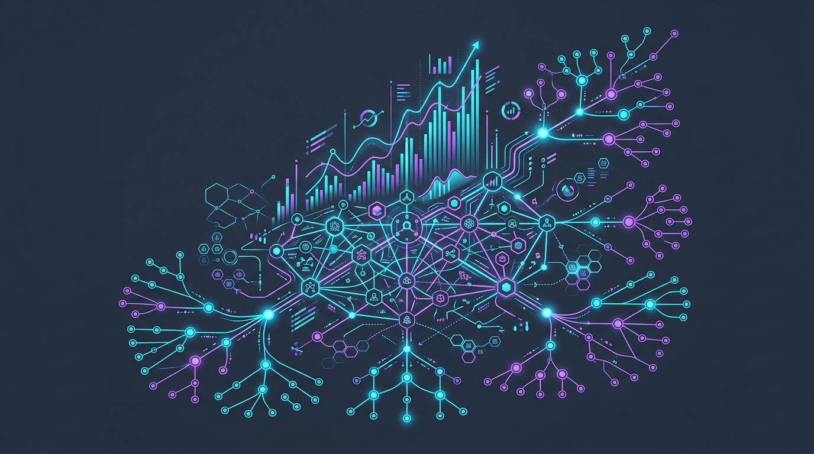
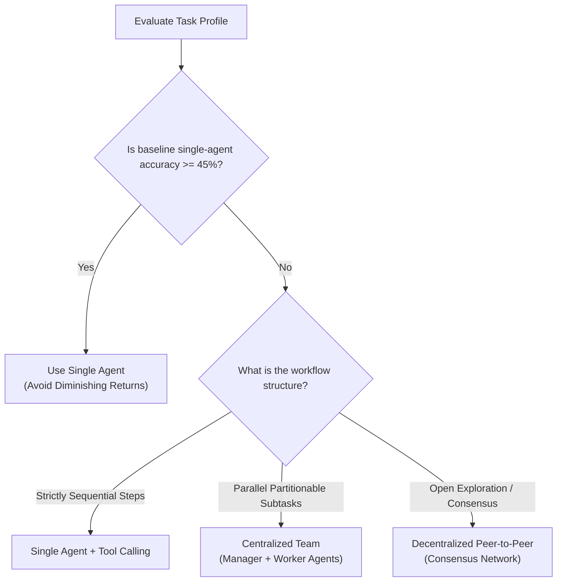
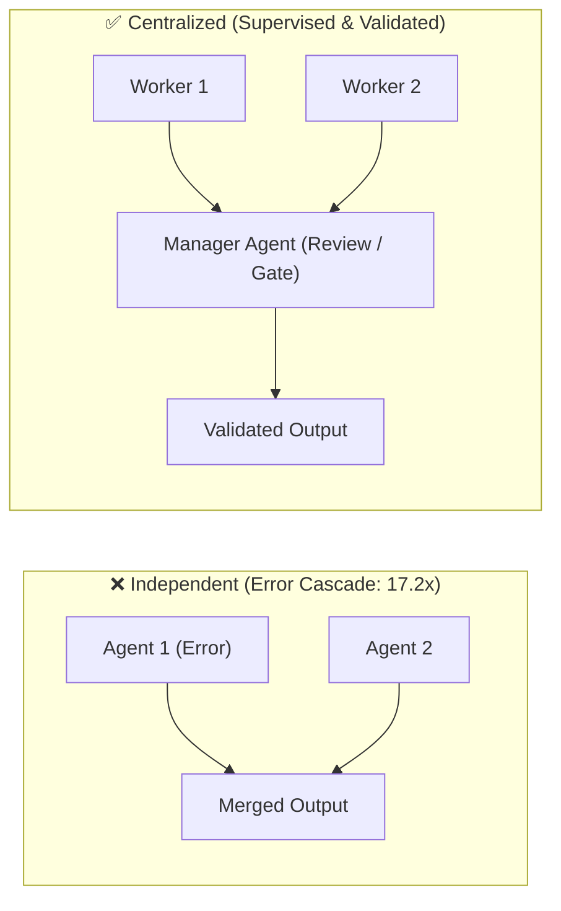

# 5 Science-Backed Takeaways to Improve Your Multi-Agentic Systems

<!-- AI Image Generation Prompt: Minimalist modern tech illustration representing multi-agent AI system scaling and performance benchmarking, interconnected glowing cyan and purple nodes and data topology, dark slate background, clean aesthetic, no text -->

> 💡 *Originally published on [Google Cloud Community on Medium](https://medium.com/google-cloud/5-science-backed-takeaways-to-improve-your-multi-agentic-systems-9a40ac5f7b06) (reposted from [LinkedIn](https://www.linkedin.com/pulse/5-science-backed-takeaways-improve-your-multi-agentic-sampath-kumar-iahtf/)).*

## TL;DR

Adding more AI agents does not guarantee better performance. In a benchmark of **180 multi-agent configurations** ([arXiv:2512.08296](https://arxiv.org/pdf/2512.08296)), researchers found that if a single agent already solves a task with $\ge 45\%$ accuracy, multi-agent swarms yield diminishing returns. Independent uncoordinated swarms amplify errors by **17.2×**, while communication costs scale super-linearly $\mathcal{O}(N^2)$. For production workloads: keep agent teams small (3–4 agents max), enforce centralized manager validation, use single agents for tool-heavy or sequential tasks, and deploy multi-agent topologies only for decomposable, parallel research.

---

## Architecture Decision Matrix

Use this decision tree to match your system topology to the task profile:

---

## 1. Beware the “45% Rule” (Capability Saturation)

It is tempting to throw a team of AI agents at every problem, but the research reveals a hard **“capability ceiling.”**

If a single, standalone AI agent can already solve a task with at least **45% accuracy**, adding more agents will likely yield diminishing—or even negative—returns.

> [!IMPORTANT]
> **The Takeaway:** Multi-agent systems shine primarily on problems where a single model fails completely. If your baseline AI model is already capable of executing the job decently well, the extra cost, latency, and orchestration complexity of managing a multi-agent team will outweigh the performance benefits.

---

## 2. Mind the “Tool-Coordination” Trade-Off

When AI agents communicate with one another, they consume **tokens**—the computational memory and processing context budget they use to read, reason, and generate responses.

The study identified a direct conflict between **team coordination** and **complex tool usage**:

- When a workflow is heavily reliant on external tool invocation (e.g., executing Python scripts, querying BigQuery databases, navigating complex APIs),
- Having multiple agents chat back and forth consumes the cognitive token budget needed to reliably execute and parse those tools.

> [!TIP]
> **The Takeaway:** If your workflow demands heavy tool usage, stick with a **single, powerful agent**. A multi-agent team will spend too much of its token context organizing and talking, leaving insufficient context budget to execute tool payloads accurately.

---

## 3. Never Let Agents Work in Isolation (The Error Cascade)

Not all multi-agent topologies are created equal, and some are dangerous for production environments.

The study tested an **“Independent”** architecture—where multiple agents work on sub-tasks concurrently without inter-agent communication, and their raw outputs are combined at the end. This approach **amplified errors by a staggering 17.2×**. Without cross-validation or supervisory oversight, a single hallucination or mistaken assumption cascaded directly into the final output.

> [!WARNING]
> **The Takeaway:** Always build in verification loops. Use a **Centralized system** where a designated orchestrator/manager agent validates, filters, and synthesizes worker outputs. Adding this supervisory validation step prevents cascading hallucinations.

---

## 4. Match Your Team Structure to the Task

The success of your AI agents depends on aligning architecture to problem topology:

| Architecture | Best Suited For | Expected Impact |
| :--- | :--- | :--- |
| **Centralized Teams** *(Manager + Workers)* | **Parallelizable Tasks** (e.g., breaking down financial reports where Agent A checks revenue, Agent B checks costs, Agent C checks market trends) | **+80% performance gain** via structured synthesis |
| **Decentralized Teams** *(Peer-to-Peer)* | **Dynamic Exploration** (e.g., open web research where agents debate and build consensus) | Higher discovery breadth through peer consensus |
| **Single Agents** | **Strictly Sequential Tasks** (where Step B strictly requires Step A output) | Multi-agent setups degrade sequential logic; single agents excel |

> [!NOTE]
> **The Takeaway:** Topology-task alignment matters far more than raw agent count. Don't use a swarm for sequential logic chains, and don't rely on a single agent for massive multi-domain parallel discovery.

---

## 5. Watch Out for the “Coordination Tax”

More agents mean super-linear communication overhead. The researchers discovered that as agent count scales, inter-agent messaging volume grows **super-linearly**:

$$\text{Communication Overhead} \propto \mathcal{O}(N^2)$$

Beyond **3 to 4 agents**, systems frequently hit a hard resource ceiling where the collective consumes its token quota on internal synchronization, status negotiation, and chatter rather than solving user requests.

> [!IMPORTANT]
> **The Takeaway:** Keep agent teams small (3–4 specialized agents maximum). Cap internal dialogue turns and enforce strict message schemas.

---

## Conclusion

As foundational LLMs become smarter, they do not eliminate the need for multi-agent systems—they redefine **when and how** we should deploy them.

By replacing *"more agents is all you need"* guesswork with empirical system design principles, you can build agentic architectures that are cost-effective, deterministic, and enterprise-ready.

---

## Related Resources & Further Reading

- [A2A Integration Test Kit Dashboard](../../a2a/test-kit/index.md)
- [The Six Essential Protocols Powering the AI Agent Ecosystem](../six-essential-protocols/index.md)
- [Advanced Memory Management for Agentic AI Development](../memory-management-agentic-ai/index.md)
- [Research Paper: Empirical Analysis of Multi-Agent Architectures (arXiv:2512.08296)](https://arxiv.org/pdf/2512.08296)
