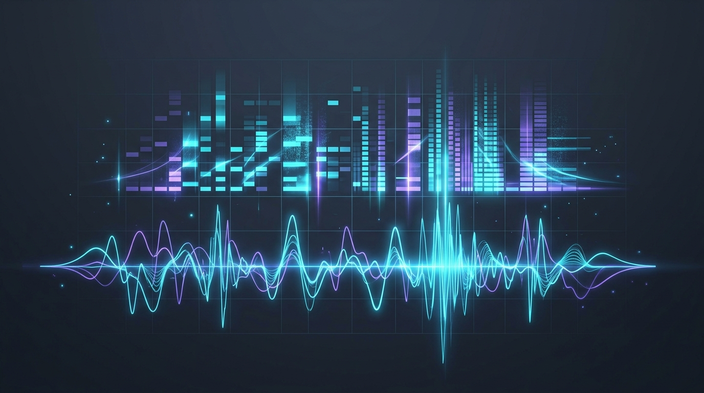

# Unlocking the Secret Language of Sound: How Computers 'Hear' (for Python Devs!)

<!-- AI Image Generation Prompt: Minimalist modern tech illustration representing audio frequencies, digital sound waves, Fourier transform spectrogram, glowing cyan and violet audio waveforms on a dark slate background, no text -->


> 💡 *Originally published on [Google Cloud Community on Medium](https://medium.com/google-cloud/unlocking-the-secret-language-of-sound-how-computers-hear-for-python-devs-f2f82db4f90f).*

## TL;DR

Computers don't hear melodies or voices—they process discrete digital amplitude measurements over time. To bridge continuous acoustics with machine learning models, audio undergoes a conversion pipeline: analog sound waves $
ightarrow$ digital sampling (Nyquist-Shannon theorem) $
ightarrow$ Fast Fourier Transform (FFT) $
ightarrow$ **Mel-Spectrograms** (2D time-frequency heatmaps). Understanding this transformation enables Python developers to build voice assistants, audio classifier pipelines, and multimodal Gemini applications with confidence.

---

## The Audio-to-AI Processing Pipeline

```mermaid
flowchart LR
    A["Continuous Sound Wave (Acoustic Pressure)"] -->|Microphone ADC| B["Discrete Digital Waveform (Amplitude vs Time)"]
    B -->|Short-Time Fourier Transform (STFT)| C["Linear Spectrogram (Frequency vs Time)"]
    C -->|Mel Scale Filterbank| D["Mel-Spectrogram (Perceptual 2D Image)"]
    D -->|Audio Encoder / CNN / ViT| E["Audio Embeddings (Multimodal AI Model)"]
```

---

## 1. Digital Sampling: From Waves to Numbers

Sound is continuous vibrations in air pressure. Microphones convert this pressure into continuous electrical voltage, and Analog-to-Digital Converters (ADCs) sample that voltage at fixed time intervals:

- **Sample Rate ($f_s$)**: Number of audio samples recorded per second (e.g., $16\,	ext{kHz}$ for speech recognition, $44.1\,	ext{kHz}$ for CD audio).
- **Bit Depth**: Resolution of amplitude values (e.g., 16-bit integers spanning $[-32768, 32767]$).

```python
import numpy as np

# Generate a synthetic 440 Hz (A4 pitch) pure tone in Python
sample_rate = 16000  # 16 kHz
duration = 2.0       # 2 seconds
t = np.linspace(0, duration, int(sample_rate * duration), endpoint=False)
waveform = 0.5 * np.sin(2 * np.pi * 440 * t)
```

---

## 2. From Time Domain to Frequency Domain: The Fourier Transform

While raw waveforms show *when* air moves, they don't reveal *which frequencies* are present. The **Fast Fourier Transform (FFT)** decomposes complex audio into its constituent sinusoidal frequency components:

```python
import librosa
import librosa.display
import matplotlib.pyplot as plt

# Load audio file and compute Short-Time Fourier Transform (STFT)
y, sr = librosa.load("audio_sample.wav", sr=16000)
D = librosa.stft(y, n_fft=1024, hop_length=512)
S_db = librosa.amplitude_to_db(np.abs(D), ref=np.max)
```

---

## 3. The Mel Scale: Modeling Human Hearing

Human hearing perception is non-linear—we distinguish differences between $100\,	ext{Hz}$ and $200\,	ext{Hz}$ much better than differences between $10{,}000\,	ext{Hz}$ and $10{,}100\,	ext{Hz}$.

The **Mel Scale** warps frequencies to match human auditory sensitivity:

$$m = 2595 \log_{10}\left(1 + rac{f}{700}
ight)$$

```python
# Compute Mel-Spectrogram
mel_spec = librosa.feature.melspectrogram(y=y, sr=sr, n_mels=128, fmax=8000)
mel_spec_db = librosa.power_to_db(mel_spec, ref=np.max)

# The resulting 2D matrix can be treated directly like an image by Computer Vision models!
print("Mel-Spectrogram Shape:", mel_spec_db.shape)  # e.g., (128 Mel bands, Time frames)
```

---

## Why Mel-Spectrograms Power Modern Multimodal AI

Modern models like **Gemini** and Whisper treat audio spectrograms as visual tokens or continuous spectrogram feature patches. By converting complex temporal pressure waves into 2D perceptual spectrogram representations, standard transformer encoders can effortlessly process audio alongside text and vision.

---

## Related Articles

- [The Role of Python in Google Cloud](../python-in-google-cloud/index.md)
- [Gemini as your Culinary Guide (Multimodal Voice & Vision)](../../gemini/culinary-guide/index.md)
- [The Six Essential Protocols Powering the AI Agent Ecosystem](../six-essential-protocols/index.md)
