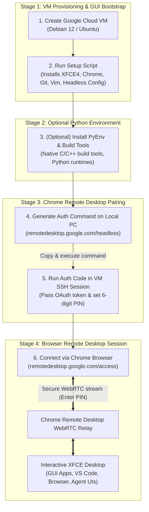

# Setting Up GUI & Chrome Remote Desktop on a Google Cloud VM

<!-- TODO: Generate image with prompt: Minimalist illustration of a laptop screen accessing a remote Linux cloud workstation desktop via Chrome browser, modern tech workspace background, glowing accents, 16:9 ratio. -->

While command-line workflows and headless SSH sessions handle most cloud engineering tasks, certain developer tools, agent debugging UIs, browser automation harnesses, and visual data explorers require a full graphical user interface (GUI).

In this guide, you will learn how to configure an ultra-lightweight **XFCE desktop** on a Google Compute Engine (GCE) VM and connect to it securely using **Google Chrome Remote Desktop** directly from your personal computer.

______________________________________________________________________

## TL;DR

- **Lightweight Desktop**: Use `XFCE4` to minimize RAM and CPU overhead on cloud instances.
- **Chrome Remote Desktop**: Provides fast, encrypted WebRTC desktop streaming without opening inbound firewall ports or managing complex VNC/RDP tunnels.
- **Idempotent Automation**: Use a startup script with a flag file check (`/var/log/workstation_setup_complete.flag`) to automate package installation during the first boot only.

______________________________________________________________________

## Architecture & Connectivity Flow

<!-- TODO: Generate image with prompt: Architecture diagram illustrating the 4 stages of setting up and connecting to a Google Cloud VM with XFCE GUI, Python tools, and Chrome Remote Desktop. -->



______________________________________________________________________

## Prerequisites

1. A **local computer** (macOS, Linux, or Windows) with Google Chrome installed.
1. A **Google Compute Engine VM** running Debian 12 or Ubuntu 22.04/24.04 LTS.

> [!TIP]
> **Need a dedicated VM from scratch?** If you want to provision an isolated cloud VM tailored specifically for Agentic AI development (with dedicated service accounts, least-privilege IAM roles, and `cloud-platform` scopes for Gemini and Vertex AI), check out our companion guide: [Building an Agentic Sandbox: Provisioning a Google Cloud VM Workstation](../building-agentic-sandbox-vm/index.md).

______________________________________________________________________

## Step 1: Set Up GUI & Chrome Remote Desktop on the VM

You can apply the desktop setup using either a startup script (for newly provisioned instances) or via a quick one-liner over SSH (for existing instances):

=== "Option A: VM Startup Script (Automated on Boot)"

````
Add the script below into your VM's **Startup script** metadata in the Google Cloud Console or via the `--metadata-from-file startup-script=...` flag when creating the instance.

```bash
#!/bin/bash
# ==============================================================================
# Automated First-Boot Setup for GUI (XFCE4) & Chrome Remote Desktop
# ==============================================================================
set -euo pipefail

FLAG_FILE="/var/log/workstation_setup_complete.flag"

# 1. Check if setup was already completed
if [ -f "$FLAG_FILE" ]; then
    echo "[+] Setup was already completed previously. Booting normally."
    exit 0
fi

echo "[*] Updating apt package repositories..."
apt-get update
DEBIAN_FRONTEND=noninteractive apt-get upgrade -y

# 2. Install XFCE4 desktop environment (lightweight for cloud VMs)
echo "[*] Installing XFCE4 and desktop base..."
DEBIAN_FRONTEND=noninteractive apt-get install -y xfce4 desktop-base

# 3. Configure Chrome Remote Desktop to use XFCE session
echo "[*] Configuring Chrome Remote Desktop session for XFCE..."
bash -c 'echo "exec /etc/X11/Xsession /usr/bin/xfce4-session" > /etc/chrome-remote-desktop-session'

# 4. Download and install Chrome Remote Desktop host package
echo "[*] Downloading and installing Chrome Remote Desktop host..."
wget -q https://dl.google.com/linux/direct/chrome-remote-desktop_current_amd64.deb
apt-get install -y --fix-broken ./chrome-remote-desktop_current_amd64.deb
rm -f ./chrome-remote-desktop_current_amd64.deb

# 5. Download and install Google Chrome browser
echo "[*] Downloading and installing Google Chrome browser..."
wget -q https://dl.google.com/linux/direct/google-chrome-stable_current_amd64.deb
apt-get install -y --fix-broken ./google-chrome-stable_current_amd64.deb
rm -f ./google-chrome-stable_current_amd64.deb

# 6. Disable the local display manager since the VM runs headless in the cloud
echo "[*] Disabling lightdm (headless cloud VM)..."
systemctl disable lightdm.service 2>/dev/null || true

# 7. Install basic developer utilities
echo "[*] Installing basic developer utilities (git, vim, gedit, tree)..."
apt-get install -y --fix-broken git vim gedit tree

# 8. Mark setup as complete
touch "$FLAG_FILE"
echo "[✓] GUI & Chrome Remote Desktop installation complete!"
```

Allow 5–10 minutes on first boot for packages to install. You can verify completion over SSH with:

```bash
ls -l /var/log/workstation_setup_complete.flag
```
````

=== "Option B: Quick Run via cURL (Existing VM)"

````
If you already have a running VM, connect via SSH and run the co-located [`setup-xfce-chrome-remote-desktop.sh`](setup-xfce-chrome-remote-desktop.sh) script in a single command:

```bash
# 1. Connect to your VM
gcloud compute ssh YOUR_VM_NAME --zone YOUR_ZONE

# 2. Execute the setup script as root
curl -sSL https://raw.githubusercontent.com/msampathkumar/msampathkumar.github.io/master/docs/writing/technical/setup-gui-chrome-remote-desktop-gcp-vm/setup-xfce-chrome-remote-desktop.sh | sudo bash
```

> [!IMPORTANT]
> **Review Before Running:** Always inspect and understand scripts before executing them on your systems. The script requires **root (`sudo`) privileges** to install desktop packages, modify `/etc/` session configs, and disable the local display manager for headless execution. You can review the raw script source in [`setup-xfce-chrome-remote-desktop.sh`](setup-xfce-chrome-remote-desktop.sh).
````

Once the setup completes (verified by the presence of `/var/log/workstation_setup_complete.flag`), your VM has the XFCE4 desktop, Google Chrome, and Chrome Remote Desktop host service installed.

______________________________________________________________________

## Step 2: (Optional) Install PyEnv Build Dependencies

If you plan to compile multiple Python versions using `pyenv` for agent framework compatibility, install the required native build dependencies:

```bash
sudo apt update
sudo apt install -y make build-essential libssl-dev zlib1g-dev \
  libbz2-dev libreadline-dev libsqlite3-dev curl git \
  libncursesw5-dev xz-utils tk-dev libxml2-dev libxmlsec1-dev \
  libffi-dev liblzma-dev libzstd-dev
```

______________________________________________________________________

## Step 3: Pair Chrome Remote Desktop

### 1. Authorize on Your Local Computer

1. Open Google Chrome and visit: [remotedesktop.google.com/headless](https://remotedesktop.google.com/headless)
1. Locate the **"Set up via SSH"** (or "Set up another computer") card.
1. Click **Begin**, click **Next**, and click **Authorize**.
1. Copy the generated authorization command for Linux/Debian. It will resemble:

```bash
DISPLAY= /opt/google/chrome-remote-desktop/start-host \
  --code="4/aXo............................" \
  --redirect-url="https://remotedesktop.google.com/_/oauthredirect" \
  --name=$(hostname)
```

### 2. Run the Authorization Command inside the VM

1. Connect to your VM via SSH:
   ```bash
   gcloud compute ssh YOUR_VM_NAME --zone YOUR_ZONE
   ```
1. Paste and run the command copied from step 1.
1. When prompted, enter and confirm a **6-digit PIN** to protect your remote desktop session.

### 3. Connect to Your Desktop via Browser

1. In Google Chrome on your local machine, open: [remotedesktop.google.com/access](https://remotedesktop.google.com/access)
1. Your Compute Engine VM will appear under **Remote Devices**.
1. Click on the VM, enter your 6-digit PIN, and your full XFCE desktop session will stream directly in your browser tab.

______________________________________________________________________

## Summary

You now have a complete, secure, and low-latency cloud desktop running on Google Compute Engine. You can run graphical applications, visual debugging inspectors, and agent browser testing harnesses with the flexibility of cloud resources and the convenience of a browser window.
