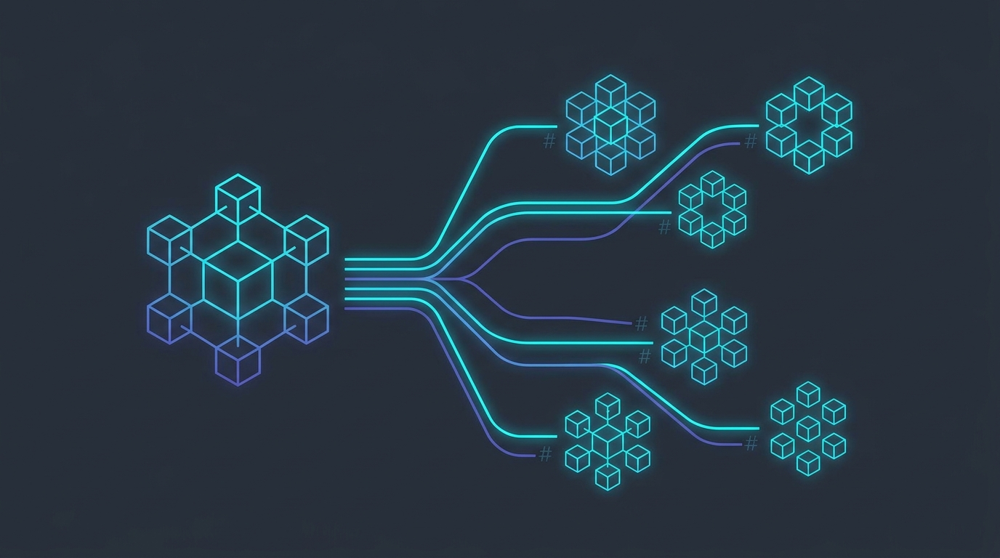
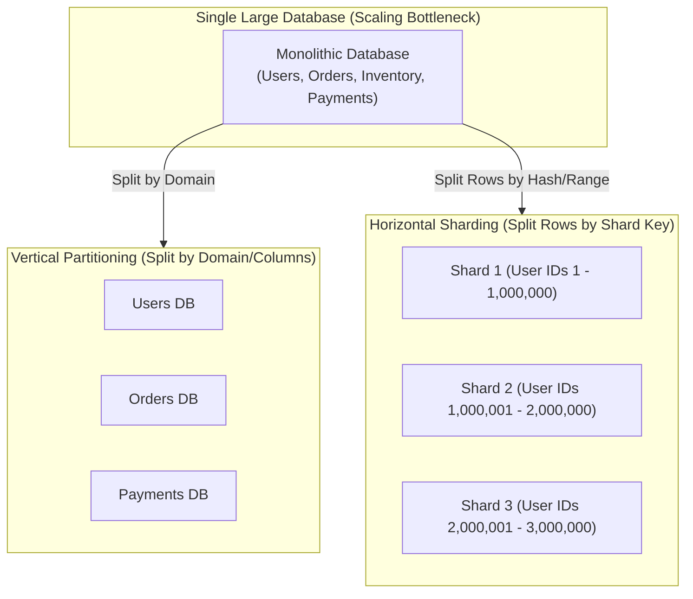

# What is Sharding, Partitioning and Why Sharding Managers?

<!-- AI Image Generation Prompt: Minimalist modern tech illustration representing database sharding and horizontal partitioning, database clusters splitting into distributed hash shards with glowing cyan and indigo connections on dark slate background, no text -->


> 💡 *Originally published on [Medium](https://medium.com/@maddula/what-is-sharding-partitioning-and-why-sharding-mangers-b8fe5baeea1d).*

## TL;DR

When database workloads outgrow the vertical CPU, memory, and disk capacity of a single machine, systems must partition data horizontally across multiple database instances—a pattern known as **Sharding**. However, managing sharded architectures introduces severe operational complexities: cross-shard joins, schema migrations, shard rebalancing, and routing logic. **Sharding Managers** (e.g., Vitess, Citus, Spanner) abstract these distributed challenges away from application code.

---

## Horizontal Sharding vs. Vertical Partitioning



- **Vertical Partitioning**: Splitting a schema by tables or columns into distinct microservice databases (e.g., separating `User Profiles` from `Audit Logs`).
- **Horizontal Partitioning (Sharding)**: Keeping identical table schemas across multiple database servers, where each server holds a subset of total rows based on a **Shard Key** (e.g., `user_id` or `tenant_id`).

---

## Sharding Strategies

### 1. Hash-Based (Consistent Hashing)
A hash function maps the shard key to a discrete shard index:

$$	ext{Shard Index} = 	ext{Hash}(	ext{Shard Key}) \pmod N$$

- **Pros**: Uniform data distribution; avoids hotspot creation.
- **Cons**: Adding new shard nodes requires complex data migration and resharding.

### 2. Range-Based Sharding
Data is partitioned according to contiguous key ranges (e.g., A–F, G–M, N–Z, or timestamps):

- **Pros**: Simple to query and range-scan.
- **Cons**: High risk of write hotspots (e.g., recent date partitions receiving all active writes).

---

## Why You Need a Sharding Manager

Implementing sharding logic directly inside application code tightly couples business services to database topology. A **Sharding Manager** acts as an intelligent proxy layer:

```mermaid
graph LR
    App["Application Service"] --> SM["Sharding Manager / Router Proxy<br/>(Query Parsing & Routing Engine)"]
    SM -->|Hash(user_id) % 3 == 0| S1["Database Shard 1"]
    SM -->|Hash(user_id) % 3 == 1| S2["Database Shard 2"]
    SM -->|Hash(user_id) % 3 == 2| S3["Database Shard 3"]
```

### Core Responsibilities of Sharding Managers:
1. **Transparent Query Routing**: Applications issue standard SQL queries; the manager routes reads and writes to the correct shard.
2. **Scatter-Gather Execution**: Aggregates and merges multi-shard queries (e.g., `SELECT COUNT(*) FROM orders`) concurrently.
3. **Dynamic Online Resharding**: Splits and migrates shards in the background without incurring application downtime.
4. **Health & Connection Pooling**: Manages thousands of pooled client connections to prevent database connection starvation.

---

## Related Articles

- [Google Cloud Load Balancing Introduction](../load-balancing-blitz-intro/index.md)
- [The Six Essential Protocols Powering the AI Agent Ecosystem](../six-essential-protocols/index.md)
- [Advanced Memory Management for Agentic AI Development](../memory-management-agentic-ai/index.md)
