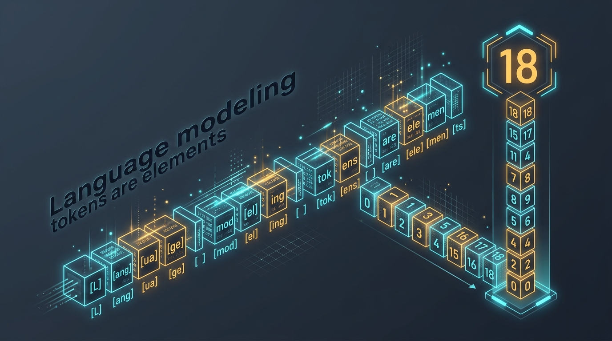
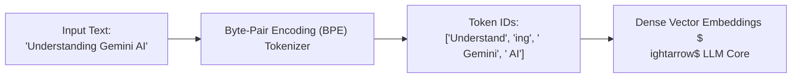

# Token Counting: What is it? Why is it required? How to use?

<!-- AI Image Generation Prompt: Minimalist modern tech illustration representing language model tokenization and token counting, text decomposing into glowing numerical vector blocks with cyan and amber accents on dark slate background, clean aesthetic, no text -->


> 💡 *Originally published on [Google Cloud Community on Medium](https://medium.com/google-cloud/token-counting-what-is-it-why-it-is-required-how-to-use-explained-to-you-in-simple-words-f817a462d56c).*

## TL;DR

Large Language Models do not read words or characters—they process **tokens** (sub-word mathematical chunks typically equivalent to ~4 characters or 0.75 words in English). Token counting is essential because API pricing, context window limits, response latency, and rate limits (RPM/TPM) are all calculated strictly in tokens. By counting tokens client-side *before* dispatching expensive API calls, developers can prevent unexpected billing surprises, optimize context packing, and implement proactive prompt pruning.

---

## How Tokenization Works



- Common words often map to a **single token** (e.g., `apple` $
ightarrow$ 1 token).
- Complex, technical, or non-English words are broken into **multiple sub-word tokens** (e.g., `tokenization` $
ightarrow$ `token` + `ization`).
- Whitespace and punctuation marks also count as tokens.

---

## Why Token Counting Matters for Production Systems

1. **Billing & Cost Governance**: LLM providers bill per 1,000 or 1,000,000 input/output tokens. Unmonitored prompt growth exponentially inflates infrastructure spend.
2. **Context Window Safety**: Exceeding model context windows (e.g., 1M or 2M tokens in Gemini) results in hard API failure errors.
3. **Latency Management**: Time-to-First-Token (TTFT) and generation time correlate directly with input prompt length.
4. **Proactive RAG Chunking**: When building Retrieval-Augmented Generation systems, token counting ensures retrieved document chunks fit precisely within allocated prompt budgets.

---

## Counting Tokens in Python with the Gemini SDK

The Google GenAI SDK allows developers to count tokens locally or via a fast zero-cost metadata call before invoking generation:

```python
from google import genai

client = genai.Client(vertexai=True, project="your-gcp-project", location="us-central1")

prompt = """
Explain the core differences between Monolithic and Microservice architectures,
focusing on operational complexity, deployment frequency, and fault isolation.
"""

# Count tokens before dispatching full inference
response = client.models.count_tokens(
    model="gemini-2.5-flash",
    contents=prompt
)

print(f"Total Input Tokens: {response.total_tokens}")
print(f"Estimated Input Cost: ${response.total_tokens / 1_000_000 * 0.075:.6f}")
```

---

## Practical Rules of Thumb

- **1 Token $pprox$ 4 English characters**
- **100 Tokens $pprox$ 75 English words**
- **1 Paragraph $pprox$ 100–150 tokens**
- **1 Page of Single-Spaced Text $pprox$ 500–800 tokens**

---

## Related Articles

- [Google Cloud Gemini Cookbook: Lesson 1 — Hello World with Streamlit](../../../google-cloud-gemini-cookbook/lesson-01/README.md)
- [Advanced Memory Management for Agentic AI Development](../memory-management-agentic-ai/index.md)
- [The Six Essential Protocols Powering the AI Agent Ecosystem](../six-essential-protocols/index.md)
